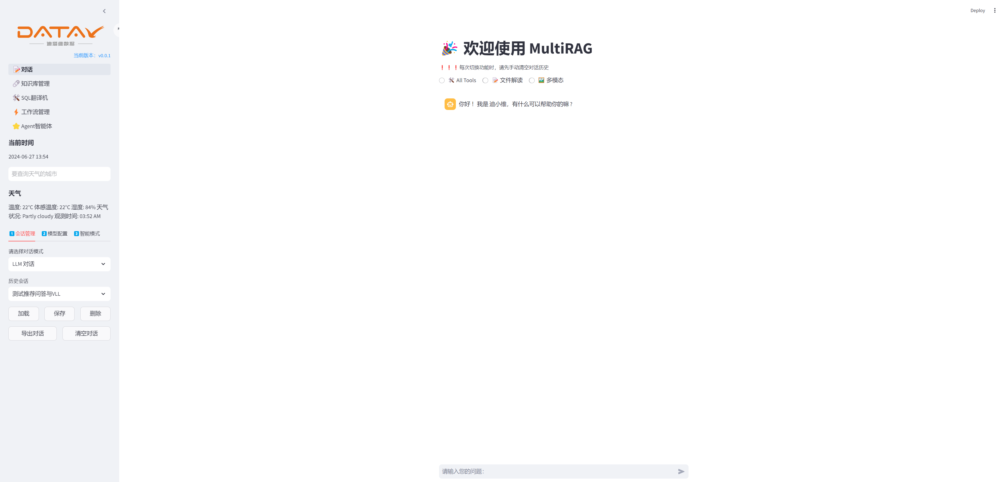
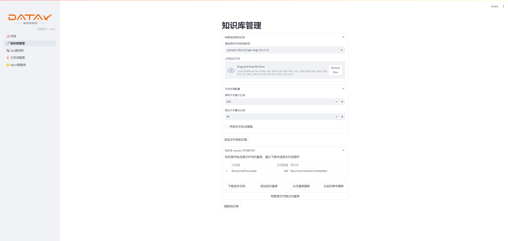
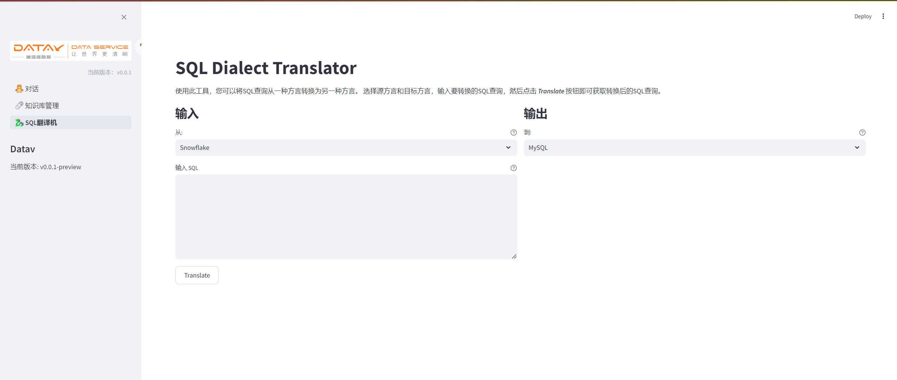
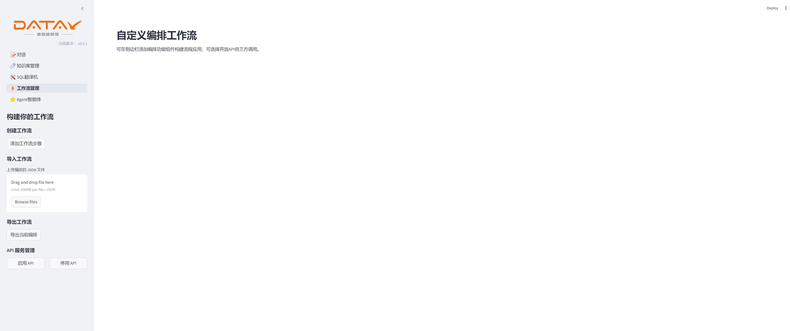
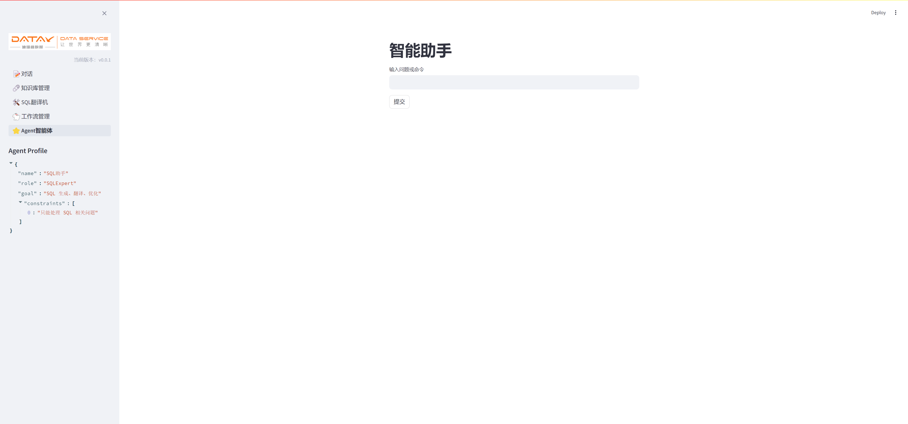

# 项目名称：大模型LLM的RAG应用项目

## 项目简介

本次项目是大模型LLM的RAG（Retrieval-Augmented Generation）应用项目，结合了当前许多开源项目的优势，具体功能包括：

- 支持自定义LLM的系统提示词。
- 支持多模态交互：用户可以上传文档，直接与大模型交流文档内容。
- 大模型回答用户的输出可以转换为语音（此功能暂未实现，需要排期）。
- 内置了一些轻AI应用，后期可以根据需求自行定制和拓展（此功能暂未实现，需要排期）。

## 项目功能

1. **对话**：与大模型进行文本、文件、图片对话。
2. **知识库管理**：上传文档，创建和管理知识库，进行文档内容问答。
3. **SQL翻译**：将SQL查询从一种方言转换为另一种方言。
4. **工作流管理**：将内置的功能组件编排成工作流，支持页面执行展示、API接口调用。
5. **Agent服务**：调用已有工具、结合角色认知、记忆管理进行智能推理，可选择开放API供三方调用。


## 使用教程

### 环境依赖

在使用本项目之前，请确保已安装以下依赖：

- Python = 3.12
- Streamlit等
- 其他依赖项请参考 `requirements.txt` 文件

### 步骤

1. 克隆本项目到本地：
    
    ```bash
    git clone <项目地址>
    ```
    
2. 进入项目目录：
    
    ```bash
    cd <项目目录>
    ```
    
3. 安装环境依赖：
    
    ```bash
    pip install -r requirements.txt
    ```
    
4. 运行项目：
    
    ```bash
    streamlit run app.py
    ```
    

## 项目截图





## 功能展示

- **对话界面**：与大模型进行交互，对话内容将显示在右侧区域。
- **知识库管理**：上传文档文件，创建和管理知识库，并与知识库中的内容进行交互。
- **SQL翻译**：输入SQL查询语句，选择源方言和目标方言，进行SQL方言转换。
- **工作流管理**：编排功能组件构建流程应用，可选择开放API供三方调用。
- **Agent服务**：调用已有工具、结合角色认知、记忆管理进行智能推理，可选择开放API供三方调用。

## 未来计划

- 实现语音输出功能：将大模型的回答转换为语音。
- 增加更多轻AI应用：根据用户需求自定义和扩展更多AI功能。
- 工作流支持在线构建组件，提高拓展性。

## 贡献

欢迎大家提交issue或pull request来共同完善本项目。

### Commit 类型介绍

* feat: 新特性或功能
* fix: 缺陷修复
* docs: 文档更新
* style: 代码风格或者组件样式更新
* refactor: 代码重构，不引入新功能和缺陷修复
* opt: 性能优化
* chore: 一些不涉及到功能变动的小提交，比如修改文字表述，修改注释等

## 许可证
本项目遵循MIT许可证开源。