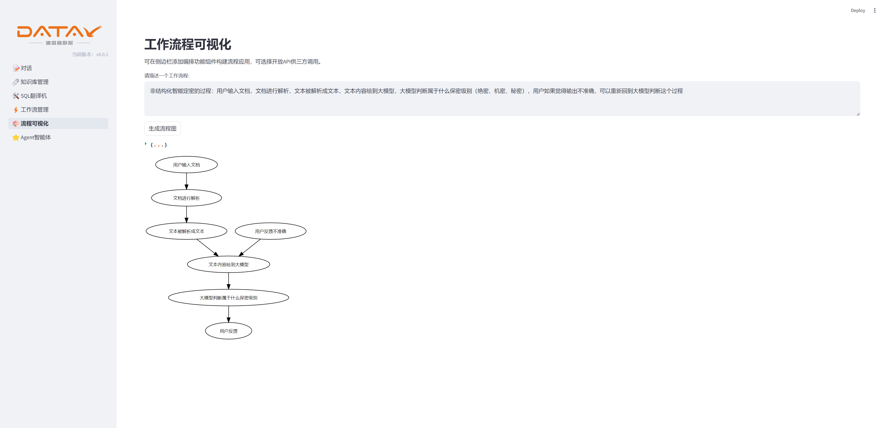
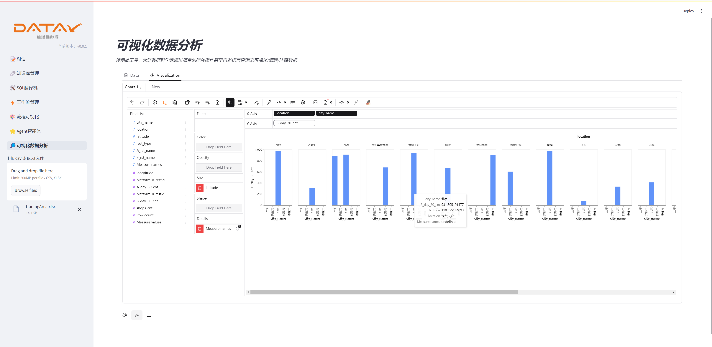

# Project Name: LLM RAG Application Project


<p align="center">
<a href="README.md"></a>
<a href="README_EN.md"></a>
</p>

## Project Overview

This project is an application of LLM RAG (Retrieval-Augmented Generation), combining the advantages of many current open-source projects. The specific features include:

- Support for custom system prompts for LLMs.
- Support for multimodal interaction: users can upload documents and directly interact with the LLM about the content.
- The model's responses can be converted into speech (this feature is not yet implemented and is scheduled for future development).
- Some lightweight AI applications are built-in and can be customized and expanded according to needs (this feature is not yet implemented and is scheduled for future development).

## Project Features

1. **Conversation**: Engage in text, document, and image conversations with the model.
2. **Knowledge Base Management**: Upload documents, create and manage knowledge bases, and perform Q&A on document content.
3. **SQL Translation**: Convert SQL queries from one dialect to another.
4. **Workflow Management**: Orchestrate built-in functional components into workflows, supporting page execution display and API calls.
5. **Process visualization**: Convert the content described by the user into a flowchart.
6. **Agent Service**: Call existing tools, combine role cognition and memory management for intelligent reasoning, and optionally provide open APIs for third-party calls.
7. **Agent Service**: Allows data scientists to visualize/cleanse/annotate data through simple drag-and-drop operations or even natural language queries.


## User Guide

### Environment Dependencies

Before using this project, please ensure the following dependencies are installed:

- Python = 3.12
- Streamlit, etc.
- Other dependencies can be found in the requirements.txt file.

### Steps

1. Clone the project to your local machine:
    
    ```bash
    git clone <project_directory>
    ```
    
2. Navigate to the project directory:
    
    ```bash
    cd <project_url>
    ```
    
3. Install the environment dependencies:
    
    ```bash
    pip install -r requirements.txt
    ```
    
4. Run the project:
    
    ```bash
    streamlit run app.py
    ```
    

## Project Screenshots






## Feature Demonstrations

- **Conversation Interface**: Interact with the model, with the conversation content displayed in the right area.
- **Knowledge Base Management**: Upload document files, create and manage knowledge bases, and interact with the content within.
- **SQL Translation**: Input SQL queries, select source and target dialects, and perform SQL dialect conversion.
- **Workflow**: Orchestrate functional components into workflow applications, with optional open APIs for third-party calls.
- **Process visualization**: Convert the content described by the user into a flowchart.
- **Agent service**: Call existing tools, combine role cognition and memory management for intelligent reasoning, with optional open APIs for third-party calls.
- **Visual data analysis**: Allows data scientists to visualize/cleanse/annotate data through simple drag-and-drop operations or even natural language queries.


## Future Plans

- Expand role-based access control: Assign different permissions based on role requirements. --> Admin users manage knowledge base and tools configuration, regular users use developed applications【**】
- Add login management: Support user login and manage user permissions.【**】
- Add more lightweight AI applications: Customize and expand more AI functions based on user needs.【*】
- Support online component construction for workflows to improve extensibility.【*】
- Implement speech output function: Convert model responses into speech.【*】

## Contribution

We welcome everyone to submit issues or pull requests to help improve this project.

### Commit Type Descriptions

* feat: New features or functionality
* fix: Bug fixes
* docs: Documentation updates
* style: Code style or component style updates
* refactor: Code refactoring without introducing new features or bug fixes
* opt: Performance optimization
* chore: Minor changes not involving feature changes, such as text adjustments, comment changes, etc.

## License
The project code is licensed under the [Apache-2.0](LICENSE) license.