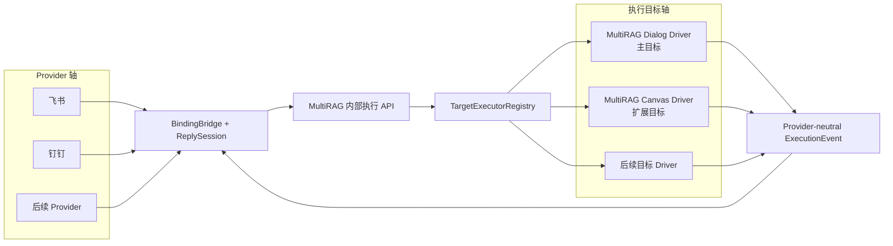
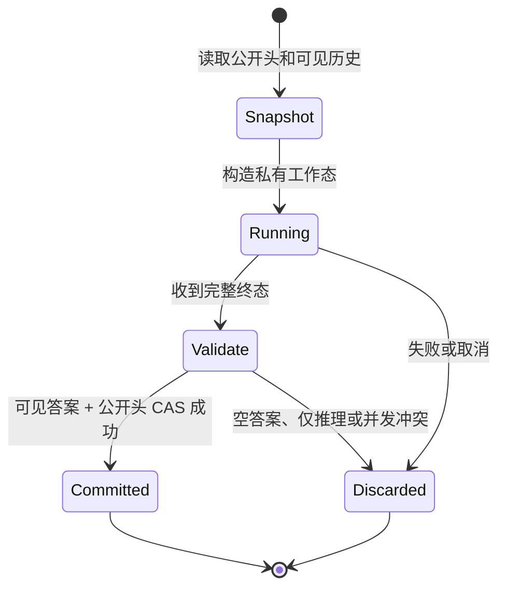

# MultiRAG Channel 执行架构

> 状态：目标架构已定案，实施分阶段进行
> 决策：[`CHN-ADR-07`](DECISIONS.md#chn-adr-07--provider-与执行目标正交历史事务由目标驱动拥有)
> 核验日期：2026-08-10（外部版本与证据见
> [`VERSION_BASELINE`](../enterprise-identity-mcp/VERSION_BASELINE.md) 和
> [`REFERENCES`](../enterprise-identity-mcp/REFERENCES.md)）

本文是 Channel Provider、MultiRAG Dialog、MultiRAG Canvas 之间执行关系的单一事实来源。
飞书卡片、Markdown 和回调时序仍以
[`FEISHU_BOT_UX`](../enterprise-identity-mcp/FEISHU_BOT_UX.md) 为准；任务状态以
[`PROGRESS`](PROGRESS.md) 和 [`ROADMAP`](../enterprise-identity-mcp/ROADMAP.md) 为准。

## 1. 术语与项目口径

仓库内一律使用 MultiRAG 自己的实体名称：

- **MultiRAG Dialog / MultiRAG Canvas**：本项目的两类执行目标；Dialog 是主目标，Canvas 是扩展目标；
- **MultiRAG 对话表、会话表、函数、方法、路由、执行器**：只要实体位于本仓库，就按 MultiRAG
  命名，不称为“RAGFlow 的表/函数/方法”；
- **上游同步区**：为了降低后续同步成本而保持低差异的 MultiRAG 文件；它仍是 MultiRAG 代码，
  不是外部运行依赖；
- **RAGFlow 上游**：只在说明代码来源、许可证、外部 commit/PR、差异对比或兼容基线时使用。

不得用“RAGFlow completion”“RAGFlow 会话表”“调用 RAGFlow 数据库”描述本仓运行时。正确说法是
“MultiRAG Dialog completion”“MultiRAG Canvas 会话表”“MultiRAG API 访问本地数据库”；如需说明
来源，再单独补一句“该实现跟随 RAGFlow 上游某提交”。

## 2. 定案结论

1. **Provider 与执行目标是两条正交轴。** 飞书、钉钉和后续 Provider 只负责事件归一化、回复渲染
   和交互回调；Dialog、Canvas 和后续目标只负责业务执行与历史事务。
2. **Dialog 是默认和首要适配目标，Canvas 是独立扩展。** 新增 Provider 必须天然可绑定 Dialog；
   Canvas 能力不得反向成为 Provider 通用契约的必填项。
3. **所有 Provider 共用同一个 MultiRAG 执行入口和事件协议。** 禁止出现
   `provider == "feishu" and target_type == "multirag.canvas_agent"` 一类组合分支。
4. **运行中的内容不是已提交历史。** 生成只在私有工作态进行；只有完整终态、存在可见答案且公开
   会话头未变化时，才以 compare-and-swap（CAS）提交一次。
5. **历史事务由目标驱动拥有，不追求伪通用。** Dialog 用内存工作副本；Canvas 在当前能力下使用
   隔离候选会话。二者共用生命周期语义，不共用持久化技巧。
6. **Channel worker 不访问数据库。** worker 只调用 MultiRAG 内部执行 API 并消费 SSE；数据库访问
   只发生在 API 进程的目标驱动中，卡片 patch 和模型 delta 不触发数据库轮询。
7. **功能由能力交集决定。** 用户可见的停止、重新生成、反馈和渐进式展示，取 Provider 能力、
   目标能力与本次执行策略的交集；不支持时明确降级或隐藏，不能猜测。

## 3. 当前事实与需要收口的地方

已经正确的基础：

- `api/channel_execution/registry.py::TargetExecutorRegistry` 已按 `target_type` 注册目标执行器；
- `api/channels/runtime_client.py` 通过内部 HTTP/SSE 调用执行 API，worker 不直接访问 SQLAlchemy；
- `ExecutionEvent` 与 `ReplySession` 已把目标输出和 Provider 渲染分开；
- binding 在服务端解析 tenant、target、revision 和 session，worker 不能覆盖这些字段。

当前需要演进的部分：

- `ChannelSessionManager` 同时暴露 `prepare_canvas()` / `prepare_dialog()`，把两个目标的持久化细节
  塞进一个 Protocol；新增第三个目标会继续扩大这个接口；
- `SqlAlchemyChannelSessionManager` 目前让 Dialog 和 Canvas 都创建数据库候选，虽然保证了失败、
  取消、reasoning-only 不污染公开历史，但对 Dialog 来说写放大并非必要；
- 候选 TTL 清理目前位于每次执行的准备热路径，会为每条消息增加一次删除扫描和提交；
- Canvas 候选依靠会话行中的名称/用户字段识别，能工作但不是理想的长期所有权模型。

不能据此直接删除现有隔离层。当前 MultiRAG completion 在内部流结束时可能已经写入空答案、仅推理
内容或部分状态；在无副作用执行缝建立前改为直接写公开会话，会重新引入历史污染。

## 4. 两条正交轴



Provider 不知道 MultiRAG 对话表结构，目标驱动也不知道飞书 CardKit 或钉钉 webhook。二者唯一的
交点是受信执行命令、能力描述和脱敏后的执行事件。

## 5. 目标驱动契约

保留现有 `TargetExecutor` 作为注册表入口，在每个执行器内部引入各自的目标驱动。目标形态如下，
名称表达职责，不要求一次 PR 机械照抄接口：

```python
class TargetExecutionDriver(Protocol):
    target_type: str

    async def capabilities(self, context: TrustedChannelContext) -> TargetCapabilities: ...
    async def prepare(self, context: TrustedChannelContext, command: ChannelExecutionCommand) -> PreparedExecution: ...
    def stream(self, prepared: PreparedExecution) -> AsyncIterator[ExecutionEvent]: ...
    async def commit(self, prepared: PreparedExecution, result: VisibleResult) -> str: ...
    async def abort(self, prepared: PreparedExecution) -> None: ...
```

`PreparedExecution` 是目标私有的不透明工作态。公共 Protocol 不再出现 `prepare_canvas()`、
`complete_dialog()` 等具体目标方法。新增目标只注册新驱动，不修改既有 Provider。

## 6. 能力协商

### ProviderCapabilities

| 能力 | 含义 |
|---|---|
| `progressive_reply` | 可以渐进展示同一回复 |
| `interactive_actions` | 可以承载按钮或等价交互 |
| `cancel_control` | 可以向用户展示停止操作 |
| `feedback_control` | 可以承载有帮助/没帮助 |
| `threaded_reply` | 可以稳定回复到来源消息或话题 |

### TargetCapabilities

| 能力 | 含义 |
|---|---|
| `streaming` | 目标能产出增量事件 |
| `cancellable` | 当前阶段可合作取消；不代表副作用回滚 |
| `regeneratable` | 当前会话尾部可按已定义语义重新生成 |
| `feedback` | 目标或 MultiRAG 反馈仓可接受本轮反馈 |
| `commit_mode` | `detached_cas`、`candidate_cas` 或未来模式 |
| `effect_class` | `generation_only`、`external_effects`、`unknown` |

最终 UI 能力为：

```text
visible_actions = ProviderCapabilities ∩ TargetCapabilities ∩ RunPolicy
```

Dialog 默认支持 `detached_cas`；Canvas 的 `regeneratable` 必须按已发布图动态判断。含工具、MCP、
代码执行、写 SQL、消息发送或未知组件时，重新生成 fail closed。停止按钮只表示停止等待后续输出，
不得宣称已撤销外部副作用。

## 7. 历史事务模型

### 共同语义



- 公开历史只保存用户可见的 user/assistant transcript、引用和允许的结构化产物；
- reasoning、原始 tool trace、半轮回答、失败和取消结果不进入公开历史；
- `message` 在快照尾部追加问题；`regenerate` 在工作副本中撤回最新且问题匹配的一轮；
- 最终提交必须携带 `expected_head`（版本号或稳定指纹），条件不成立返回冲突，不覆盖后来消息；
- 公开会话只在终态写一次。流式事件、卡片刷新和反馈渲染不写对话历史。

### Dialog：`detached_cas`

Dialog 是主目标，应先收敛到：

1. 读取一次 MultiRAG Dialog 公开会话和目标配置；
2. 清洗为可见 transcript，在内存中构造 detached working copy；
3. 调用 MultiRAG Dialog 生成能力，但不让生成过程写公开会话或候选行；
4. 完整终态后，在一个事务中按 `expected_head` 更新公开会话；新会话则到终态才插入；
5. 失败、取消、仅推理或冲突时丢弃内存副本，公开历史零写入。

这与 MultiRAG 后续跟进上游时的方向一致：同步区保持原有 Dialog 语义，Channel 的 operation、
CAS 和可见历史投影都留在 `api/channel_execution`。禁止给同步区函数新增 Channel 私有参数。

### Canvas：`candidate_cas`

当前 MultiRAG Canvas completion 自己读取和持久化会话，尚无等价的无落库执行端口，因此：

1. 保留数据库候选作为**Canvas 专属兼容策略**，不再伪装成所有目标的通用方案；
2. 候选所有权、创建时间和状态由 MultiRAG 自有元数据记录；公开 Canvas 会话表不增加 Channel
   私有列；
3. 成功后锁定公开行并校验 `expected_head`，再复制允许字段并删除候选；失败只删除候选；
4. 候选 GC 改为启动时/周期性低频批处理，不在每条消息准备路径执行；
5. 一旦 MultiRAG Canvas 获得稳定的无落库执行端口，驱动内部切到 `detached_cas`，Provider、
   binding、事件协议和卡片均不变。

## 8. Run 生命周期与会话历史分离

每次尝试拥有新的 `run_id`。重新生成创建新 run，并记录 `supersedes_run_id` 或等价来源关系；它
不是把旧问题当普通消息再次追加。`queued/running/final/error/cancelled` 是 run 状态，不是 Dialog
或 Canvas 会话消息。

当前首期可继续由 worker 持有有界队列，因为它能以最低延迟驱动 Provider 卡片；但这只是进程内
体验状态。若要支持 worker 重启恢复、跨实例取消或长期可查询状态，按 CHN-O14 增加 API 侧持久化
run ledger：

- worker 仍只通过内部 API/SSE，不直连数据库；
- 每个会话最多一个 `queued/running` run 的约束由数据库唯一条件兜底，内存检查只是快路径；
- 取消请求和成功终态使用竞争 CAS，已接受的取消不能被迟到 success 覆盖；
- run 事件和目标历史分表，不能把运行状态塞进 Dialog/Canvas 消息数组；
- 不按 token 写 run 表，只在有限状态迁移和终态写入。

在明确需要重启恢复前，不提前引入完整 durable workflow runtime；MultiRAG 只吸收其一致性不变量。

## 9. 数据库 I/O 预算

| 路径 | 目标预算 | 禁止项 |
|---|---|---|
| Dialog 已有会话 | 准备阶段一次快照读；终态一次 CAS update | 候选 insert/delete、每 delta 写库 |
| Dialog 新会话 | 目标配置读；终态一次 insert | 开始生成就发布空会话 |
| Canvas 已有会话 | 快照读 + 候选写；终态 CAS copy/delete | 每请求全表/目标范围 TTL 清理 |
| Canvas 新会话 | 私有候选创建；终态发布映射 | 半成品直接成为公开会话 |
| Provider 渲染 | 0 次目标历史 SQL | 为卡片 patch 轮询数据库 |
| run ledger（后续） | 状态迁移时小次数 CAS | 每 token、每 CardKit sequence 写库 |

desired runtime 的控制面轮询是另一条运维链路，不属于对话执行热路径，不能与上述 I/O 混为一谈。

## 10. 重新生成的产品语义

Dialog 和 Canvas 当前都是线性会话，因此只开放“重新生成最新完成轮次”：

1. 新建 run；
2. 以原 user message 之前的可见历史为快照；
3. 重新执行原问题；
4. 成功后原子替换尾部 user/assistant 对；
5. 后续已有新消息、问题不匹配或公开头变化时拒绝；
6. 失败/取消卡上的按钮是 retry，因为失败轮次没有提交。

Open WebUI 一类消息树能支持任意节点分支，但 MultiRAG 当前 Dialog/Canvas 的公开会话仍是线性数组。
在目标模型、前端和 Channel 都没有原生 branch ID 前，不引入只有 Channel 理解的半套分支 DAG。
未来如支持分支，应新增独立能力与契约，不改变这里的最新轮次语义。

## 11. 实施顺序

| 顺序 | EIM / CHN | 单 PR 目标 | 行为风险 |
|---:|---|---|---|
| 1 | EIM-U11 / CHN-X13 | 引入 Provider/Target capabilities 和目标私有 driver；拆掉具体目标方法组成的 `ChannelSessionManager`，保持行为等价 | 低 |
| 2 | EIM-U12 / CHN-U14 | Dialog 改为 detached working copy + 单次 CAS；删除 Dialog 候选写放大 | 中 |
| 3 | EIM-U13 / CHN-U15 | Canvas 候选策略独立化；候选元数据显式化；GC 移出请求热路径 | 中，涉及 DB |
| 4 | EIM-O4 / CHN-O14 | 仅在确认需要重启恢复后增加 durable run ledger、单活约束和 cancel/final CAS | 高，需独立 ADR 复核 |

前三步不改变 Provider runtime 私有 DTO，因而不需要 tolerate/emit 双部署。若实现时需要修改
`RuntimeBindingConfig` 或执行 SSE wire，必须停止并按 CHN-ADR-06 重新拆分。

## 12. 验收不变量

- 飞书和钉钉针对同一目标执行相同的目标驱动，不存在 Provider × Target 组合实现；
- Dialog/Canvas 的正常消息与重新生成均满足失败、取消、仅推理不改公开历史；
- 同一公开头上的并发提交最多一个成功，失败方不覆盖后来消息；
- 新会话在首个完整终态前对外不可见，session mapping 只在发布后写入；
- Dialog 热路径没有候选 insert/delete，Canvas 热路径没有 TTL prune；
- worker 导入图中没有 SQLAlchemy 和 `api.db`，并继续只走内部 API/SSE；
- Provider capability、Target capability 和实际按钮/错误行为有契约测试；
- 上游同步区相对移植基线不新增 Channel 私有参数或历史分支；
- DB 改动执行 `make verify` + `make integration`，其余改动至少执行 `make verify`。
