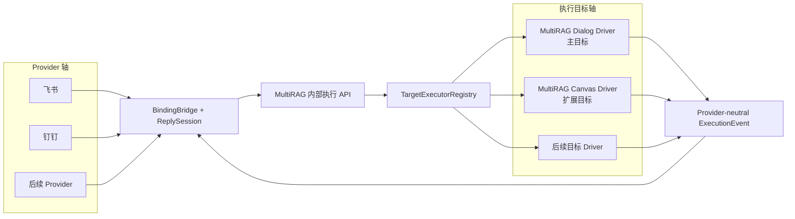
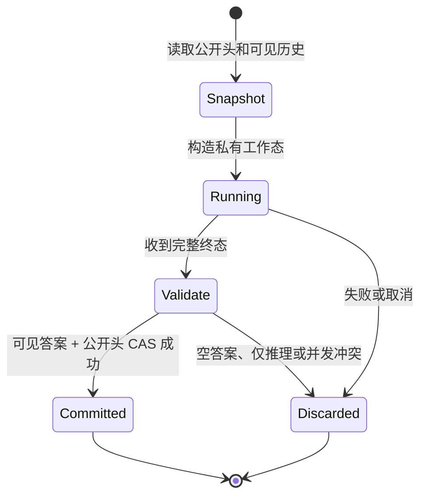
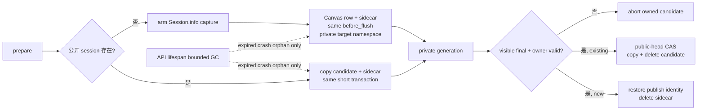

# MultiRAG Channel 执行架构

> 状态：EIM-U11 / CHN-X13、EIM-U12 / CHN-U14、EIM-U13 / CHN-U15 已实现，U15 迁移/API 重启已完成、现场 smoke 待完成；
> CHN-U16 是下一项，CHN-O9 紧随其后；EIM-F5 / CHN-X14 与 CHN-O14 挂起
> 决策：[`CHN-ADR-07`](DECISIONS.md#chn-adr-07--provider-与执行目标正交历史事务由目标驱动拥有)
> 核验日期：2026-08-10（外部版本与证据见
> [`VERSION_BASELINE`](../enterprise-identity-mcp/VERSION_BASELINE.md) 和
> [`REFERENCES`](../enterprise-identity-mcp/REFERENCES.md)）

本文是 Channel Provider、MultiRAG Dialog、MultiRAG Canvas 之间执行关系的单一事实来源。
飞书卡片、Markdown 和回调时序仍以
[`FEISHU_BOT_UX`](../enterprise-identity-mcp/FEISHU_BOT_UX.md) 为准；任务状态以
[`PROGRESS`](PROGRESS.md) 和 [`ROADMAP`](../enterprise-identity-mcp/ROADMAP.md) 为准。

## 1. 术语与项目口径

仓库内一律使用 MultiRAG 自己的实体名称：

- **MultiRAG Dialog / MultiRAG Canvas**：本项目的两类执行目标；Dialog 是主目标，Canvas 是扩展目标；
- **MultiRAG 对话表、会话表、函数、方法、路由、执行器**：只要实体位于本仓库，就按 MultiRAG
  命名，不称为“RAGFlow 的表/函数/方法”；
- **上游同步区**：为了降低后续同步成本而保持低差异的 MultiRAG 文件；它仍是 MultiRAG 代码，
  不是外部运行依赖；
- **RAGFlow 上游**：只在说明代码来源、许可证、外部 commit/PR、差异对比或兼容基线时使用。

不得用“RAGFlow completion”“RAGFlow 会话表”“调用 RAGFlow 数据库”描述本仓运行时。正确说法是
“MultiRAG Dialog completion”“MultiRAG Canvas 会话表”“MultiRAG API 访问本地数据库”；如需说明
来源，再单独补一句“该实现跟随 RAGFlow 上游某提交”。

## 2. 定案结论

1. **Provider 与执行目标是两条正交轴。** 飞书、钉钉和后续 Provider 只负责事件归一化、回复渲染
   和交互回调；Dialog、Canvas 和后续目标只负责业务执行与历史事务。
2. **Dialog 是默认和首要适配目标，Canvas 是独立扩展。** 新增 Provider 必须天然可绑定 Dialog；
   Canvas 能力不得反向成为 Provider 通用契约的必填项。
3. **所有 Provider 共用同一个 MultiRAG 执行入口和事件协议。** 禁止出现
   `provider == "feishu" and target_type == "multirag.canvas_agent"` 一类组合分支。
4. **运行中的内容不是已提交历史。** 生成只在私有工作态进行；只有完整终态、存在可见答案且公开
   会话头未变化时，才以 compare-and-swap（CAS）提交一次。
5. **历史事务由目标驱动拥有，不追求伪通用。** Dialog 当前使用内存工作副本与终态 CAS，Canvas
   当前使用隔离候选会话。二者共用生命周期语义，不要求持久化技巧永久相同；Canvas 后续形态由
   RAGFlow 上游可用执行缝和语义等价审计决定。
6. **Channel worker 不访问数据库。** worker 只调用 MultiRAG 内部执行 API 并消费 SSE；数据库访问
   只发生在 API 进程的目标驱动中，卡片 patch 和模型 delta 不触发数据库轮询。
7. **功能由能力交集决定。** 用户可见的停止、重新生成、反馈和渐进式展示，取 Provider 能力、
   目标能力与本次执行策略的交集；不支持时明确降级或隐藏，不能猜测。

## 3. 当前实现事实

已经正确的基础：

- `api/channel_execution/registry.py::TargetExecutorRegistry` 已按 `target_type` 注册目标执行器；
- `SqlAlchemyDialogTargetDriver` 与 `SqlAlchemyCanvasTargetDriver` 分别持有目标私有 history transaction，
  公共协议不再出现目标名称；
- `api/channels/runtime_client.py` 通过内部 HTTP/SSE 调用执行 API，worker 不直接访问 SQLAlchemy；
- managed worker 启动时为当前 binding generation 读取一次脱敏能力信封，进程重启允许重新读取；消息、
  delta 和卡片 patch 均不读取目标数据库；
- `ExecutionEvent` 与 `ReplySession` 已把目标输出和 Provider 渲染分开；
- binding 在服务端解析 tenant、target、revision 和 session，worker 不能覆盖这些字段。

EIM-U11 / CHN-X13、EIM-U12 / CHN-U14 与 EIM-U13 / CHN-U15 已收口的部分：

- 原 `ChannelSessionManager` 已删除；Dialog 与 Canvas 分别拥有不透明 prepared 类型和不同签名的
  `DialogHistoryTransaction` / `CanvasHistoryTransaction`；
- Provider、Target 与 RunPolicy 通过纯函数求交；Bridge 只签发有效 action ID，渲染与回调均二次校验；
- 完成后的 regenerate 与失败/取消后的 retry 已分开建模；未解析的 conditional capability、旧 API、
  预取异常和未知 Canvas 组件均 fail closed；
- 飞书在 `progressive_reply=false` 时回退 buffered reply，而不是继续假装流式能力存在。
- Dialog 生成只修改 detached working copy，完整终态按公开头执行一次 CAS；新会话终态才 INSERT；
- generation 8 worker 先部署 completed snapshot consumer，随后 Dialog producer 才 emit 权威终态正文。
- Canvas 私有候选由 MultiRAG 自有 `ChannelCanvasCandidate` sidecar 记录 owner、目标、公开头、状态、
  创建/过期时间和新会话发布身份；公开 Dialog/Canvas 表没有增加 Channel 私有列；
- 新 Canvas 会话仍由原有 completion 创建，但 API 执行层通过 execution-scoped `Session.info` 和
  `before_flush` 在同一次 flush 中附加所有权元数据，把 `dialog_id` 暂时移入候选自身命名空间并遮蔽
  发布身份；现有会话也使用自作用域 `dialog_id`，并在短事务内同时创建候选行和 sidecar；
- 候选提交/中止按不透明 owner token 定位，不再把名称/用户哨兵当作所有权证明；已有会话终态继续
  校验公开头 CAS，新会话终态恢复发布身份，两类路径都在成功终态删除 sidecar；
- TTL 清理已移出每次执行的准备热路径，由 API router lifespan 在启动时及之后周期性执行有界回收。

不能据此直接删除现有隔离层。当前 MultiRAG completion 在内部流结束时可能已经写入空答案、仅推理
内容或部分状态；在无副作用执行缝建立前改为直接写公开会话，会重新引入历史污染。

## 4. 两条正交轴



Provider 不知道 MultiRAG 对话表结构，目标驱动也不知道飞书 CardKit 或钉钉 webhook。二者唯一的
交点是受信执行命令、能力描述和脱敏后的执行事件。

## 5. 目标驱动契约

注册表继续以 `TargetExecutor` 为入口；具体 driver 在执行器内部拥有目标私有 history transaction。
当前公共形态为：

```python
class TargetExecutor(Protocol):
    target_type: str

    async def capabilities(self, context: TrustedChannelContext) -> TargetCapabilities: ...
    async def execute(
        self,
        context: TrustedChannelContext,
        command: ChannelExecutionCommand,
    ) -> AsyncIterator[ExecutionEvent]: ...


class DialogHistoryTransaction(Protocol):
    async def prepare(...) -> PreparedDialogExecution: ...
    async def commit(self, prepared: PreparedDialogExecution) -> str: ...
    async def abort(self, prepared: PreparedDialogExecution) -> None: ...


class CanvasHistoryTransaction(Protocol):
    async def prepare(...) -> PreparedCanvasExecution: ...
    async def commit(self, prepared: PreparedCanvasExecution, generated_session_id: str) -> str: ...
    async def abort(self, prepared: PreparedCanvasExecution, generated_session_id: str | None) -> None: ...
```

`PreparedCanvasExecution` 与 `PreparedDialogExecution` 是各自 driver 的私有工作态。对应实现是
`SqlAlchemyCanvasHistoryTransaction` 和 `SqlAlchemyDialogHistoryTransaction`；公共 Protocol 不再出现
`prepare_canvas()`、`complete_dialog()` 等具体目标方法。新增目标只注册新 executor/driver，不修改
既有 Provider。

## 6. 能力协商

### ProviderCapabilities

| 能力 | 含义 |
|---|---|
| `progressive_reply` | 可以渐进展示同一回复 |
| `interactive_actions` | 可以承载按钮或等价交互 |
| `cancel_control` | 可以向用户展示停止操作 |
| `feedback_control` | 可以承载有帮助/没帮助 |
| `threaded_reply` | 可以稳定回复到来源消息或话题 |

### TargetCapabilities

| 能力 | 含义 |
|---|---|
| `streaming` | 目标能产出增量事件 |
| `cancellable` | 当前阶段可合作取消；不代表副作用回滚 |
| `regeneration` | `always`、`conditional` 或 `never`；只有解析后的 `always` 可展示重新生成 |
| `retryable` | 失败/取消且未提交的 run 是否可安全重试；与 regenerate 分开 |
| `feedback` | Channel 可接收本轮低风险反馈；当前是卡片确认与脱敏事件，不宣称已有持久反馈仓 |
| `commit_mode` | `detached_cas`、`candidate_cas` 或未来模式 |
| `effect_class` | `generation_only`、`external_effects`、`unknown` |

最终 UI 能力为：

```text
visible_actions = ProviderCapabilities ∩ TargetCapabilities ∩ RunPolicy
```

Dialog 当前为 `detached_cas`，Canvas 仍为 `candidate_cas`。Canvas 的 `regeneration` 与 `retryable`
按已发布图动态判断：含工具、MCP、代码执行、写 SQL、未知组件、文档/Excel 持久输出，或带附件输出/
Memory 保存的 Message 时均 fail closed；纯文本 Message 可安全重放。停止按钮只表示停止等待后续输出，
不得宣称已撤销外部副作用。

能力通过 workload-authenticated 的
`GET /api/v1/internal/channel-bindings/{binding_id}/execution-capabilities` 下发。响应只含最终布尔能力，
不含 target type/id/revision、图结构、`commit_mode` 或 `effect_class`。worker 在每次启动时为当前 binding
generation 读取并缓存一次；同 generation 的崩溃重启会重新读取，正常消息、token、CardKit patch 不读取。
旧 API、超时或非法响应时继续正常回答，但关闭渐进式和所有交互动作。regenerate/retry 在执行 API
claim event 之前还会按 Target 与 RunPolicy 再授权；隐藏按钮不是唯一保护。

## 7. 历史事务模型

### 共同语义



- 公开历史只保存用户可见的 user/assistant transcript、引用和允许的结构化产物；
- reasoning、原始 tool trace、半轮回答、失败和取消结果不进入公开历史；
- `message` 在快照尾部追加问题；`regenerate` 在工作副本中撤回最新且问题匹配的一轮；
- 最终提交必须携带 `expected_head`（版本号或稳定指纹），条件不成立返回冲突，不覆盖后来消息；
- 公开会话只在终态写一次。流式事件、卡片刷新和反馈渲染不写对话历史。

这里的 terminal commit barrier 是“API 已把终态事务交给数据库提交”的边界。边界前的异常可以安全
abort 私有工作态；COMMIT 已发出但结果不明时，数据库内要么完整保持旧头、要么完整提交新头，但
API 不能猜测是哪一种，也不能再用补偿删除冒充回滚。若数据库已提交而 Provider 卡片交付失败，
跨存储结果同样未知。U15 GC 只会在 TTL 到期后删除仍带 sidecar 的孤儿候选，不判断卡片或 run 终态；
这类结果核对与恢复仍属于当前挂起的 CHN-O14。

### Dialog：`detached_cas`

Dialog 是主目标，U14 已收敛到：

1. 读取一次 MultiRAG Dialog 公开会话和目标配置；
2. 清洗为可见 transcript，在内存中构造 detached working copy；
3. 调用 MultiRAG Dialog 生成能力，但不让生成过程写公开会话或候选行；
4. 完整终态后，在一个事务中按 `expected_head` 更新公开会话；新会话则到终态才插入；
5. terminal commit barrier 前失败、取消、仅推理或冲突时丢弃内存副本，公开历史零写入。

这与 MultiRAG 后续跟进上游时的方向一致：同步区保持原有 Dialog 语义，Channel 的 operation、
CAS 和可见历史投影都留在 `api/channel_execution`。禁止给同步区函数新增 Channel 私有参数。

### Canvas：`candidate_cas`

当前 MultiRAG Canvas completion 自己读取和持久化会话，尚无等价的无落库执行端口，因此：

1. 保留数据库候选作为**Canvas 专属兼容策略**，不再伪装成所有目标的通用方案；
2. `usr_ai.t_ai_channel_canvas_candidates` 是 MultiRAG 自有 sidecar，显式保存唯一 `owner_token`、
   candidate/target/public session、源头指纹、`active|finalizing` 状态、过期时间，以及新会话最终需要
   恢复的发布身份；公开 Canvas/Dialog 表不增加 Channel 私有列；
3. 新会话 prepare 先在当前 API `AsyncSession` 上注册 execution-scoped capture；原有 Canvas
   completion 创建会话时，全局 `before_flush` observer 只消费这次 capture，把候选行与 sidecar 放入
   **同一次 flush/commit**，并在终态前把 `dialog_id` 放入候选自身命名空间、用兼容哨兵遮蔽发布
   身份。现有会话的复制候选与 sidecar 也在同一短事务创建。普通 Canvas list/delete-all 只按真实
   target 命名空间操作，因此不会发现或误删活跃候选；
4. commit/abort 只能用 prepared state 中的不透明 owner token 找回 sidecar。已有会话提交按
   candidate → public → metadata 的固定锁序校验 `expected_head`，复制允许字段后删除候选；新会话
   提交恢复真实 target 与 sidecar 保存的发布身份并删除 metadata。失败/取消只删除自己拥有的候选；
   修改兼容哨兵不能转移所有权；
5. API router lifespan 启动一个 API-local collector：启动即执行，随后按带 jitter 的间隔周期运行；
   每个 batch 使用新 `AsyncSession`、共享条数预算、`LIMIT` 和
   `FOR UPDATE ... SKIP LOCKED`，每个 cycle 还有最大 batch 数。多个 API 实例以候选行作为锁锚点，
   无需 Redis leader，也不会阻塞正在终态提交的候选；
6. collector 优先按 sidecar 的数据库过期时间回收显式 Canvas 候选；剩余预算只匹配完整旧哨兵组合，
   兼容回收无 sidecar 的旧 Canvas 候选和 U14 前遗留的 Dialog `[channel-candidate]`。近似命名、身份
   不一致或未过期行不会被删除；普通轮次失败记录脱敏日志并留给下一周期，task cancellation 继续传播；
7. TTL 仅是 API/进程崩溃后孤儿候选的**安全网**，不是运行 lease、心跳、取消或 terminal barrier。
   活跃 run 的上限必须短于 TTL；正常成功/失败仍由执行事务立即 commit/abort；
8. candidate 是当前上游持久化契约的兼容桥，不是承诺永久保留的终态，也不是必须删除的临时补丁；
   后续按 [CHN-ADR-08](DECISIONS.md#chn-adr-08--canvas-与-channel-演进以上游同步为主只在适配层吸收现代执行不变量)
   的上游事实决策门选择继续 candidate、评估 detached CAS 或适配上游原生 checkpoint runtime。



### 长期演进：RAGFlow upstream-first，现代不变量驱动

“Canvas 是扩展目标”只表示 Canvas 特性不得反向成为所有 Provider 的必填契约，不表示 MultiRAG
要降低 Canvas 的上游跟进优先级或独立重写 Canvas 内核。MultiRAG 后续仍以持续跟进 RAGFlow 的
Canvas、Agent 与 Channel 源码为主线；本地优化优先位于目标 driver、执行编排和 Provider 适配边界。

现代项目用于校准以下不变量：Thread/公开历史与 Run/Execution 分离；中间 checkpoint/event 不冒充
已完成消息；完整终态才发布；取消与成功终态通过 CAS 竞争；外部操作需幂等且未知副作用不得自动
重放。这些不变量可以落在不同的上游执行形态上，不要求 MultiRAG 先替换 RAGFlow Canvas runtime。

| RAGFlow 上游演进事实 | Channel 目标 driver 的选择 | 对 Provider / wire 的影响 |
|---|---|---|
| Canvas completion 继续自行持久化 | 保留 U15 `candidate_cas` 反腐层 | 无 |
| 提供稳定 no-store/snapshot 输入输出 | 做等价审计后，才评估切换 `detached_cas` | 无 |
| 提供原生 run/checkpoint/resume | 优先适配上游 runtime，评估删除 candidate | 仍保持目标中立 |
| 没有稳定新执行缝 | 不自研平行 Canvas runtime，继续 candidate | 无 |

所谓 `CanvasExecutionPort` 只是对“稳定、无 Channel 私参的目标执行缝”的条件性称呼，不承诺一定
自研这个接口。每次上游跟进都要记录来源 SHA、同步区差异、本地适配点、被保护的不变量、契约测试
和本地兼容层退出条件；上游出现等价能力时优先删除兼容债。具体决策见 CHN-ADR-08。EIM-F5 /
CHN-X14 当前挂起，待 Channel 稳定且用户恢复从约 4 月 24 日上游基线逐 commit 跟进时，随正常
同步节奏启动，而不是抢占当前稳定化工作。

## 8. Run 生命周期与会话历史分离

每次尝试拥有新的 `run_id`。重新生成创建新 run，并记录 `supersedes_run_id` 或等价来源关系；它
不是把旧问题当普通消息再次追加。`queued/running/final/error/cancelled` 是 run 状态，不是 Dialog
或 Canvas 会话消息。

当前首期继续由 worker 持有有界队列，因为它能以最低延迟驱动 Provider 卡片；但这只是进程内
体验状态。若要支持 worker 重启恢复、跨实例取消或长期可查询状态，按 CHN-O14 增加 API 侧持久化
run ledger：

- worker 仍只通过内部 API/SSE，不直连数据库；
- 每个会话最多一个 `queued/running` run 的约束由数据库唯一条件兜底，内存检查只是快路径；
- 取消请求和成功终态使用竞争 CAS，已接受的取消不能被迟到 success 覆盖；
- run 事件和目标历史分表，不能把运行状态塞进 Dialog/Canvas 消息数组；
- 不按 token 写 run 表，只在有限状态迁移和终态写入。

CHN-O14 当前保持挂起。在明确需要重启恢复前，不提前引入完整 durable workflow runtime；MultiRAG
只吸收其一致性不变量。Canvas 目标内部未来可能采用的 workflow checkpoint 负责目标执行恢复，
CHN-O14 run ledger 负责跨 Provider 的队列、取消与交付协调；U15 sidecar 只描述候选所有权，三者
不能互相替代。

### 正常优雅停机边界（CHN-U16）

正常 SIGTERM、supervisor generation 切换或显式关闭属于当前进程能够协作完成的生命周期，不需要
durable run ledger。CHN-U16 在现有 worker → Bridge → ReplySession 链内固定以下行为：停止接收后，
已经展示 queued 卡但尚未开始的请求进入明确终态且不得启动 MultiRAG 执行；running 请求关闭现有
execution stream，并按既有安全取消语义终态化回复卡；跨层测试同时证明卡片状态与“执行从未启动”
两个事实，不能只断言 task 被 cancel。

这项任务不承诺 kill -9、进程崩溃、机器掉电、跨实例接管或重启后恢复。上述场景没有合作式清理
窗口，仍属于挂起的 CHN-O14；不得借 U16 引入数据库 run ledger、worker 数据库访问或第二套恢复
协议。

## 9. 数据库 I/O 预算

| 路径 | 目标预算 | 禁止项 |
|---|---|---|
| Dialog 已有会话 | 准备阶段一次快照读；终态一次 CAS update | 候选 insert/delete、每 delta 写库 |
| Dialog 新会话 | 目标配置读；终态一次 insert | 开始生成就发布空会话 |
| Canvas 已有会话 | 快照读；候选 + sidecar 同短事务写；终态 CAS copy/delete | 每请求全表/目标范围 TTL 清理 |
| Canvas 新会话 | 原生会话行 + sidecar 同 flush；终态恢复发布身份 | 半成品直接成为公开会话 |
| Canvas 候选 GC | API 启动/周期执行；每 batch 新 session、共享 `LIMIT`、`SKIP LOCKED`；每 cycle 有上限 | worker 查库、Redis leader、无界扫描、把 TTL 当取消 |
| capability preflight | 每次 worker 启动、每个 binding generation 一次脱敏读取；动作时按目标安全性再授权 | 每消息、每 token、每卡片 patch 查询 |
| Provider 渲染 | 0 次目标历史 SQL | 为卡片 patch 轮询数据库 |
| run ledger（后续） | 状态迁移时小次数 CAS | 每 token、每 CardKit sequence 写库 |

desired runtime 的控制面轮询是另一条运维链路，不属于对话执行热路径，不能与上述 I/O 混为一谈。

## 10. 重新生成的产品语义

Dialog 和 Canvas 当前都是线性会话，因此只开放“重新生成最新完成轮次”：

1. 新建 run；
2. 以原 user message 之前的可见历史为快照；
3. 重新执行原问题；
4. 成功后原子替换尾部 user/assistant 对；
5. 后续已有新消息、问题不匹配或公开头变化时拒绝；
6. 失败/取消卡上的按钮是 retry，因为失败轮次没有提交。

Open WebUI 一类消息树能支持任意节点分支，但 MultiRAG 当前 Dialog/Canvas 的公开会话仍是线性数组。
在目标模型、前端和 Channel 都没有原生 branch ID 前，不引入只有 Channel 理解的半套分支 DAG。
未来如支持分支，应新增独立能力与契约，不改变这里的最新轮次语义。

## 11. 实施顺序

| 顺序 | EIM / CHN | 单 PR 目标 | 行为风险 |
|---:|---|---|---|
| 1 | EIM-U11 / CHN-X13 | ✅ 已完成：Provider/Target capabilities、启动预取和目标私有 driver；删除 `ChannelSessionManager`，保持目标执行行为等价 | 低 |
| 2 | EIM-U12 / CHN-U14 | ✅ generation 8 worker 先部署 consumer；随后 emit 权威终态快照并切换 Dialog detached working copy + 单次 CAS | 中 |
| 3 | EIM-U13 / CHN-U15 | ✅ 已实现：Canvas sidecar 显式所有权；新行同 flush 捕获；API bounded GC 移出请求热路径 | 中，涉及 DB |
| 4 | CHN-U15 rollout gate | 🔵 数据库迁移、API/supervisor 重启与 healthz 已确认；还需完成飞书 Dialog/Canvas 现场 smoke | 中，现场验证 |
| 5 | CHN-U16 | ⬜ 下一项：正常优雅停机时终态化 queued/running 卡，queued 项不得启动执行；补 worker → Bridge → ReplySession 跨层测试 | 中，生命周期 |
| 6 | CHN-O9 | ⬜ U16 后紧接：补 binding 级消息量、丢弃原因与时延分位，使现场浸泡有可聚合证据 | 低，运维可见性 |
| 7 | EIM-F5 / CHN-X14 | ⏸ 挂起：Channel 稳定且用户恢复从约 4 月 24 日基线逐 commit 跟进时，随同步做只读差异审计 | 低，只读 |
| 8 | EIM-O4 / CHN-O14 | ⏸ 挂起：仅在确认需要重启恢复后增加 Channel durable run ledger、单活约束和 cancel/final CAS；不复制 Canvas checkpoint runtime | 高，需独立 ADR 复核 |

X13 不改变 Provider runtime 私有 DTO 或执行 SSE wire，并使用独立 additive private preflight。
U14 在既有 `message_completed.content` 可选字段上启用权威终态快照，并严格完成两步：先让 worker
接受字段、在 ReplySession 内整体替换且保持线格逐字节不变；generation 8 部署确认后 Dialog
producer 才 emit。旧 API 时新 worker 回退 delta，旧 worker 遇到新字段会忽略但继续消费原 delta。
后续修改 `RuntimeBindingConfig` 或执行 SSE wire仍必须按 CHN-ADR-06 拆分。

## 12. 验收不变量

- 飞书和钉钉针对同一目标执行相同的目标驱动，不存在 Provider × Target 组合实现；
- Dialog/Canvas 的正常消息与重新生成均满足 terminal commit barrier 前失败、取消、仅推理不改公开历史；
- 同一公开头上的并发提交最多一个成功，失败方不覆盖后来消息；
- 新会话在首个完整终态前不进入普通 target list/delete-all 命名空间，session mapping 只在发布后写入；
- Dialog 热路径没有候选 insert/delete；Canvas 热路径没有 TTL prune，TTL 只清理 crash orphan；
- Canvas owner/create/state/expiry 位于 MultiRAG sidecar，新会话行与 metadata 同 flush；公开
  Dialog/Canvas 表无 Channel 私有列；
- GC 只在 API 进程启动/周期运行且严格有界，多实例用 candidate-row `SKIP LOCKED` 协调；旧
  Canvas/Dialog 只按完整兼容哨兵回收；
- worker 导入图中没有 SQLAlchemy 和 `api.db`，并继续只走内部 API/SSE；
- Provider capability、Target capability 和实际按钮/错误行为有契约测试；
- 上游同步区相对移植基线不新增 Channel 私有参数或历史分支；
- RAGFlow 上游变化只在单一目标适配点消化；不复制完整 Canvas/Agent 编排，不长期并行维护本地与
  上游两套 runtime；每项本地兼容层都有上游来源、保护不变量、测试和退出条件；
- DB 改动执行 `make verify` + `make integration`，其余改动至少执行 `make verify`。
