# 端到端架构与运行时流程

精确 DTO、表、JWT 和错误码见 [CONTRACTS](CONTRACTS.md)。本文件只解释组件关系、信任边界、
时序和失败语义。

---

## 1. 系统与信任边界

下图是端到端目标，不表示每条边都已上线；当前实现/目标的分界以本节后的任务标记和
[ROADMAP](ROADMAP.md) 为准。

```mermaid
flowchart LR
    O["Customer Organization\n首期 1:1 Tenant"] --> U["企业员工"]
    O --> T["MultiRAG Tenant"]
    T --> PA["Independent Provider Account"]
    PA --> L["IdentityProviderChannelLink"]
    L --> F["飞书企业自建应用 / Channel"]
    U --> F
    F -->|"长连接事件：不可信 actor assertion"| CW["MultiRAG Channel Worker"]
    CW -->|"binding-scoped authenticated command"| CE["Channel Execution"]
    CE --> ID["Enterprise Identity Service"]
    ID --> DB[("User / UserTenant / ExternalIdentity")]
    ID -.->|"首次、过期、敏感操作"| FC["Feishu Contact V3"]
    ID -.->|"可选 enterprise subject"| OA["OA / HR Resolver"]
    ID --> P["Trusted Principal"]
    P --> AG["Agent / RAG / Memory / Workflow"]
    AG --> TI["MCP Token Issuer"]
    TI -->|"short-lived audience-bound bearer"| GW["of_mcp Gateway"]
    GW --> AZ["Principal + Scope + Audit Middleware"]
    AZ --> MS["MCP Service / Tool"]
    MS -->|"service credential; no token passthrough"| BS["Jira / ERP / HR / Business API"]
```

信任级别：

| 边界 | 输入 | 信任结论 |
|---|---|---|
| 飞书 -> Channel Worker | event、open_id、chat/message | SDK 建连可信，但字段仍只是外部身份断言 |
| Worker -> Channel Execution | command + workload token | worker 身份/binding generation 可信；actor 仍未提升 |
| Identity Service -> Principal | DB binding + Contact 验证 + tenant policy | 平台可用的可信 Principal |
| MultiRAG -> of_mcp | OAuth bearer | 只在签名、issuer、audience、scope、exp 全部通过后可信 |
| of_mcp -> 下游业务 | 工具参数 + Principal | 工具参数不提供身份；业务权限仍由 service/PDP 判定 |

`CustomerOrganization` 是真实客户企业/合同与治理边界的目标术语。首期它与 `Tenant` 保持 1:1，
只用于解释架构，不落表、不进入 JWT claim/API，也不参与运行时路由。当前机器约束仍由
`IdentityProviderTenant -> Tenant` 承担；未来集团多 Tenant 必须另立 ADR 和迁移。

---

## 2. 组件归属

### MultiRAG

#### Channel transport

负责飞书协议、消息/卡片收发、队列、去重、会话顺序；不创建 Principal。

Transport 内部再拆两层：

```text
Inbound adapter
  -> 白名单规范化：identity/thread/mention/content/attachment
  -> Channel Execution async event stream

Progressive reply adapter
  -> transport-neutral ReplySession
  -> 飞书 reaction/CardKit/post/text renderer
```

执行层产生的 `message_delta` 不得在 Channel client 中等待完整回答后才交给 Provider；若
`message_completed` 携带引用装饰后的权威正文，Bridge 通过 `ReplySession.replace()` 整体校正后再
完成。CardKit 创建、节流、sequence、最终 flush 和降级属于飞书 renderer；业务 bridge 只理解
ReplySession 状态。该体验链不依赖 transport 从 `lark-oapi.ws.Client` 迁移到 `lark-channel-sdk`，完整设计见
[FEISHU_BOT_UX](FEISHU_BOT_UX.md)。

EIM-C1 / CHN-X5 已让 Channel Execution private consumer tolerate 可选 `ExternalIdentityAssertion`；
EIM-C2 / CHN-X6 又让飞书 producer emit 对应的 transport-neutral `IncomingIdentityAssertion`。飞书
adapter 要求事件 header tenant 与 sender open ID，保留存在的 user/union ID；可选 sender tenant 必须
匹配 header tenant，可选 header app 只与本地配置账户核对且不进入 assertion。Bridge、regenerate 与
runtime client 透传同一对象，legacy `provider/subject/conversation` 仍必填，subject 保持 open ID，无
assertion 的序列化线格不新增 null。API 继续拒绝重复 kind、Provider 不一致以及
`tenant_id/principal_id/app_id/provider_account_key/role/scopes/token` 等 authority 夹带。

`896c582d` 的定向、兼容、完整门禁与安全扫描均通过；supervisor/worker 重启后，真实飞书消息出现
identity/tenant presence、三种 identifier kind 与 count 的脱敏结构日志，并由 private API HTTP 200 完成
执行。execution resolver 仍不读取合法 assertion，Canvas 仍为 `user_id=""`、`exp_user_id=null`，10 张
EIM sidecar 零写入。
C3 verified consume 和 C4 legacy remove 均未发生；公开 `channel-api/v1` 不受这条 private 加法影响。
因此这里描述的是已部署的 tolerate + emit 边界，不是已部署的身份解析或 Principal 链。

#### Channel control/runtime

负责加密凭据、tenant-owned binding、supervisor/worker 和 runtime 状态。Provider Account 是身份
控制面的独立企业连接，Channel 通过 tenant/provider-safe 的 `IdentityProviderChannelLink` 引用它；
`provider account -> link -> channel/binding -> tenant_id` 是服务端配置，不由飞书消息决定。

EIM-I2.1 只解耦持久化关系。飞书 `app_secret` 暂时仍归 `ChannelSecret`，所以 I4 调用 Provider API
必须沿 account 的唯一 link 精确取得 credential；无 link、多 link 或 scope 不一致 fail closed。通用
Provider credential vault 是后续独立任务，不能把 I2.1 描述成凭据已经脱离 Channel。

EIM-I6.1 / CHN-X17 已提供 Channel-first 的受控企业连接 onboarding，而不是新增一套明文凭据入口：

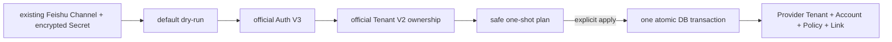

读 session 在解密前关闭，Auth/Tenant 网络调用不持数据库事务；apply 再锁定并复核 Channel/Secret
generation、tenant/provider ownership、policy 与 link。两个真实 Channel 已在飞书补齐企业信息只读
权限并重新发布后证明属于同一外部企业，最终允许同 Tenant 下两个独立 Provider Account。这个控制面
不查询 Contact、不创建 User/ExternalIdentity，也不改变下文 C3 尚未 consume assertion 的事实。

#### Enterprise Identity Service

EIM-I3 当前包边界：

```text
api/identity/
├── onboarding_contracts.py
├── onboarding.py
├── contracts.py
├── principal.py
├── legacy_owner.py
├── policy.py
├── provisioning_contracts.py
├── provisioning.py
├── provisioning_repository.py
├── service.py
├── validation.py
└── repository.py
```

I4 已新增 Provider 与过渡 credential composition，I5 再加 enterprise-subject adapter：

```text
api/identity/
├── providers/
│   ├── contracts.py
│   ├── runtime.py
│   ├── lark_oapi.py
│   └── feishu.py
└── enterprise_subjects/
    ├── feishu_employee_number.py
    └── oa.py

api/identity_adapters/
├── channel_credentials.py
└── channel_onboarding.py
```

当前 repository 按仓库规范 async-first，使用 `AsyncSession`。I3 的 `IdentityService` 只依赖框架无关
`IdentityLookupRepository` 与 provisioning policy resolver；I6 的 `IdentityProvisioningService` 只依赖
完整事务 use-case port、同一个权威 policy resolver 与 HMAC codec。I3 不存在 Provider client，也不
访问真实飞书/OA；I6 同样只消费 I4 已验证 proof，不在数据库事务中发 Provider 网络请求。

I4 没有把飞书 SDK 塞回 I3 service/repository：`FeishuEnterpriseIdentityProvider` 仍只消费
`ProviderContext + ExternalIdentityAssertion + ProviderCredentialResolver`。唯一知道 ChannelSecret
过渡所有权的 `ChannelProviderCredentialResolver` 位于 `api.identity_adapters`，避免 identity
domain 依赖 Channel control plane。它用单 SQL 从精确 account 走唯一 link 到
Channel/Secret，并把 `ChannelSecret.version` 投影为 credential generation；不会修改或缓存数据库
credential。

Provider runtime 的真实外部链是：

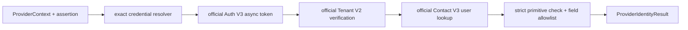

SDK 仅在首次调用时 lazy import。I4 显式传递 project-scoped tenant token，不走 SDK 同步/
global TokenManager cold path。Auth V3 使用官方 generated async request/resource/transport，再由项目
adapter 严格解析 live 顶层 wire response；Tenant V2/Contact V3 保持官方 generated typed nested
response。I4.1 已兼容 1.7.2 生成 Auth response 期待 `data`、实际 token/expire 位于顶层的差异。
一次 account generation 由 account id/revision/scope marker + Secret version + domain
组成，同 generation 的 token/directory cold miss single-flight，跨 generation 绝不共享。有界 cache
使用 300 秒正向、30 秒负向 TTL，token 预留 600 秒安全窗；Contact 按 account
15 calls/s，排队超过 2 秒即 fail closed。一个 waiter 取消不会取消共享 producer，失败结果
不进 cache。

三个 SDK endpoint 都保留 HTTP status 与 business code envelope；非 2xx + code 0 仍是失败。
Auth/Tenant 位于 credential/tenant ownership 控制面，不能产生 I6 会消费的 identity
`not_found/not_in_scope`；只有 Contact 用户查询面可以。业务码按 endpoint stage 分类，不能
全局复用：`10003` 不是 credential code，Auth credential mismatch 当前为 `10015/20002`。
Contact 只有 code 0 才能使用 HTTP 403/404 fallback；未知/瞬时非零 code 不得触发 JIT。

I4 自身不把 Provider proof 写入 ExternalIdentity/Alias，也不会建 User/UserTenant 或构造 Principal。
I6 现已在独立事务层消费该 proof 并完成三种 provisioning 写入；P1 的 Principal builder 已存在，
但 C3 尚未把 Channel assertion、Provider verification、I6 事务与该 builder 组合接线。

核心入口接收服务端构造的 Provider Context，而不是 `channel_id`。Channel adapter 先解析唯一 link，
再调用同一核心接口；目录事件、管理员预绑定、Web OAuth 或未来 SSO 因而可以复用身份服务而不伪造
聊天入口。

I3 当前解析路径是：

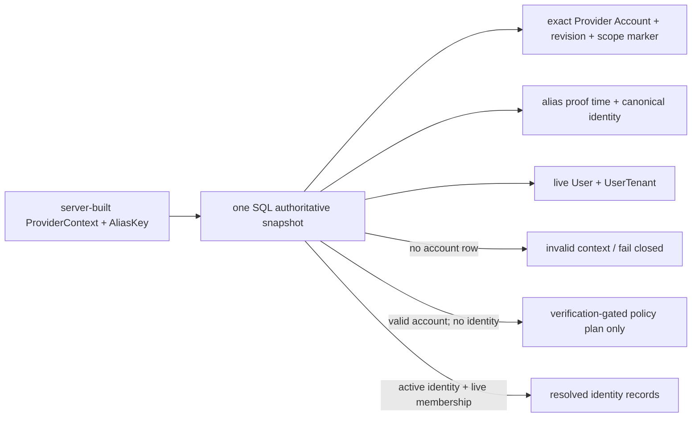

`None` 只表示 Provider Context 无效；有效 account 下 alias miss 由 `identity=None` 明确表达。三种
provisioning mode 都只返回需要 Provider verification 的 plan，不在 I3 开户、绑定、激活或构造
Principal。account revision 与 `last_scope_change_at` 共同绑定 ProviderContext；read snapshot 同时投影
`alias_verified_at`。scope marker 晚于 alias proof 时要求 Provider 重验；若 identity 已是
conflict/revoked 终态，则终态结论优先，不能被 freshness 降格或提示可重验。

写权限再拆为三类 capability：ordinary mutation 只能 pending identity insert/单向收紧 CAS；verified
identity mutation 独占 alias 新建/只前进刷新和显式 activation；provider-account control 独占
health/scope/event marker CAS。verified ownership 仍是独立 port，普通 `IdentityService` 无法取得任何
写 capability；事务 commit/rollback 由上层用例拥有。省略 health command 的 scope/event 时间会保留
旧值，显式时间不得倒退；Core DML 显式写审计时间，输入和 driver 异常在 repository 边界稳定脱敏。

I6 不是把这些 I3 单表 capability 拼成一串外部可见半事务，而是另设两个完整 use-case：

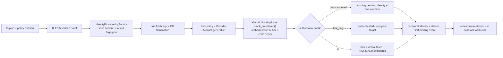

policy 是每 Tenant 显式创建、revisioned 的数据库事实，TTL 固定在 60～900 秒；缺 policy 不采用默认
mode。link code 由 192-bit CSPRNG 生成，raw value 只返回一次，表内只存 HMAC digest/key id 与
policy/account generation。新签发撤销同 account + target 的旧 pending code，scope/revision 变化使
旧码失效。`IdentityBindingEvent` 只记录一个 ExternalIdentity 的首次绑定，使用独立 domain 的 keyed
request digest；普通 revalidation 不篡改首次事实。

事务开始时间只可用于廉价初筛。policy/account/canonical/target/grant 的所有阻塞锁取得后，repository
必须用 PostgreSQL `clock_timestamp()` 重取真实墙钟，重验 proof 不超过 5 分钟且 pending code 未
过期；首次写入、grant consume/revoke 与 event 都使用该 post-lock time，锁等待不能延长有效窗口。

preprovisioned 不开户；link_only 的 target 只来自当前已认证 Principal 的 grant；JIT 只创建
external-only User 和 active `UserTenant(NORMAL)`。姓名、邮箱、手机号、employee_no 都不参与匹配。
“显式 link”只是 ExternalIdentity 到既有 User 的绑定并可能 local→hybrid，不是两个 User 及其业务
数据的 merge。inactive/conflict/revoked identity 不自动恢复；只有 canonical identity 仍 active、只是
alias proof 因 scope marker 过旧时，fresh I4 proof 才能刷新 alias 并返回 `ALREADY_BOUND`。

I6 schema 以全状态 reverse identity unique 和 active membership partial unique 作为并发最后防线；
User/UserTenant/identity/alias/code/event 同事务提交或全部回滚。I6.1 已增加独立运维 onboarding adapter/
CLI，但没有公开 HTTP/UI 或消息侧 C3 adapter；它不写 I5 EnterpriseSubject，也不把 Principal 传入
Agent 或 FastMCP。

#### Principal construction

EIM-P1 已在 `api.identity.principal` 建立唯一的 request-scoped immutable Principal 与
AuthenticationContext。Principal 只有 platform user、tenant、认证证据、可选企业主体和
展示名；不携 role/groups/scopes/email/token/Provider 原始标识，也不允许 direct construction。

I3 `RESOLVED` 结果只能在进程内 trusted adapter 经 builder 提升；不一致的 user/tenant/provider/
proof time、待 provisioning 或需重验状态均 fail closed。存量 Web/API 凭据通过独立
`legacy_owner` adapter 每请求活查用户和唯一 personal OWNER Tenant；它只保留现有兼容
语义，不是多 Tenant 动态选择器。`api.utils.api_utils.Principal` 只 re-export 同一领域 class。

P1 尚未把 Principal 经 Channel Execution、Agent、Memory、Workflow 和 MCP tool call 全链传递；
这属于 C3/P2。现有 sync `Depends(manager)` 也仍可能暴露 ORM User。目标态仍要求
模型看不到或修改不了 Principal，但不能因 P1 完成就宣称传播链已打通。

#### MCP Token Issuer

逻辑上是 Authorization Server：根据已认证 Principal、目标 MCP resource、Agent 允许的工具和
租户策略签发短 token。首期与 MultiRAG 同部署，但包和配置独立。

#### MCP Host/Client

Agent Runtime 是出站 MCP Host，按每次工具请求携带当前 Principal，通过 credential provider 获取
目标 resource 的短期 token，再由标准 MCP Client 调用 `of_mcp`。Client 不缓存某位用户的 bearer，
不把身份写进静态 server headers，也不依赖连接状态恢复用户上下文。

当工具返回多轮输入请求时，Host 拥有 InteractionSession、用户呈现、响应校验和恢复调用；MCP
service 不直接依赖飞书。详细状态与字段见 [CONTRACTS §9](CONTRACTS.md#9-interactionconfirmation-与幂等契约)。

#### MultiRAG RAG MCP Resource Server

MultiRAG 还通过独立的入站 MCP Resource Server 向外部 Client 暴露数据集和检索能力。这是与上面的
出站 Host/Client 不同的安全和发布面：

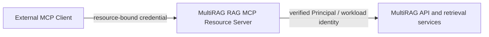

入站 Server 有自己的 canonical resource、audience、scope policy、兼容端点和回滚计划。它不能
复用发给 `of_mcp` 的 token，也不能把收到的 bearer 不加区分地透传到 MultiRAG 后端。当前实现事实
和尚未实现项只在 [`mcp/README.md`](../../mcp/README.md) 维护；本文件只定义目标边界。

### of_mcp

#### Gateway resource server

统一拥有 `auth=`、protected-resource metadata、JWKS verifier、scope challenge、审计和 OTel。
service 的 `build_server()` 不自行决定 auth，保持 mount/proxy 等价。

#### Service authorization

平台中间件完成 token 通用校验；每个服务声明 scope 和业务授权 adapter。工具通过 dependency
获得 Principal，不在 input schema 暴露身份参数。

---

## 3. 首次私聊：JIT 身份解析（I3/I4/I6 与 C1/C2 已有，C3→P2 接线仍是目标）

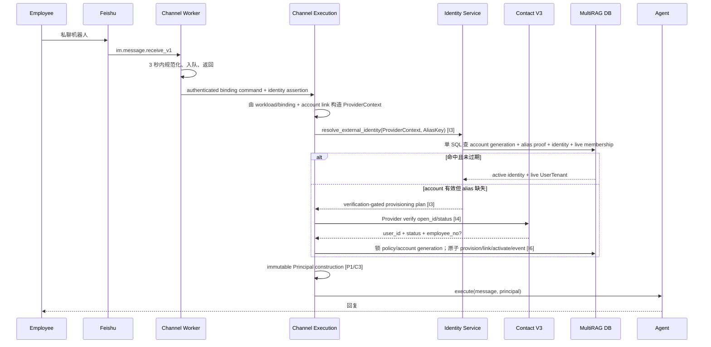

关键规则：

- Contact 调用在 SDK callback 之外；
- I3 的 `IdentityService` 不调用 Contact；I4 Provider adapter 在组合层消费 I3 返回的验证计划；
- ProviderContext 必须携最新 account revision + scope marker；旧 alias proof 先进入 Provider 重验，
  verified mutation 只允许 proof 时间前进，绝不倒退已有 alias verification；
- I3 plan 携权威 policy revision；I6 重新锁定 mode/revision，缺 policy 或 generation 漂移 fail closed；
- I4 同一 directory lookup generation 使用 single-flight 降低外部放大；I6 仍锁 canonical/target 并依赖
  数据库唯一约束作为并发首次消息的最终保护，不能把 cache/single-flight 当正确性锁；
- JIT 的 `User`、`UserTenant(NORMAL)`、`ExternalIdentity`、alias 与 first-binding event 要么一起提交，
  要么全部回滚；preprovisioned 不开户，link_only target 只来自 grant；
- identity insert 固定为 `pending_link`，只有本次权威 Provider 验证成功后的显式 activation 才能进入
  `active`；`conflict/revoked` 不能因新消息自动恢复；
- Provider 返回 active 不自动授予管理员角色；
- I6 不消费 `employee_no` 或写 EnterpriseSubject；I5 尚未实现。enterprise subject 缺失时，高风险
  MCP 仍一律拒绝。

截至 EIM-I6.1 完成，图中已有 `ProviderContext/AliasKey`、单 SQL snapshot、携 policy revision
的三态 plan、Auth V3 -> Tenant V2 -> Contact V3 Provider proof、权威 policy/link/event schema、三种
原子 provisioning transaction 与 Principal builder。I4.1 的 production adapter live sandbox 与全量
门禁已收口；I6 完整门禁也已全绿。I6.1 又完成双 Channel Auth/Tenant ownership 验证与原子
Provider Tenant/Account/Policy/Link 落库。C1 tolerate 与 C2 emit 均已完成真实飞书活体，但 resolver 仍不
consume assertion、`principal_id=None`，Contact/I3/I6 没有从消息执行链接线，identity sidecar 也无写入。
下一条是 C3 verified consume，之后 P2 才传播 Principal；不能把 C2 的 structured transport 描述为
飞书身份端到端已上线。

---

## 4. 后续消息快速路径

```text
event -> binding tenant -> open_id alias cache/DB -> active platform_user_id -> Principal -> Agent
```

不调用 Contact/OA 的条件：

- alias 存在；
- link 状态 active；
- `last_verified_at` 未超过租户普通对话 TTL；
- 没有待处理的 Contact/scope 失效标记；
- 当前操作不要求 step-up freshness。

建议初始 TTL：

| 场景 | 建议 | 说明 |
|---|---|---|
| 普通 RAG | 24 小时 | 事件是主失效机制，TTL 是兜底 |
| 只读内部 MCP | 1 小时内重新确认身份状态 | scope/业务授权仍实时 |
| 高风险副作用 | 15 分钟内身份状态 + 本次用户确认 | 不等于 token 有效期 |
| MCP access token | 5 分钟 | audience-bound，不使用 refresh token |

这些值必须可配置并用时间源注入测试，不能散落 magic number。

---

## 5. Contact 事件失效流程

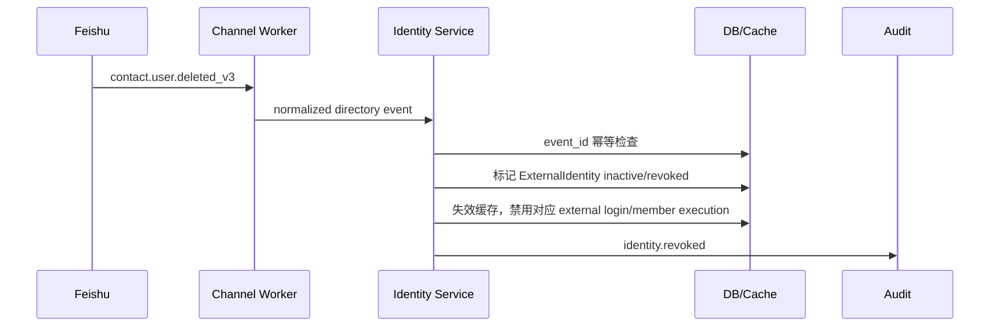

事件处理不能物理删除 identity link。保留历史用于审计、避免工号/open_id 被复用后静默继承旧
权限。员工重新加入必须产生明确 reactivation/link decision。

`contact.scope.updated_v3` 不试图猜出哪些用户受影响：先 bump provider account 的
`identity_revision` 并失效该 account 下 cache；下一次使用逐个重验。高风险操作立即重验。

---

## 6. MCP 委托调用

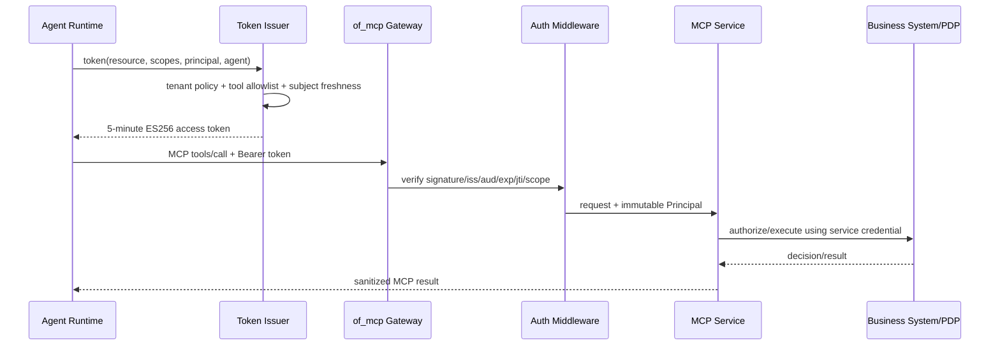

MultiRAG 不能因为模型选择了某个工具就自动授予对应 scope。可签发 scopes 的上限是：

```text
tenant policy ∩ agent/tool policy ∩ user/platform eligibility ∩ service declared scopes
```

业务系统仍可拒绝。of_mcp 返回：缺身份/无效 token 为 401，scope 不足为 403/标准 scope
challenge，业务拒绝是可审计的 tool error，不泄露内部策略细节。

### MCP 多轮交互与结构化结果

MCP 2026 Multi-Round-Trip Request 的通用承载流程是：

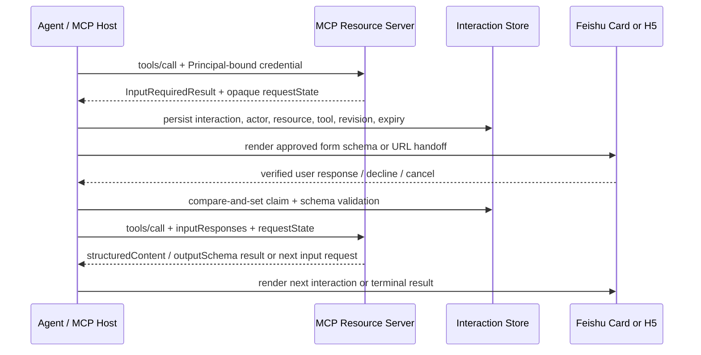

关键边界：

- InteractionSession 与 ReplySession 分离；前者可跨请求恢复输入，后者只交付单次回答；
- `requestState` 仅作为不透明 continuation 保存和原样回传，不能生成 Principal、tenant 或 scope；
- 表单字段由已批准的 MCP schema 映射，用户响应仍由 resource server 再验证；
- `structuredContent` 在客户端按 `outputSchema` 校验后进入类型化执行事件，不能只转成模型文本再猜测；
- decline、cancel、过期和 schema/revision 不匹配都是显式终态，不自动改写为普通模型追问；
- 需要密码、API key、access token、OAuth 或复杂动态 UI 时只返回受控 URL，由 H5/授权页重新认证；
- 写操作即使通过 MRTR 收集完参数，也必须继续走下一节的持久化确认、重授权和幂等执行。

---

## 7. medic 敏感操作确认

推荐“两阶段命令”而不是工具执行后才弹提示：

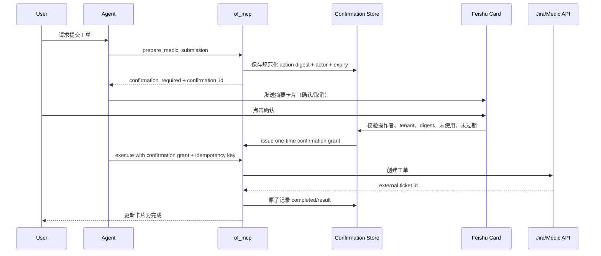

若 MCP 2026 Multi-Round-Trip Request 在 MultiRAG 客户端和 of_mcp 框架中稳定可用，可把
`confirmation_required` 表达为标准 `InputRequiredResult`；飞书卡片仍是客户端承载 UI。不能
为了追新协议绕过持久化 confirmation 和幂等键。

---

## 8. 用户 OAuth 与聊天身份是两条链

```text
聊天身份：Feishu event -> Contact V3 -> platform Principal
飞书资源委托：Web OAuth + PKCE -> user_access_token -> encrypted token vault
```

前者只证明员工是谁；后者才允许代表员工访问个人飞书文档/日历。它们可以链接到同一
`platform_user_id`，但 token、scope、生命周期、撤销和审计必须分开。

首期 medic/MCP 身份链不依赖飞书 user OAuth。

---

## 9. 故障语义

| 故障 | 普通对话 | 高风险 MCP | 运维动作 |
|---|---|---|---|
| Contact 暂时不可用，有未过期 active cache | 继续 | 拒绝或要求稍后重试 | 告警外部依赖 |
| Contact 暂时不可用，cache 过期/不存在 | 拒绝身份建立 | 拒绝 | 不创建匿名用户 |
| 用户不在应用数据范围 | 明确拒绝 | 拒绝 | 检查飞书数据权限 |
| employee_no 缺失 | 可按 policy 继续 RAG | 需要企业主体的工具拒绝 | HR/OA 补数据或 resolver |
| 身份 link 冲突/歧义 | 拒绝 | 拒绝 | 人工审核/纠错；禁止自动猜测或双 User 合并 |
| token issuer 不可用 | RAG 可继续 | 不调用 MCP | issuer SLO 告警 |
| of_mcp verifier/JWKS 不可用 | 不调用 MCP | 拒绝 | 使用短期缓存的已验证 JWKS；过期后 fail closed |
| 业务系统不可用 | RAG 可继续 | tool error，不自动重试副作用 | 幂等后人工/任务重试 |
| 离职/冻结事件 | 结束新执行、失效 link | 立即拒绝 | 审计并清缓存 |
| Reaction/CardKit 不可用 | 降级 post/text，继续交付最终答案 | 不影响授权结果 | 指标告警并检查 scope/限流/客户端版本 |
| Channel follow-up 队列满 | 明确 busy，不静默丢弃 | 不开始新的副作用执行 | 检查 binding 容量和执行时延 |

故障时不把底层 Secret、飞书响应体、OA 判断或完整身份 ID 返回给模型。

---

## 10. 抽取 identity-broker 后的终态

未来抽取时只有部署变化：

```text
MultiRAG Channel -> Identity Broker resolve/introspect/token
Web/OIDC          -> Identity Broker link/provision
Identity Broker  -> Feishu/OA/HR providers
of_mcp           -> Identity Broker JWKS/introspection
```

数据库表可先继续与 MultiRAG 共库，完成 API 边界和双写/迁移计划后再拆库。禁止一次 PR 同时拆
进程、拆库、换 token 和改 Channel DTO。
