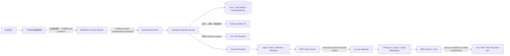
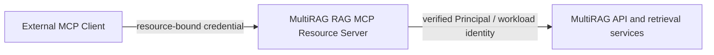
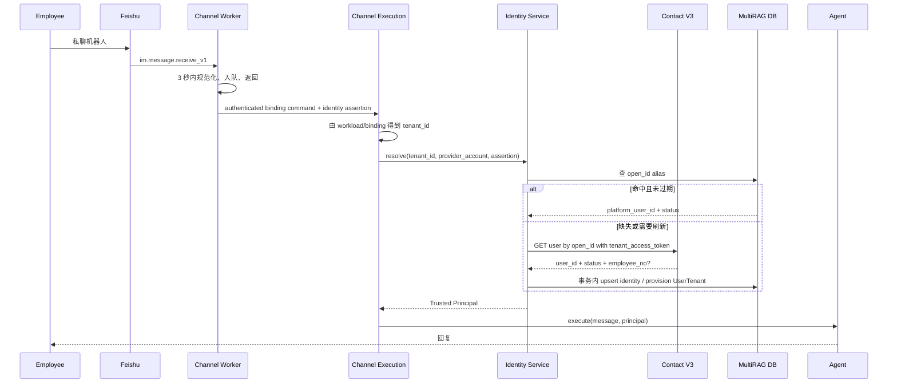
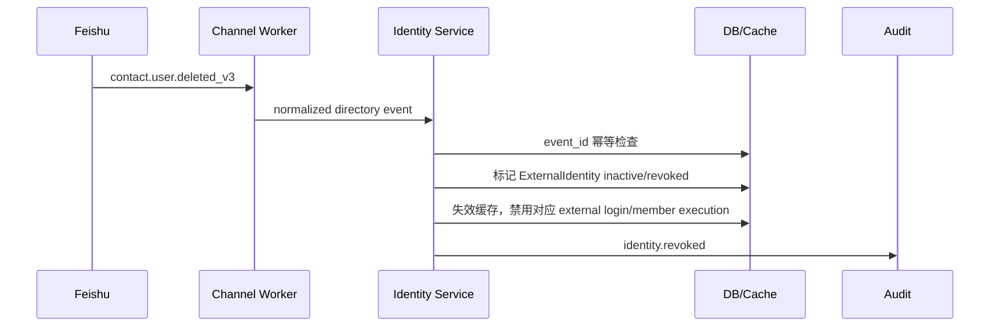
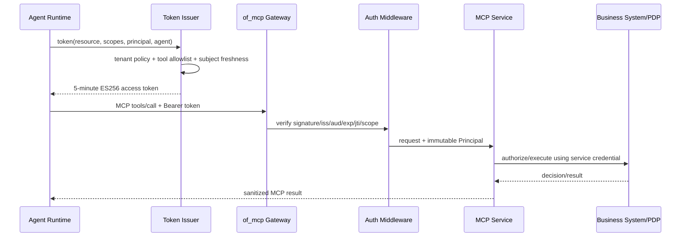
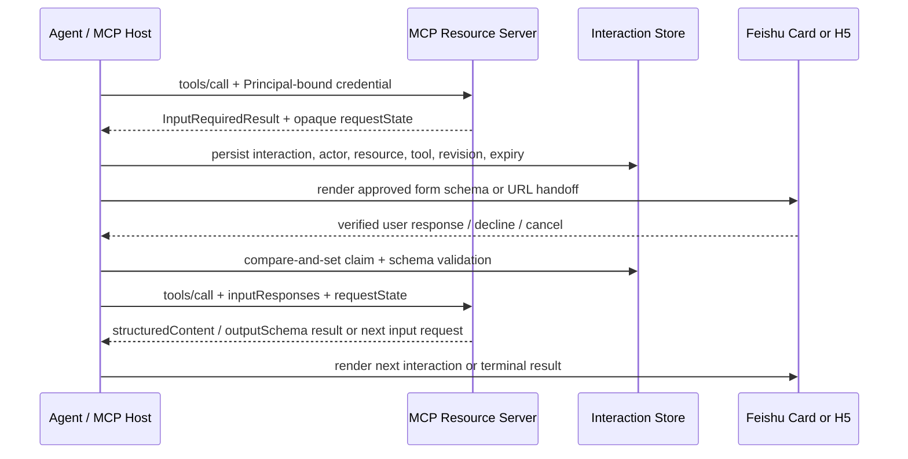
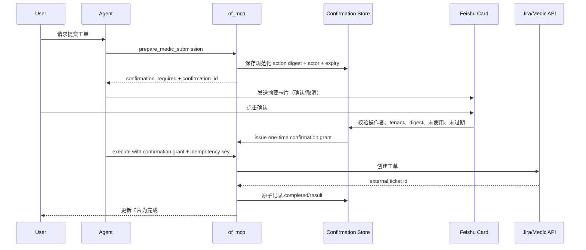

# 端到端架构与运行时流程

精确 DTO、表、JWT 和错误码见 [CONTRACTS](CONTRACTS.md)。本文件只解释组件关系、信任边界、
时序和失败语义。

---

## 1. 系统与信任边界



信任级别：

| 边界 | 输入 | 信任结论 |
|---|---|---|
| 飞书 -> Channel Worker | event、open_id、chat/message | SDK 建连可信，但字段仍只是外部身份断言 |
| Worker -> Channel Execution | command + workload token | worker 身份/binding generation 可信；actor 仍未提升 |
| Identity Service -> Principal | DB binding + Contact 验证 + tenant policy | 平台可用的可信 Principal |
| MultiRAG -> of_mcp | OAuth bearer | 只在签名、issuer、audience、scope、exp 全部通过后可信 |
| of_mcp -> 下游业务 | 工具参数 + Principal | 工具参数不提供身份；业务权限仍由 service/PDP 判定 |

---

## 2. 组件归属

### MultiRAG

#### Channel transport

负责飞书协议、消息/卡片收发、队列、去重、会话顺序；不创建 Principal。

Transport 内部再拆两层：

```text
Inbound adapter
  -> 白名单规范化：identity/thread/mention/content/attachment
  -> Channel Execution async event stream

Progressive reply adapter
  -> transport-neutral ReplySession
  -> 飞书 reaction/CardKit/post/text renderer
```

执行层产生的 `message_delta` 不得在 Channel client 中等待完整回答后才交给 Provider；若
`message_completed` 携带引用装饰后的权威正文，Bridge 通过 `ReplySession.replace()` 整体校正后再
完成。CardKit 创建、节流、sequence、最终 flush 和降级属于飞书 renderer；业务 bridge 只理解
ReplySession 状态。该体验链不依赖 transport 从 `lark-oapi.ws.Client` 迁移到 `lark-channel-sdk`，完整设计见
[FEISHU_BOT_UX](FEISHU_BOT_UX.md)。

#### Channel control/runtime

负责 provider account、加密凭据、tenant-owned binding、supervisor/worker 和 runtime 状态。
`app_id -> channel/binding -> tenant_id` 是服务端配置，不由飞书消息决定。

#### Enterprise Identity Service

建议包边界：

```text
api/identity/
├── contracts.py
├── policies.py
├── service.py
├── repository.py
├── errors.py
├── providers/
│   └── feishu.py
└── enterprise_subjects/
    ├── feishu_employee_number.py
    └── oa.py
```

新 service 按仓库规范 async-first，使用 `AsyncSession`；Provider client 通过依赖注入，单元测试不
访问真实飞书/OA。

#### Principal propagation

Principal 是 request-scoped 不可变 DTO，经 Channel Execution、Agent、Memory、Workflow、
MCP tool call 传递。模型看不到或修改不了 Principal。

#### MCP Token Issuer

逻辑上是 Authorization Server：根据已认证 Principal、目标 MCP resource、Agent 允许的工具和
租户策略签发短 token。首期与 MultiRAG 同部署，但包和配置独立。

#### MCP Host/Client

Agent Runtime 是出站 MCP Host，按每次工具请求携带当前 Principal，通过 credential provider 获取
目标 resource 的短期 token，再由标准 MCP Client 调用 `of_mcp`。Client 不缓存某位用户的 bearer，
不把身份写进静态 server headers，也不依赖连接状态恢复用户上下文。

当工具返回多轮输入请求时，Host 拥有 InteractionSession、用户呈现、响应校验和恢复调用；MCP
service 不直接依赖飞书。详细状态与字段见 [CONTRACTS §9](CONTRACTS.md#9-interactionconfirmation-与幂等契约)。

#### MultiRAG RAG MCP Resource Server

MultiRAG 还通过独立的入站 MCP Resource Server 向外部 Client 暴露数据集和检索能力。这是与上面的
出站 Host/Client 不同的安全和发布面：



入站 Server 有自己的 canonical resource、audience、scope policy、兼容端点和回滚计划。它不能
复用发给 `of_mcp` 的 token，也不能把收到的 bearer 不加区分地透传到 MultiRAG 后端。当前实现事实
和尚未实现项只在 [`mcp/README.md`](../../mcp/README.md) 维护；本文件只定义目标边界。

### of_mcp

#### Gateway resource server

统一拥有 `auth=`、protected-resource metadata、JWKS verifier、scope challenge、审计和 OTel。
service 的 `build_server()` 不自行决定 auth，保持 mount/proxy 等价。

#### Service authorization

平台中间件完成 token 通用校验；每个服务声明 scope 和业务授权 adapter。工具通过 dependency
获得 Principal，不在 input schema 暴露身份参数。

---

## 3. 首次私聊：JIT 身份解析



关键规则：

- Contact 调用在 SDK callback 之外；
- 同一 `(tenant_key, app_id, open_id)` 首次解析使用 single-flight，避免并发重复开户；
- JIT 事务内锁定 canonical provider identity，数据库唯一约束是最终并发保护；
- `User`、`UserTenant`、`ExternalIdentity` 创建要么一起提交，要么全部回滚；
- Provider 返回 active 不自动授予管理员角色；
- enterprise subject 缺失时，普通 RAG 是否继续由 policy 决定，高风险 MCP 一律拒绝。

---

## 4. 后续消息快速路径

```text
event -> binding tenant -> open_id alias cache/DB -> active platform_user_id -> Principal -> Agent
```

不调用 Contact/OA 的条件：

- alias 存在；
- link 状态 active；
- `last_verified_at` 未超过租户普通对话 TTL；
- 没有待处理的 Contact/scope 失效标记；
- 当前操作不要求 step-up freshness。

建议初始 TTL：

| 场景 | 建议 | 说明 |
|---|---|---|
| 普通 RAG | 24 小时 | 事件是主失效机制，TTL 是兜底 |
| 只读内部 MCP | 1 小时内重新确认身份状态 | scope/业务授权仍实时 |
| 高风险副作用 | 15 分钟内身份状态 + 本次用户确认 | 不等于 token 有效期 |
| MCP access token | 5 分钟 | audience-bound，不使用 refresh token |

这些值必须可配置并用时间源注入测试，不能散落 magic number。

---

## 5. Contact 事件失效流程



事件处理不能物理删除 identity link。保留历史用于审计、避免工号/open_id 被复用后静默继承旧
权限。员工重新加入必须产生明确 reactivation/link decision。

`contact.scope.updated_v3` 不试图猜出哪些用户受影响：先 bump provider account 的
`identity_revision` 并失效该 account 下 cache；下一次使用逐个重验。高风险操作立即重验。

---

## 6. MCP 委托调用



MultiRAG 不能因为模型选择了某个工具就自动授予对应 scope。可签发 scopes 的上限是：

```text
tenant policy ∩ agent/tool policy ∩ user/platform eligibility ∩ service declared scopes
```

业务系统仍可拒绝。of_mcp 返回：缺身份/无效 token 为 401，scope 不足为 403/标准 scope
challenge，业务拒绝是可审计的 tool error，不泄露内部策略细节。

### MCP 多轮交互与结构化结果

MCP 2026 Multi-Round-Trip Request 的通用承载流程是：



关键边界：

- InteractionSession 与 ReplySession 分离；前者可跨请求恢复输入，后者只交付单次回答；
- `requestState` 仅作为不透明 continuation 保存和原样回传，不能生成 Principal、tenant 或 scope；
- 表单字段由已批准的 MCP schema 映射，用户响应仍由 resource server 再验证；
- `structuredContent` 在客户端按 `outputSchema` 校验后进入类型化执行事件，不能只转成模型文本再猜测；
- decline、cancel、过期和 schema/revision 不匹配都是显式终态，不自动改写为普通模型追问；
- 需要密码、API key、access token、OAuth 或复杂动态 UI 时只返回受控 URL，由 H5/授权页重新认证；
- 写操作即使通过 MRTR 收集完参数，也必须继续走下一节的持久化确认、重授权和幂等执行。

---

## 7. medic 敏感操作确认

推荐“两阶段命令”而不是工具执行后才弹提示：



若 MCP 2026 Multi-Round-Trip Request 在 MultiRAG 客户端和 of_mcp 框架中稳定可用，可把
`confirmation_required` 表达为标准 `InputRequiredResult`；飞书卡片仍是客户端承载 UI。不能
为了追新协议绕过持久化 confirmation 和幂等键。

---

## 8. 用户 OAuth 与聊天身份是两条链

```text
聊天身份：Feishu event -> Contact V3 -> platform Principal
飞书资源委托：Web OAuth + PKCE -> user_access_token -> encrypted token vault
```

前者只证明员工是谁；后者才允许代表员工访问个人飞书文档/日历。它们可以链接到同一
`platform_user_id`，但 token、scope、生命周期、撤销和审计必须分开。

首期 medic/MCP 身份链不依赖飞书 user OAuth。

---

## 9. 故障语义

| 故障 | 普通对话 | 高风险 MCP | 运维动作 |
|---|---|---|---|
| Contact 暂时不可用，有未过期 active cache | 继续 | 拒绝或要求稍后重试 | 告警外部依赖 |
| Contact 暂时不可用，cache 过期/不存在 | 拒绝身份建立 | 拒绝 | 不创建匿名用户 |
| 用户不在应用数据范围 | 明确拒绝 | 拒绝 | 检查飞书数据权限 |
| employee_no 缺失 | 可按 policy 继续 RAG | 需要企业主体的工具拒绝 | HR/OA 补数据或 resolver |
| 身份 link 冲突/歧义 | 拒绝 | 拒绝 | 人工合并，禁止自动猜测 |
| token issuer 不可用 | RAG 可继续 | 不调用 MCP | issuer SLO 告警 |
| of_mcp verifier/JWKS 不可用 | 不调用 MCP | 拒绝 | 使用短期缓存的已验证 JWKS；过期后 fail closed |
| 业务系统不可用 | RAG 可继续 | tool error，不自动重试副作用 | 幂等后人工/任务重试 |
| 离职/冻结事件 | 结束新执行、失效 link | 立即拒绝 | 审计并清缓存 |
| Reaction/CardKit 不可用 | 降级 post/text，继续交付最终答案 | 不影响授权结果 | 指标告警并检查 scope/限流/客户端版本 |
| Channel follow-up 队列满 | 明确 busy，不静默丢弃 | 不开始新的副作用执行 | 检查 binding 容量和执行时延 |

故障时不把底层 Secret、飞书响应体、OA 判断或完整身份 ID 返回给模型。

---

## 10. 抽取 identity-broker 后的终态

未来抽取时只有部署变化：

```text
MultiRAG Channel -> Identity Broker resolve/introspect/token
Web/OIDC          -> Identity Broker link/provision
Identity Broker  -> Feishu/OA/HR providers
of_mcp           -> Identity Broker JWKS/introspection
```

数据库表可先继续与 MultiRAG 共库，完成 API 边界和双写/迁移计划后再拆库。禁止一次 PR 同时拆
进程、拆库、换 token 和改 Channel DTO。
