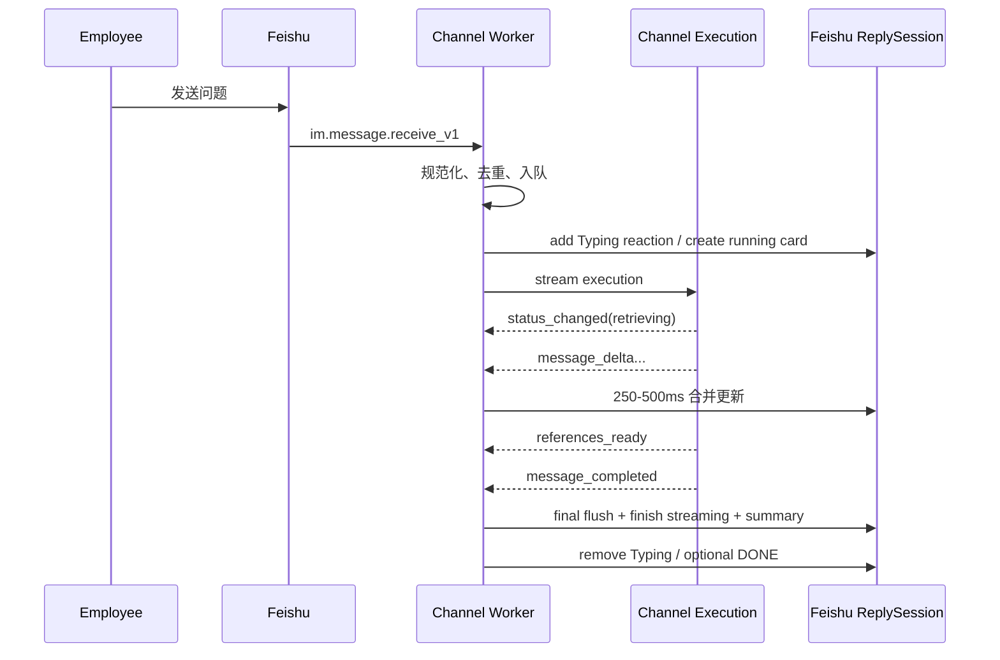

# 飞书机器人对话体验设计与实施基线

> 状态：设计基线；EIM-U0/CHN-X9 的执行流与 buffered ReplySession、
> EIM-U1/CHN-U8 的飞书 CardKit 渐进式回复、EIM-U11/CHN-X13、EIM-U12/CHN-U14 与
> EIM-U13/CHN-U15 的目标事务均已实现。
> 最后核验：2026-08-11（Asia/Shanghai）。
> 适用范围：MultiRAG `api/channels/`、`api/channel_execution/`、飞书企业自建应用，以及后续
> 与 `of_mcp` 的确认交互。

> **近期优先级**：CHN-U15 迁移与 API/supervisor 重启已完成，CHN-U16 正常停机终态化与跨层测试已于
> 2026-08-11 完成；**Dialog/Canvas 真实飞书 smoke 仍然欠着**（U16 的跨层测试不替代它），
> 下一项 CHN-O9 最小可观测，随后稳定浸泡。EIM-F5 / CHN-X14 保留为 upstream-first
> 长期入口，但挂起到用户恢复从约 2026-04-24 本地同步点逐 commit 跟进 RAGFlow 时。

本文负责回答“如何把当前飞书私聊文本桥升级为飞书原生 AI 对话体验”。身份、JWT、MCP 授权和
业务确认的数据契约仍分别以 [CONTRACTS](CONTRACTS.md) 和 [TESTING_SECURITY](TESTING_SECURITY.md)
为准；任务状态和依赖以 [ROADMAP](ROADMAP.md) 为准。

---

## 1. 结论和实施边界

当前最值得先做的不是迁移 SDK，而是打通 MultiRAG 已经存在的执行流：

```text
Agent message_delta
  -> Channel execution SSE
  -> transport-neutral ReplySession
  -> 飞书 Typing reaction + CardKit 2.0 流式卡片
  -> final flush + finish_streaming_card
  -> 富文本/纯文本降级
```

四件事必须拆开：

1. **执行流式化**：MultiRAG 自己的跨模块契约，不依赖飞书 SDK、企业身份或 MCP。
2. **飞书渐进式回复**：可以继续用现有 `lark-oapi` 调 IM、Reaction 和 CardKit OpenAPI，不等待
   `lark-channel-sdk` transport PoC。
3. **MCP 结构化交互**：由 provider-neutral InteractionSession 承载，飞书 form/H5 只是 renderer；
   不复用 ReplySession 或 MCP connection state。
4. **敏感操作确认**：必须等待 verified Principal、MCP 授权、Confirmation Store 和幂等链完成。

`lark-channel-sdk` 仍是 transport 优先 PoC 候选，但迁移成功与否不得改变上层消息和回复契约。

---

## 2. 当前代码事实

| 层 | 当前行为 | 直接后果 |
|---|---|---|
| `api/channel_execution` | executor 产生现有 SSE；Dialog/Canvas 各有私有 driver/history transaction；Canvas sidecar 显式持有候选所有权；私有 preflight 计算 Target 能力 | execution wire 不承载目标差异；新增目标不修改 Provider；候选 GC 只在 API 生命周期运行 |
| `api/channels/runtime_client.py` | `stream()` 是执行 HTTP/SSE 的唯一路径；worker 启动另取一次脱敏 capability envelope | 正常消息、delta、卡片 patch 不查目标数据库；旧 API 降级为无交互 buffered reply |
| `api/channels/binding_bridge.py` | 按能力交集创建 queued/running/final 状态，只签发允许的 cancel/regenerate/retry/feedback action ID | 渲染与回调二次校验；完成后替换与失败后重试语义分开 |
| `api/channels/core/base.py::ChannelAction` | 只含 opaque action、operator/chat/message/event ID，不表达 form value 或 InteractionSession revision | 当前低风险按钮契约不能直接承载 MCP MRTR，必须 additive 演进 |
| `api/channels/core/base.py` | `Channel.begin_reply()` 默认 buffered；`ReplyContext` 携带状态、动作与最终能力 | 普通 Provider 完成时只发一条文本，支持逐 Provider 覆盖 |
| `api/channels/feishu/channel.py` | 协商允许时使用 Typing + CardKit 2.0；否则 buffered text，CardKit 故障仍有 post/text fallback | Markdown/公式走 CardKit renderer，能力缺失时仍能交付最终答案 |
| `api/channels/feishu/channel.py` | 入站仍只支持 text，但已保留 header tenant 与类型化 open/user/union ID，Bridge/runtime client 发送冻结、repr 脱敏的 structured assertion | 无话题、引用、附件或 mention；C3 已把 LINKED assertion 提升到 `TrustedChannelContext`/target owner，P2 尚未把完整 Principal 传进 Agent/RAG/Memory/workflow/MCP context |
| `api/channel_providers/feishu.py` | 声明私聊文本、CardKit 渐进式、交互、取消、反馈与 threaded reply；文件/图片仍为 false | 管理面与运行时共用同一 Provider 事实源 |

必须保留的已有优势：SDK 回调只规范化并入队、有界队列、每会话顺序、Redis 原子去重、
binding leader lease、generation fence、Secret/日志脱敏，以及产生副作用后不盲目自动重试。

---

## 3. 目标用户体验

### 3.1 一次正常私聊



用户看到的状态只能来自服务端白名单：

```text
queued -> accepted -> retrieving -> using_authorized_tool -> composing
       -> completed | failed | cancelled
```

不得展示模型思维链、原始工具参数、企业工号、token、文件正文、SQL、底层异常或内部 URL。

### 3.2 降级顺序

任何 CardKit 权限、客户端版本、限流、网络或卡片结构错误都不能吞掉最终答案：

```text
CardKit streaming
  -> one-shot interactive/card
  -> post rich text
  -> chunked text
  -> concise failure text with trace reference
```

降级只改变渲染，不重新执行 Agent 或有副作用工具。

### 3.3 用户可见错误

| 类别 | 建议文案语义 | 是否建议重试 |
|---|---|---|
| 未通过企业身份 | 当前账号尚未完成企业身份验证或不在应用范围 | 否，给管理员/绑定入口 |
| 无 Agent/资源权限 | 你没有使用此助手或目标资源的权限 | 否 |
| 队列已满 | 当前请求较多，请稍后再试 | 是 |
| 执行超时 | 本次生成超时，可以重新生成 | 是，但不得重复副作用 |
| 上游服务不可用 | 依赖服务暂时不可用 | 视错误类型 |
| 内容/附件不支持 | 明确列出支持类型和上限 | 修改输入后重试 |
| 未知错误 | 通用文案 + 短 trace reference | 联系管理员 |

错误卡片和日志只使用稳定错误码，不能回显飞书响应体、异常栈或用户内容。

---

## 4. Transport-neutral 契约

### 4.1 执行事件

EIM-U0 已在 worker 内提供三个 immutable、transport-neutral 类型：

```python
BindingExecutionEvent = MessageDeltaEvent | MessageCompletedEvent | ExecutionFailedEvent
```

它们只携带用户可见 `content`、稳定 `error_code` 和必要 `session_id`，不携带飞书
`card_id/message_id/sequence` 等字段。`stream()` 负责跨 delta reasoning 过滤、SSE 完整性与安全错误
归一；未知加法事件会被忽略。EIM-U12 / CHN-U14 复用既有可选 `content` 字段表示
`message_completed` 的权威终态正文：consumer/tolerate 先落 worker 且不改变线格，generation 8
部署确认后 Dialog producer 才 emit。新 worker 对旧 API 回退 delta；旧 worker 忽略额外字段并继续
消费原 delta。

后续事件的演进目标仍是：

```python
ExecutionEventType = Literal[
    "message_delta",
    "status_changed",
    "references_ready",
    "artifact_ready",
    "message_completed",
    "execution_failed",
]
```

建议的结构化载荷：

```text
event
content?                 # 用户可见正文 delta，或 message_completed 的权威终态快照
status?                  # 白名单状态
references?              # 脱敏引用数组
artifact?                # 受控下载/发送描述符，不是本地路径
session_id?
error_code?
```

`ask()` 不是长期推荐接口：U0 只为迁移和回滚安全保留它，且禁止新代码新增调用。它不得拥有第二套
HTTP/SSE/校验逻辑。生产调用归零且 U1 稳定后，可在单独任务中删除。后续新增
`references_ready/artifact_ready` 时，老 worker 必须继续忽略未知加法事件，再按 API -> worker 部署。

### 4.2 ReplySession

U0 的 Provider-neutral 接口表达最小回复生命周期，不暴露飞书 `card_id`：

```python
class ReplySession(Protocol):
    @property
    def state(self) -> ReplySessionState: ...
    async def append(self, content: str) -> None: ...
    async def replace(self, content: str) -> None: ...
    async def complete(self) -> None: ...
    async def fail(self, error_code: str) -> None: ...

class Channel(ABC):
    async def begin_reply(
        self, source: IncomingMessage, *, max_content_chars: int
    ) -> ReplySession: ...
```

状态机只有 `open -> completed | failed`，终态后 append/replace/double finish/complete-fail 互换全部拒绝。
`replace()` 只整体替换 Provider 内存中的正文，不发网络请求；Bridge 紧接着调用 `complete()`，因此
飞书仍由单写者 drain 旧 patch 后用更高 sequence 写入权威终态。默认 `BufferedReplySession` 把 delta
留在内存，`complete()` 沿用 reasoning 清理和长度截断后调用
`Channel.send()` 一次，`fail()` 丢弃半截答案并只发安全提示，同时保留 `reply_to_message_id`。
U1 已由飞书 override `begin_reply()` 并在 Provider 内保存
`card_id/message_id/sequence/reaction_id/delivery_uuid`；业务 bridge 没有 `isinstance(Feishu...)`。
`status` 与 references 不属于 U0，分别留给 U1/U5 以加法扩展。

### 4.3 入站消息

最终 `IncomingMessage`/执行 command 至少要保留：

```text
event_id, message_id, chat_id, chat_type
root_id, parent_id, thread_id
sender_type
structured identity identifiers
mentions, mentioned_bot, mentioned_all
quoted_message_id
content type + normalized text
attachments[]
tenant_key；app_id/provider account 只从服务端 binding/ownership 取得，不进入 assertion
```

不持久化或排队完整 SDK event；只提取业务需要的白名单字段。`raw` 继续默认为 `None`。

### 4.4 出站幂等

Redis `event_id/message_id` claim 负责业务执行幂等；飞书 `uuid` 负责消息 API 幂等。建议：

```text
delivery_uuid = sha256(binding_id + event_id + delivery_stage)[:40]
```

`delivery_stage` 使用稳定枚举，例如 `running_card`、`final_fallback`、`error`。不得在网络结果未知时
换 UUID 重发同一阶段；CardKit patch 还要为每张卡维护严格递增的 sequence。U1 的 transport
session 不持有 binding ID，因此实现使用服务端生成的不透明 provider account ID + 飞书 event ID +
stage；patch/finish 的 stage 纳入 sequence。Redis 执行 claim 仍按 binding 单独隔离，两层幂等不混用。

---

## 5. 飞书渐进式回复实现

### 5.1 卡片生命周期

1. 最早可用时添加 Typing reaction；失败只记指标，不阻塞主流程。
2. 创建 CardKit JSON 2.0 实体，`streaming_mode=true`，摘要为“生成中”。
3. 回复原消息并保存 `card_id` 和发送返回的 `message_id`。
4. delta 只更新内存中的权威全文并通知后台单写者，`append()` 不等待 CardKit HTTP；单写者按
   250ms 窗口取最新快照，最多一个 patch 在途，期间到达的待发状态始终 latest-value 覆盖。
5. 定时刷新独立于后续 delta，短尾也会按时显示；每次 patch 使用严格递增 sequence。中间状态可
   合并或跳过，但最终状态不能丢。
6. 完成时取消未开始的定时刷新或等待在途 patch，然后强制 final flush，再用更大的 sequence 调
   `finish_streaming_card()`。
7. 生成阶段可显示停止按钮；完成后先关闭 streaming，再把交互区替换为重新生成和反馈按钮。JSON 2.0
   使用 `column_set` 直接承载 `button` 与 callback behavior，禁止使用已移除的 `tag: action` 模块。
8. 清理 Typing reaction；失败时尝试错误卡片或文本降级。

飞书官方单卡 OpenAPI 上限是 10 次/秒，本项目使用更保守的 4 次/秒硬上限。卡片创建时显式固定
`print_frequency_ms=70`、`print_step=1`、`print_strategy=fast`，后续不修改：客户端负责平滑逐字
展示，`fast` 在新快照到达时不会让旧动画形成长队；服务端负责限流、latest-value 合并与最终一致性。
该分工对齐飞书[流式更新卡片](https://open.feishu.cn/document/cardkit-v1/streaming-updates-openapi-overview)
的配置/前缀更新约束、官方 Channel SDK 的 throttle + 单写者合并队列，以及 OpenClaw 的定时 flush、
在途互斥和终态 drain；latest-value 模式也与 `shareAI-lab/lark-channel` 一致，固定参数参考 LangBot
已验证的 CardKit 配置。快照源码见 [REFERENCES §2/§4/§6/§7](REFERENCES.md)。节流配置属于
Provider outbound config，不属于模型参数。

### 5.2 内容渲染

实现独立 renderer，不在 bridge 里拼卡片 JSON：

- 保留标题、列表、粗体、链接、代码块；
- Markdown 表格转换成飞书兼容卡片结构或可读列表；
- 未闭合代码块在每次 patch 时做暂态闭合，最终内容按原始正文重渲染；
- 链接只允许 `https` 或配置的受控 scheme，显示实际主机；
- mention 使用结构化 API，普通模型文本中的 `@all` 不产生真实 mention；
- 长答案优先卡片/分段，不再用固定 4,000 字符静默截断；
- `summary` 在完成后改成可读的短摘要，兼容通知栏和低版本客户端。

### 5.3 EIM-U1 / EIM-U10 落地映射

- `api/channels/feishu/reply.py` 独立承载 renderer、节流、ReplySession 状态、sequence、delivery UUID
  和 post/text fallback；`BindingBridge` 与 execution event 未增加任何飞书字段。
- `api/channels/feishu/channel.py` 只负责把上述操作映射到 `lark-oapi` CardKit/reaction/message API；
  CardKit SDK transport 迁移仍不是前置条件。
- 卡片正文使用 UTF-8 24KB 安全预算并带显式截断后缀；post/text fallback 继续遵守 binding 的
  `max_answer_chars`，不会把固定 4,000 字符限制套在正常流式卡片上。
- Card create/reply/patch 失败只把 session 切到 fallback 并继续消费同一次 Agent stream；最终正文
  已 patch、只有 finish 失败时不重复发送文本。Reaction 与首卡并发启动、添加/删除始终
  best-effort；慢 reaction 不阻塞首卡，终态后迟到会立即清理。
- CHN-U13 的刷新器只允许一个 CardKit patch 在途；等待窗口和网络请求都运行在后台 task，多个模型
  delta 只改变最新权威全文。终态会 drain 在途请求并强制 final patch，保持 U1 的 strict sequence、
  delivery UUID 与 post/text fallback 语义不变。
- manifest 只在实现和回归测试落地后声明 `streaming_cards=true`。上线前仍须按
  `FEISHU_ONBOARDING.md` 在目标租户申请、发布并实测 CardKit、消息回复和 reaction 权限。

### 5.4 引用和产物

RAG 来源必须通过 `references_ready` 结构化事件输出，而不是从答案文本或内部 A2UI/tool payload
反向解析。每个引用只包含用户有权看到的标题、受控 URL/文档定位和可选摘要。

生成文件、图片或报告使用 `artifact_ready`；Channel 负责上传/发送，绝不能把本地路径、对象存储
临时签名或内部下载 URL直接发给用户。

---

## 6. 连续追问、排队与取消

当前 per-conversation lock 保证顺序但会让后续消息无提示等待。目标行为：

- 同一会话运行中收到新消息时，建立有界 follow-up 队列；默认最多 5 条；
- 每条来源消息拥有自己的状态：`queued -> running -> final/error`；
- 卡片显示队列位置，但不承诺精确等待时间；
- 队列溢出立即返回 busy 文案，不静默 drop；
- `/new` 或“开始新对话”需要确认是否清空未运行的 follow-up；
- “取消生成”只停止可取消的模型/RAG 阶段；已经发起的副作用工具不能伪装成已回滚；
- 网络结果未知或副作用已开始时，卡片显示“结果待确认”，进入幂等恢复流程。

首期可先做安全的“排队 + 纯生成取消”；steering/中途修改当前 run 留到执行引擎有明确语义后。

> **EIM-U4 / CHN-U9 已实现的首期边界（2026-08-09）**：worker 是唯一会话队列所有者，
> `followup_queue_size` 默认 5；每条正常问题有独立 queued/running/final/error/cancelled 卡片，
> 溢出返回 busy。停止按钮取消当前 SSE 子任务或阻止 queued 项启动，卡片明确声明外部操作不视为
> 已撤销。重新生成以新 request ID 重入同一队列，只替换当前会话最新且问题匹配的完成轮次；
> 旧卡在出现后续追问后 fail closed，失败/取消轮次以“重试”按钮按普通 retry 处理。替换通过 Channel execution
> 的私有工作态完成。**以下是 U4 当时的过渡实现，不是当前事实**：当时 MultiRAG Dialog/Canvas
> completion 都只写候选，成功且公开头未变化才原子晋升；
> 失败、取消或并发冲突不改公开历史。Channel 历史只提交可见答案，reasoning-only 不提交；含
> 外部工具/MCP/未知组件的 Canvas 不允许直接重放。反馈与操作均绑定
> 操作者、chat、回复卡片和 one-shot opaque action ID。`/new` 清队列确认、跨进程恢复和 steering
> 不在本首期内。
>
> **2026-08-10 EIM-U11 / CHN-X13 已实现**：上述“Dialog/Canvas 都写候选”仍是安全过渡态，但已
> 拆为目标私有 driver/history transaction。worker 启动时读取一次 Provider × Target × RunPolicy
> 的脱敏交集，不按消息查库；飞书只渲染和注册允许的动作。Canvas 对未知/工具图、持久文档输出、
> 带附件或 Memory 保存的 Message 同时关闭 regenerate/retry，纯文本 Message 保持可用。后续由
> [MultiRAG Channel 执行架构](../channel-program/EXECUTION_ARCHITECTURE.md) 已让 Dialog 使用内存
> 工作副本 + 终态 CAS，Canvas 则以 sidecar 管理专属候选并由 API 周期 GC 回收孤儿。长期演进遵循
> CHN-ADR-08：持续跟进 RAGFlow 上游，不预设 Canvas 必然改成 detached 或自研 checkpoint runtime。
>
> **2026-08-10 EIM-U12 / CHN-U14、EIM-U13 / CHN-U15 已实现**：Dialog 已改为 detached working
> copy + terminal CAS；Canvas 保留目标私有 candidate CAS，但所有权不再依靠会话哨兵，而由
> MultiRAG sidecar 显式记录。新 Canvas 会话行与 metadata 在同一次 flush 中捕获，现有会话的
> 候选行与 metadata 在同一短事务创建；候选期 `dialog_id` 位于自身私有命名空间，普通 target
> list/delete-all 不会发现或误删，发布新会话时才恢复真实 target；公开 Dialog/Canvas 表不增加
> Channel 列。TTL 回收已从
> 每条消息热路径移到 API router lifespan，启动即执行并周期运行有界 `SKIP LOCKED` batch，同时
> 只按完整旧哨兵兼容回收遗留 Canvas/Dialog 候选。TTL 只是 crash orphan 安全网；worker 仍无数据库，
> COMMIT 结果不明及提交后卡片交付失败仍不伪装成回滚，CHN-O14 保持挂起。

正常发布或 generation 变更触发的可控 worker/supervisor 停机，与崩溃恢复是两个问题。CHN-U16
**已实现**：停止接收后立即清空队列，queued 卡以零执行调用改为 cancelled，running 卡先关闭私有
execution SSE 再改为同一终态，**已经拿到完整终态答案、正在交付卡片的那次 run 不被取消而是等它
交付完**；重复 close 幂等且不留后台 task。它不持久化队列、run 或 action。`kill -9`、主机掉电、
跨实例取消、数据库 COMMIT 结果未知和提交后交付结果未知仍不自动恢复，只有真实需求成立时才评估
CHN-O14 / EIM-O4。Windows 上 supervisor 停子进程走 `TerminateProcess`，没有合作窗口，这套清理
不会执行——在 Windows 开发机上看到的悬空卡不能当作回归。

---

## 7. 话题、群聊和会话键

首期继续保持 `private_chat_only=true`。结构化字段和 thread-aware reply 可以先实现，但正式开放
群聊必须等待 verified Principal 和独立风险评审。

默认策略：

- 群组 allowlist；
- 只响应明确 `@机器人`，`@all` 不算；
- 忽略 bot/app/system sender，防止机器人循环；
- DM 会话按 tenant + provider account + platform user 隔离；
- 群话题按 tenant + provider account + chat + thread 隔离；
- 是否额外按 sender 隔离由 binding policy 明确选择，不能隐式变化；
- 回复保留 `reply_in_thread`，必要时从消息查询补全缺失的 `thread_id`；
- 群内高风险 MCP 工具默认关闭，即使私聊已获授权也不自动继承。

任何会话键不得直接使用一个裸 `open_id`，也不得让不同租户、App、群或话题碰撞。

---

## 8. 卡片操作、结构化表单、反馈和敏感确认

### 8.1 低风险操作

完成卡片可提供：

- 重新生成；
- 开始新对话；
- 有帮助 / 没帮助；
- 查看来源；
- 下载已授权产物。

当前 U4 的低风险 `card.action.trigger` 回调只做长连接信任、规范化，并以 raw operator ID 与原消息
sender 做同值校验，再绑定 chat/message/nonce/action 后入队；它**尚未**把 action operator 解析为
verified Principal，不能据此授权敏感操作。业务执行异步完成，按钮 value 只携带 opaque
nonce/action ID，不携带 Principal、scope、工具参数、工号或目标 URL。U7/U14/U15 的敏感确认必须
另行接入 verified operator Principal、持久幂等 claim 与执行前重授权。

### 8.2 MCP 结构化表单与 H5/URL Elicitation

飞书 Provider 是 [InteractionSession](CONTRACTS.md#91-interactionsession) 的 renderer，不拥有工具
状态或业务授权。MCP Host 收到 `InputRequiredResult` 后先持久化 interaction，再按服务端批准的
schema 选择承载方式：

| MCP 输入形态 | 飞书承载 | 规则 |
|---|---|---|
| 短字符串/多行文本 | Card JSON 2.0 input/textarea | 长度、格式和必填约束由白名单 mapper 生成 |
| 单选 enum | select/radio 类组件 | 只显示 schema 中的稳定 value/安全 label |
| boolean | checkbox | 不把默认勾选当作用户确认 |
| date/date-time | 日期/时间组件 | 统一时区并把规范值交回 resource server 验证 |
| enum array | 多选组件 | 限制选项数和提交大小 |
| 复杂联动、附件、人员选择、多步骤 | 飞书 H5 | 使用短期一次性 nonce，进入页面后重新免登和同人校验 |
| 密码、API key、token、OAuth、支付凭据 | 授权页/H5 URL mode | 禁止进入卡片 form、日志或模型上下文 |

原生表单使用 Card JSON 2.0 `form` 容器，组件 `name` 在同一 form 内唯一；提交回调中的
`event.action.form_value` 只规范化为用户输入，不自动成为 Principal、scope 或最终工具参数。不能把
任意 MCP `inputSchema` 或模型生成的卡片 JSON 直接渲染，必须经过受控 schema 子集、组件 allowlist、
长度/枚举/URL 校验和服务端二次验证。

交互生命周期：

```text
finish current streaming card
  -> persist InteractionSession(awaiting_input, revision)
  -> render form or H5 handoff
  -> callback verifies operator, persists normalized input and CAS claims revision
  -> acknowledge quickly and enqueue resume
  -> tools/call(inputResponses + requestState)
  -> render next form or structured terminal result
```

进入表单前必须显式结束流式更新；不得让 stream patch 与用户编辑同一张卡片并发竞争。回调同步路径
沿用 §8.1 的快速 ACK，不等待 MCP、OA 或数据库长事务。卡片 value/URL 只含 Interaction Store
生成的 opaque action ID/nonce 和 revision；`requestState`、Principal、原始参数和凭据留在服务端。

首期只在私聊或个人可见 H5 中开放企业敏感表单。群聊只显示安全摘要和“前往私聊/打开授权页”入口，
不把请假原因、余额、人员或审批信息渲染到共享卡片。

### 8.3 敏感操作

敏感确认卡依赖 [CONTRACTS §9](CONTRACTS.md#9-interactionconfirmation-与幂等契约)：

```text
prepare -> persistent confirmation -> card -> verified click
        -> compare-and-set confirm -> re-authorize -> idempotent execute
```

确认记录绑定 tenant、platform user、tool、规范化参数摘要、过期时间和一次性状态。流式卡片完成前
不承载确认按钮；不能用“用户点击过某个按钮”替代执行时重新授权。

---

## 9. 多模态输入输出

建议实现顺序：图片 -> PDF/Office 文件 -> 生成文件/图片 -> 语音转写 -> 视频附件。

统一附件描述符：

```text
kind, file_key/image_key, file_name, mime_type?, size?, duration?
source_message_id
```

处理规则：

- 只通过官方 `message_id + file_key/image_key` 资源 API 下载；
- 官方上限不是业务默认值，首期建议业务上限 20-30MB；
- 下载采用流式、超时、MIME/扩展名双校验、病毒/内容扫描和临时存储 TTL；
- 不把 token-bearing URL 传给模型、sandbox 或第三方工具；
- 不支持类型返回明确提示，不把原始 JSON 当作用户文本；
- 文件进入 RAG/解析流程时建立用户、tenant、session 和 retention 绑定；
- 输出文件先上传到飞书或受控 artifact 服务，再发送可审计引用。

---

## 10. 两个官方库的责任边界

### `lark-oapi`

继续负责完整 OpenAPI：IM send/reply/reaction、CardKit、Contact V3、消息资源、token 生命周期以及
未来文档/日历 API。EIM-U1 不需要等待 EIM-C5，可以基于当前 REST client 实现。

### `lark-channel-sdk`

PoC 重点验证：

- `InboundMessage` 的 thread/mention/resources/safe text 是否能无损映射本项目 DTO；
- `channel.stream()` 的预分配、节流、finish 和异常行为；
- public connect/disconnect/reconnect 生命周期；
- `compat -> audit -> strict` 安全迁移；
- 多 worker、连接上限、日志脱敏和回滚；
- SDK 两层去重如何与 Redis 原子 claim 分工。

即使采用，也只替换飞书 Provider 内部 transport/outbound adapter；不得替换 MultiRAG binding、
Secret、tenant、Principal、执行边界、Redis 状态和审计。

---

## 11. 上游项目参考边界

| 项目 | 应借鉴 | 不应照搬 |
|---|---|---|
| 官方 Channel SDK | typed inbound、Reply/stream lifecycle、CardKit、public lifecycle、安全模式 | 内存 policy/dedup 代替平台控制面和 Redis |
| `lark-oapi` | 完整 typed OpenAPI、token 管理、IM/CardKit/Contact/资源接口 | 依赖私有 WS 字段形成新的上层耦合 |
| OpenClaw | streaming card、typing reaction、thread hydration、mention/group policy、媒体 fallback | 私人 Agent 的 pairing/信任模型充当企业授权 |
| DeerFlow | 单卡 patch、queued -> running -> final、来源消息预览、follow-up buffer | 共享 internal token 下用户 ID 的信任假设 |
| LangBot | Provider adapter、WS 非阻塞/重连测试、Markdown 表格兼容 | API key/allowlist 充当员工身份和业务权限 |
| shareAI-lab/lark-channel | thread 隔离、reaction 状态、块级流式展示 | 本地工作区和代码执行权限模型 |

具体源码路径和快照见 [REFERENCES](REFERENCES.md) 与 [VERSION_BASELINE](VERSION_BASELINE.md)。

---

## 12. 安全不变量

- 不展示或记录 chain-of-thought、原始 tool trace、MCP 参数、token、Secret、完整身份 ID 或答案正文；
- Markdown/卡片链接、mention、图片和媒体源必须经过结构化校验；
- card action 必须绑定操作者、tenant、动作、参数摘要、过期时间和 nonce；
- 群聊、引用来源、附件和反馈都必须做资源可见性校验；
- SDK 回调必须在 3 秒内返回，耗时逻辑只入队；
- 事件处理和出站发送分别幂等；重连/重复投递不得重复执行或重复发最终消息；
- SDK 失败只能触发渲染降级，不能绕过身份、授权或业务确认；
- 媒体下载防 SSRF、路径穿越、压缩炸弹、超限和保密消息错误降级；
- 任何状态文案来自服务端 allowlist，不能直接转发模型或异常文本。

---

## 13. 指标和 SLO

每条消息至少关联 `trace_id/event_id/run_id/reply_handle_id`。新增指标：

```text
first_ack_ms
first_card_ms
first_delta_ms
queue_wait_ms / queue_depth
card_update_count / card_update_throttled_total
card_create_failure / card_patch_failure / final_flush_failure
fallback_by_type
reaction_add/remove_failure
duplicate_event / duplicate_delivery
execution_total_ms
thread_hydration_ms
attachment_download/scan/parse_ms
```

首期验收目标：

- p95 `first_ack_ms <= 500ms`（在 worker 已接收事件后计时）；
- p95 `first_card_ms <= 1s`，飞书 API 故障时明确记录降级；
- 单卡正常更新 `<= 4 QPS`，最终 flush 不丢；
- 同一 event 只产生一次 Agent 执行和一次同阶段出站消息；
- CardKit 失败仍能交付最终文本；
- queue full、身份拒绝、超时和上游故障都有独立错误码与用户文案。

SLO 是上线初始目标，真实压测和灰度后可调整；调整必须写进任务日志，不能靠提高限额掩盖设计问题。

---

## 14. 测试与验收矩阵

### 单元/契约

- SSE delta 按序向 bridge 暴露，兼容 `ask()` 聚合结果逐字节不变；
- ReplySession begin/append/complete/fail 状态机拒绝非法转移和 double finish；
- 节流合并中间 delta，最终 flush 永不丢；
- sequence 严格递增；相同 delivery UUID 不变；
- Markdown 代码块、表格、链接、mention 和超长内容 golden tests；
- CardKit create/patch/finish 任一步失败均走正确 fallback，且不重跑 Agent；
- Typing reaction add/remove 是 best-effort，不污染主结果；
- queue 顺序、溢出、queued/running 取消；正常停机终态化由
  `tests/unit/test_channel_graceful_shutdown.py` 覆盖（真 worker 队列 → 真 Bridge → 真执行
  client 走 mock SSE → 真 CardKit ReplySession），断言卡片终态、queued 项零执行调用、SSE 流被
  主动关闭、已提交 run 允许交付完与重复 close 幂等；**不把它写成崩溃恢复**；
- thread/message/identity/attachment 规范化 fixture；
- card action 重放、换人点击、跨租户、过期和参数变化全部拒绝。
- form schema allowlist、component name 唯一、字段长度/枚举/日期校验和 schema 外字段拒绝；
- InteractionSession 当前 revision 只消费一次；decline/cancel/expire、再次请求输入和重启恢复逐态覆盖；
- H5 URL 只含一次性 nonce，`requestState`、token、Principal 和原始参数不会进入 URL/卡片/日志；
- `structuredContent` 通过 `outputSchema` 校验后才生成结果卡，失败只产生稳定安全错误。

### 集成/真实飞书测试租户

- 首卡、流式刷新、完成摘要和低版本客户端 fallback；
- 5 QPS 消息和 10 QPS CardKit 限制下的节流/429 行为；
- WS 重连、重复事件；正常 worker 重启验收 U16 的卡片终态化与新进程重新接流；
- `kill -9`、跨实例和 final 未知结果只验证 fail-closed/可诊断边界，当前不宣称自动恢复；
- 普通群、话题群、消息转话题和缺失 thread_id hydration；
- 图片、文件、保密消息、超限、撤回消息和不匹配 file_key；
- 权限缺少、应用未重新安装、机器人不在群和卡片 schema 错误；
- 两个用户、两个 tenant、两个 App 的会话/身份/反馈隔离；
- 原生 form、H5 handoff、双击、换人点击、过期 revision、断线重连和多轮 InputRequiredResult；
- 群聊只出现安全 CTA，个人表单内容不会更新到共享卡片。

生产验收只使用测试应用和测试业务系统。真实员工范围、正式 App 权限、生产重启和真实副作用仍需
用户明确批准。

近期真实 smoke 至少对 Dialog 与 Canvas 各执行：短答/长答/Markdown/公式且无 reasoning 泄漏；
连续三条追问按 queued -> running -> final 串行；超过上限明确 busy；queued 与 running 分别取消；
取消后 retry；final regenerate 只替换最新轮且旧卡 fail closed；正反反馈重复点击只处理一次；
CardKit/reaction 失败只降级 post/text 且不重跑目标。Canvas 还要核对成功、失败和取消后没有活跃
candidate，公开历史不含半轮或 `<think>`。这些现场结果和相关结构化日志是进入稳定浸泡的闸门，
不能只用单元测试或 `/healthz` 代替。

---

## 15. 实施任务与依赖

| EIM | CHN | 内容 | 依赖 |
|---|---|---|---|
| EIM-U0 | CHN-X9 | 加法暴露执行事件流 + ReplySession，保留 `ask()` | 现有 execution SSE |
| EIM-U1 | CHN-U8 | Typing、CardKit 流式卡片、富文本和 fallback | U0；不依赖 C5/M3 |
| EIM-U10 | CHN-U13 | 后台单写者刷新、latest-value 合并、固定客户端打印参数 | U9；不依赖 C5 |
| EIM-U4 | CHN-U9 | follow-up queue、纯生成取消、重新生成、反馈 | U1 |
| EIM-U11 | CHN-X13 | ✅ Provider/Target capabilities、启动预取与目标私有 driver | U4 |
| EIM-U12 | CHN-U14 | ✅ 权威快照 consumer 已部署；Dialog detached working copy + 终态 CAS emit | U11 |
| EIM-U13 | CHN-U15 | ✅ Canvas sidecar 所有权、同 flush 新会话捕获与 API 周期 GC | U11、U12 |
| — | CHN-U16 | ✅ 正常停机终态化；queued cancel、busy 交付和 worker→HTTP/SSE→ReplySession 跨层测试（target 段仍由 integration 覆盖） | CHN-U9/U15；完整 UX smoke 是 soak gate，不是 U16 实现依赖 |
| — | CHN-O9 | 稳定性最小可观测：首卡/首正文、队列、CardKit update/fallback、终态与停机结果 | CHN-U16 ✅ |
| EIM-U3 | CHN-U10 | mention-only 群聊、话题、thread session | U1、U2、C3、O2 |
| EIM-U5 | CHN-X10 | references/artifacts 结构化事件与渲染 | U0、P2 |
| EIM-U6 | CHN-X11 | 图片/文件/语音输入输出 | U0、U5、C3、附件安全基建 |
| EIM-U14 | — | provider-neutral InteractionSession、MRTR resume 和结构化结果事件 | F3、P3、A4、C3 |
| EIM-U15 | CHN-X15 | 飞书 Form/H5 renderer、快速 callback 和持久化恢复 | U14、U1、U4 |
| EIM-U7 | CHN-X12 | 敏感确认卡和 action callback | U15、M3、M4 |
| EIM-C5 | CHN-P14 | 官方 Channel SDK transport PoC | 与上述 UX 并行，非阻塞依赖 |

一次只执行一个 ID。涉及 private DTO 的任务必须按安全部署半步拆 PR；涉及 Channel 目录时同步更新
`docs/channel-program/PROGRESS.md`。详细状态以 [ROADMAP](ROADMAP.md) 为准。
