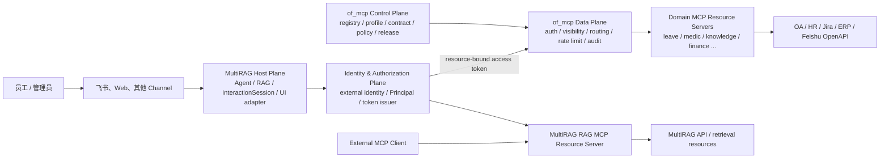
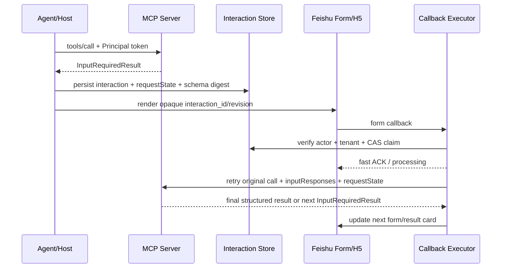

# Modern MCP、企业服务中心与飞书交互基线

> 状态：EIM 程序级权威说明。本文解释为什么这样设计、当前两仓真实处于什么位置、哪些能力应当
> 现在采用、哪些必须延后，以及零上下文 Agent 应按什么门禁推进。
>
> 最后核验：2026-08-12（Asia/Shanghai）。版本事实会变化；重新开工时必须按
> [VERSION_BASELINE](VERSION_BASELINE.md) 的命令重新查询。
>
> 精确 DTO/JWT/状态字段以 [CONTRACTS](CONTRACTS.md) 为准；任务状态和依赖以
> [ROADMAP](ROADMAP.md) 为准；长期不可擅改的结论以 [DECISIONS](DECISIONS.md) 为准；
> 安全上线门禁以 [TESTING_SECURITY](TESTING_SECURITY.md) 为准。

---

## 1. 零上下文先读结论

本项目不把“整仓升级了 SDK/框架”等同于“整个系统完成 MCP 2.0”。EIM-F6 在兼容
矩阵和无存量生产 FastMCP 3 服务的条件下，已选择整仓协调升级作为技术边界；
但以下三点仍然成立：

1. 官方没有名为“MCP 2.0”的协议；`2.x` 是 SDK 大版本，协议版本是日期
   `2026-07-28`。
2. MultiRAG 同时是 **MCP Host/Client** 和 **MCP Resource Server**；两个方向有不同的
   resource、audience、身份、风险和发布面，却共享当前 Python 依赖环境。
3. 协议升级只提供传输和互操作基础，不自动提供企业 Principal、租户授权、PDP、私有 Registry、
   幂等、审计或飞书交互。

固定策略及当前进度是：

```text
已完成：双方向兼容矩阵和依赖拓扑证明
  -> 已完成：整仓 exact pin + outbound Client / inbound Server 分向迁移
  -> 身份/Principal 支线并行推进
  -> OAuth Resource Server、scope、PDP 到位后开放只读 MCP
  -> 再接 InteractionSession + MRTR + 飞书 Form/H5
  -> 最后开放 prepare/confirm/execute 的敏感写操作
```

`of_mcp` 不需要推倒重做。它已经有 profile、mount/proxy、namespace、契约快照和 composition root；
下一阶段是在这些结构上补齐真实认证、Principal、scope、内部委托、持久幂等和审计。

---

## 2. 术语与成熟度：不要再把四件事都叫“MCP 2.0”

| 名称 | 准确含义 | 2026-08-12 状态 | 本项目怎么用 |
|---|---|---|---|
| MCP `2026-07-28` | 官方协议修订版；modern/stateless era | 已正式发布 | 新架构目标协议 |
| MCP Python SDK `2.x` | 官方 Python SDK 大版本 | `2.0.0` 稳定线 | MultiRAG outbound Client 首选实现 |
| FastMCP `3.x` | FastMCP 稳定框架线 | 最新稳定 `3.4.7` | 只作 legacy 兼容 fixture/回滚参考，不再是两仓当前运行时 |
| FastMCP `4.x` | 基于 MCP SDK 2 的框架大版本 | 最新 `4.0.0b2`，仍是 beta | MultiRAG 与 of_mcp 当前均 exact pin `4.0.0b2` |
| MCP Authorization | OAuth Resource Server、resource/audience、scope challenge | 核心规范 | 两个远程 MCP Server 都必须实现 |
| Enterprise-Managed Authorization | 企业 IdP 经 ID-JAG 集中授权的官方扩展 | 扩展稳定；底层 ID-JAG 仍引用 IETF draft | 真实企业 IdP 到位后按租户启用 |
| OAuth Client Credentials | 机器到机器授权扩展 | 可选扩展 | 后台任务/CI，不代表某位员工 |
| MCP Tasks | 长任务的扩展协议 | 生态仍需保守按实验能力管理 | 技术长任务可选，不承载 OA 人工审批 |
| MCP Apps | MCP-native Host 中的 sandboxed UI 扩展 | 可选扩展 | 未来 Web Host 可用；飞书卡片不是 MCP App |
| FastMCP MultiAuth | FastMCP 接受多个 token verifier 的框架能力 | 框架能力，不是标准 | 只有多个受信 issuer 并存时采用 |
| Prefect Horizon | FastMCP 团队的商业 Deploy/Registry/Gateway/Agents 平台 | 商业产品 | 作为 build-vs-buy 和治理参考，不是前置 |

官方依据：

- [MCP `2026-07-28` 发布说明](https://blog.modelcontextprotocol.io/posts/2026-07-28/)
- [MCP Python SDK v2 What's New](https://github.com/modelcontextprotocol/python-sdk/blob/main/docs/whats-new.md)
- [Authorization Extensions](https://modelcontextprotocol.io/extensions/auth/overview)
- [FastMCP Releases](https://github.com/PrefectHQ/fastmcp/releases)
- [Prefect Horizon](https://gofastmcp.com/deployment/prefect-horizon)

项目内统一用语：

> 技术基线已切换到 MCP `2026-07-28` modern/stateless protocol era；客户端基于 MCP
> Python SDK `2.0.0`，服务端在兼容门禁下 exact pin FastMCP `4.0.0b2`，同时保留 legacy 路径。

禁止在任务、提交或上线说明中只写“完成 MCP 2.0 升级”。必须写清调用方向、协议时代、SDK/框架
版本、认证模式和兼容范围。

---

## 3. 当前代码事实：已经有什么，不能宣称什么

### 3.1 MultiRAG outbound：Host/Client 消费外部 MCP

当前生产路径在 `common/mcp_tool_call_conn.py`：

- 使用 MCP SDK `2.0.0` 官方高层 `Client`；
- Streamable HTTP 使用 `Client(mode="auto")`，先协商 modern `server/discover`，对 legacy
  HTTP server 自动回退；SSE 固定 `mode="legacy"`；业务代码不手调 `initialize()`；
- 一个 `MCPToolCallSession` 仍自建线程和 event loop，长期持有 SDK `Client`；
- Streamable HTTP 通过 SDK `create_mcp_http_client()` 创建受管 `httpx2.AsyncClient`，注入配置
  headers 并沿用 MCP 的 30 秒 connect/write/pool、300 秒 read 默认值；response hook 在 SDK
  归一化错误前保留 `401`/`403`，并转换为带 status 的类型化连接错误/旁路 metadata；
- 已能读取 `structuredContent`、`meta`、多段 Content 和 tool annotations；
- 旧的每 Server 串行队列已删除，并发调用不再受 HOL 阻塞；超时取消并清理本地 task，
  但远端取消取决于 server/transport 的协作；
- EIM-U14 在显式启用时把 modern `InputRequiredResult` 与已声明的 legacy
  `ask-before-effect` guard 归一为不进入模型的持久化 InteractionSession；暂停不重调工具，
  resume 由数据库 revision/CAS、response idempotency 与 lease 驱动；默认仍关闭；
- EIM-P3 已为登记且具备 published Canvas revision 的 Channel 请求注入 request-scoped Principal
  credential provider，按 server/resource/tool 的 grant/policy 换发短期 bearer；未登记 server 保持
  legacy static mode，Dialog 因没有 published revision 仍不能进入该委托路径；
- 仍没有交互式 OAuth discovery/step-up 编排；U14 恢复只重验已有 identity/membership/grant/policy，
  不自行扩大 scope。

因此它现在是双时代协议 Client，并已具备默认关闭、限于已发布 Canvas 上下文的企业委托与持久暂停恢复；
它仍不是通用 OAuth discovery/scope step-up Host。`401`/`403` 分类只提供失败语义，不能替代授权或提权。

### 3.2 MultiRAG inbound：自己暴露 RAG MCP Server

当前实现位于 `mcp/server/server.py`：

- 暴露 `/mcp` Streamable HTTP、`/sse` legacy SSE 和 `/health`；
- 使用 FastMCP `4.0.0b2`，底层 MCP SDK `2.0.0`；
- `/mcp` 已用真实 Server 验证 MCP `2026-07-28` `server/discover`、
  `Mcp-Protocol-Version` / `Mcp-Method` / `Mcp-Name` 路由 headers 和无
  `Mcp-Session-Id` 的 stateless HTTP；
- 迁移期继续保留 legacy HTTP/SSE，现代能力不以删除存量路径为代价；
- self-host 模式使用静态 API key，host 模式把收到的 bearer/API key 当 MultiRAG 后端 API key；
- 兼容 `Authorization`、`api_key`、`x-api-key` 三种历史凭据形态；
- 有 Host/Origin 防护、限流、错误脱敏、结构化输出和 output schema；
- 没有 RFC 9728 Protected Resource Metadata；
- 没有用户 Principal、tenant/scope policy、标准 step-up 或每用户 tool visibility；
- 没有 MRTR Host/InteractionSession；入站 modern transport 不会自动生成用户交互编排。

该 Server 的外部客户端、resource URI、token audience 和发布周期与“MultiRAG 调用 of_mcp”是另一条
独立链，不能共用 bearer 或静态 headers。

### 3.3 共享依赖边界的已实施选择

EIM-F2 证明旧 `fastmcp-slim 3.4.4` 与 `mcp>=2` 不可同一解析。EIM-F6 随后在当前无
生产 FastMCP 3 服务的前提下选定方案 A，EIM-F7 实施整仓协调升级。MultiRAG 当前同一个
lock 中 exact pin：

```text
fastmcp==4.0.0b2
mcp==2.0.0
```

本次没有拆独立 MCP Server 运行时；outbound 与 inbound 在安全和发布语义上仍独立，但依赖
回滚面是整个技术切换。FastMCP 4 仍为 beta，因此 exact pin、双方向兼容矩阵和整仓
验证不得被宽松版本范围替代。顶层 `mcp/` 故意无 `__init__.py`，以防遮蔽官方 SDK package。

### 3.4 of_mcp

当前 `of_mcp` 已通过 EIM-F4 独立升级并精确锁定 FastMCP `4.0.0b2`、MCP
SDK/mcp-types `2.0.0`，具备：

- apps composition root、services domain library、packages platform library；
- `service.toml` 目录、profile overlay、namespace、mount/proxy；
- contract fingerprint、snapshot、graded diff 和 mount/proxy 等价门禁；
- FastMCP 4 modern server 基础。

但当前仍是开发期数据面：

- gateway 没有 `auth=`；
- `house_middleware()`、`house_extensions()` 为空；
- `StorageBundle.in_memory()` 固定使用进程内存；
- `service.toml.scopes` 只声明、不执行；
- proxy 不携带 audience-bound internal actor token；
- tool 可以接受调用者自报的 OA/业务用户标识；
- leave 写工具没有持久幂等台账和结果未知自动 reconciliation。

结论：可以继续把 `of_mcp` 建成企业服务中心，但未补认证和幂等前，不能把飞书确认按钮直接连到
真实写工具用于生产。

### 3.5 飞书交互

MultiRAG 已有 CardKit 渐进式回复、ReplySession、低风险 stop/regenerate/retry/feedback、Redis
事件去重和确定性 delivery UUID。EIM-U14 已在 F3 的 transport-level 识别之上，把 modern
`InputRequiredResult` 与声明式 legacy guard 归一为加密、可恢复的 InteractionSession，并实现
revision/CAS、幂等响应、DB-time lease、重启恢复、恢复前重授权与结果 schema 校验；默认仍关闭。
当前还没有：

- 通用 Form/H5 交互协议；
- 通用 callback executor；
- persistent confirmation；
- 写操作端到端幂等和 unknown-outcome reconciliation。

`ReplySession` 仍只负责“把输出可靠交付到 Channel”；等待用户输入的 continuation store 是 U14
InteractionSession。把 InteractionSession 投影为飞书卡片并处理回调属于 U15。

---

## 4. 目标架构：六个平面，各自拥有一种事实



### 4.1 Experience/Host Plane：MultiRAG

拥有：

- 飞书/Web 入站与输出；
- LLM/Agent 编排；
- request-scoped Principal；
- 针对每个逻辑 MCP Server 的 Client；
- `InputRequiredResult` 到 `InteractionSession` 的持久化；
- Channel Form/H5 renderer；
- 确定性 callback executor；
- 用户可见错误、取消和恢复。

不拥有：

- of_mcp 领域业务权限事实；
- OA/HR 的业务状态机；
- 服务目录 artifact 的任意动态装载；
- 以模型文本决定身份或 scope。

### 4.2 Identity & Authorization Plane

第一阶段作为 MultiRAG 内部模块部署，逻辑上独立：

- 外部身份映射；
- tenant membership；
- immutable Principal；
- token policy 和短时签发；
- JWKS、轮换、撤销和审计接口。

达到 README 的多平台/多 Provider/独立 IdP 团队条件后再抽成独立 Broker/Authorization Server。

### 4.3 of_mcp Control Plane

拥有声明和发布事实：

- server/service/tool owner；
- artifact/version/digest；
- namespace 和虚拟 MCP Server 组合；
- input/output contract；
- risk/data classification；
- required scopes 和允许 audience；
- timeout/retry/idempotency policy；
- lifecycle：draft/approved/deprecated/disabled；
- SLO、runbook、回滚版本。

`service.toml + contract snapshot + approved resolved profile` 可以继续作为 GitOps 源头。不要做“在数据库
登记任意 Python entrypoint，Gateway 运行时直接 import”的插件市场。

### 4.4 of_mcp Data Plane

拥有每请求执行事实：

- token 验证；
- Principal 投影；
- tools/list 可见性；
- direct call 再授权；
- route、rate limit、timeout、circuit breaker；
- mount/proxy 内部委托；
- trace、audit、metrics；
- interaction/action/idempotency 的基础存储接入。

### 4.5 Domain Resource Server

领域服务永远保留最终业务授权、参数验证、数据域隔离、幂等和下游凭据管理。Gateway 通过不代表
“用户可以查看所有请假记录”或“可以替别人提交”。

### 4.6 State/Workflow Plane

必须显式区分：

- `InteractionSession`：等待用户补充输入；
- `Confirmation`：证明某个主体确认了精确副作用；
- `Action/Idempotency Ledger`：保证派发和恢复语义；
- MCP Task：可选的技术长任务；
- OA/Jira 审批：外部业务生命周期。

这五者不能用一个 `session_id` 或一个长时间挂起的 coroutine 代替。

---

## 5. MultiRAG 的两个 MCP 角色必须独立治理

| 维度 | Outbound：MultiRAG 调 of_mcp | Inbound：外部 Client 调 MultiRAG |
|---|---|---|
| MCP 角色 | Host/Client | Resource Server |
| 目标 resource | of_mcp gateway canonical URI | MultiRAG MCP canonical URI |
| token audience | of_mcp | MultiRAG MCP |
| 主体 | 当前 MultiRAG Principal | 外部 client 所代表的企业主体/机器身份 |
| tool policy | Agent/tenant policy ∩ of_mcp scopes | MultiRAG dataset/Agent/tenant policy |
| 主要代码 | `common/mcp_tool_call_conn.py` | `mcp/server/server.py` |
| 当前实现 | 官方 SDK 2 `Client`：HTTP `auto`、SSE `legacy` | FastMCP 4 / SDK 2：modern HTTP + legacy HTTP/SSE |
| 下一目标 | request-scoped Principal/token/scope 和 MRTR resume | OAuth Resource Server、Principal 和 tool policy |
| 回滚面 | Agent 的 MCP 调用 | 外部 MCP 接入 |
| 审计 | 当前用户发起的外部工具调用 | 外部 client 对 MultiRAG 资源的访问 |

绝对禁止：

- 把收到的 of_mcp token 拿来调用 MultiRAG MCP；
- 把外部 MultiRAG MCP token 透传给 of_mcp；
- 让两个方向共享一个静态“用户 Header”；
- 因为都使用 MCP，就把两条生产发布合并为一次 big-bang。

### 5.1 依赖拓扑选项

#### 方案 A：同环境耦合升级，已选择并实施

一次纯技术依赖任务把 MultiRAG 的 FastMCP Server 升到 FastMCP 4，同时把 MCP SDK 升到 2.x；
随后 outbound/inbound 行为分别用独立任务迁移。优点是仓库和部署不拆分；缺点是 beta 框架影响面大。

本项目已在 EIM-F2/F6 证明下列条件、且当前没有生产 FastMCP 3 服务后选择 A：

- lock 可解且 exact pin；
- 当前 `/mcp`、`/sse`、三种旧凭据、structured output 测试全绿；
- modern/legacy 两时代都能由 fixture 验证；
- 无 import-time 或 httpx/starlette 冲突；
- 回滚只需恢复 lock 和纯技术改动。

#### 方案 B：拆独立 MCP Server 运行时，beta 门禁失败时采用

把 `mcp/server` 变成独立 uv project/process/lock；MultiRAG 主 API 可以先使用 MCP SDK 2 Client，
inbound Server 另行升级。优点是风险隔离；缺点是多一个部署、健康检查和版本矩阵。
当前未采用；若后续 beta 框架与主 API 发生无法受控的依赖/运行冲突，再以新任务重新评估。

#### 方案 C：改用官方 MCP SDK 2 `MCPServer`

只有 FastMCP 依赖长期成为战略阻塞时评估。它减少框架绑定，但会重写当前 middleware、auth、
transport 和工具装饰层，首期成本最高，不是默认方案。

当前选择由 EIM-F2 兼容证据和 EIM-F6 runtime-boundary 决策形成，不是个人偏好。

---

## 6. MCP `2026-07-28`：哪些必须采用，哪些按需

### 6.1 近期必须

| 能力 | 必须原因 | 项目注意事项 |
|---|---|---|
| 无 handshake、每请求 self-describing | 普通负载均衡、无 sticky session | 业务状态仍用显式 handle |
| `server/discover`/双时代协商 | 迁移期同时接 modern 与 legacy | Client 不手调 `initialize()` |
| `Mcp-Method`/`Mcp-Name` | Gateway/WAF/计量无需解析 JSON body | 仍在 service 内再授权 |
| deterministic list + `ttlMs/cacheScope` | 稳定工具上下文和安全缓存 | 用户可见目录必须 `private` 或按 scope key |
| `structuredContent` + `outputSchema` | UI/Agent 不靠解析自然语言 | Client 必须验证/保留结构化结果 |
| OAuth Resource Server | 企业远程 MCP 的基础安全边界 | 每 HTTP 请求验证 token |
| resource/audience binding | 防 confused deputy/token passthrough | 两个 MCP 方向 audience 分开 |
| 401/403 + scope step-up | 最小权限和可恢复授权 | 角色拒绝不能伪装为 scope challenge |
| MRTR/InputRequiredResult | 通用表单/确认/补参数 | 先建 InteractionSession，再接飞书 UI |

当前落地边界：

- EIM-F3/F8 已落地无 handshake modern HTTP、`server/discover`、路由 headers、无 session、
  `structuredContent`/`outputSchema` 和 legacy 回退；
- 出站 Client 已能把 `401`/`403` 分类及 `InputRequiredResult` 交给上层，但上层尚无
  scope step-up 或持久 MRTR resume；
- production tool list 的按 Principal/scope 可见性、`cacheScope=private`、OAuth Resource Server 和
  resource/audience binding 仍归 A/P 轨，不得因协议 fixture 已验证就宣称生产落地。

### 6.2 后续按条件采用

| 能力 | 采用条件 | 现在不作为前置的原因 |
|---|---|---|
| EMA/ID-JAG | 真实企业 IdP、Client、AS 三方都支持 | 飞书事件 ID 不是 Identity Assertion |
| MultiAuth | 至少两个受信 issuer 同时存在 | 它不做身份关联或策略 |
| OAuth Client Credentials | daemon/CI/M2M 真实用例 | 不能代表员工 |
| Tasks | 秒/分钟级技术任务、断线轮询需求 | 不等于 OA 审批工作流 |
| MCP Apps | MultiRAG Web 成为 MCP Apps Host | 飞书不渲染 `ui://` iframe |
| Public MCP Registry | 对外公开发行服务 | 内部服务中心需要 private registry |
| Horizon | build-vs-buy 成本、合规和部署评审通过 | 当前 of_mcp 已有自建骨架 |

### 6.3 明确不采用

- 用 transport session 保存用户身份；
- 新实现依赖已弃用的 server-initiated sampling/roots/logging；
- 所有工具放进一个全公司超级端点并全部进入模型上下文；
- Host 直接消费公共 Registry 作为未经审批的执行目录；
- 将 Tasks 挂到人工审批完成；
- 将 MCP Apps 等同于飞书卡片；
- 为了“支持 modern”而删除 migration 期间仍有真实调用方使用的 legacy transport。

---

## 7. 企业身份、角色、Scope 与业务权限

### 7.1 身份链

```text
(provider, provider_tenant_key, provider_account_key, external identifier)
  -> canonical provider subject
  -> MultiRAG User.id / tenant membership
  -> immutable request-scoped Principal
  -> optional enterprise subject
  -> resource-bound MCP access token
  -> Resource Server Principal
```

飞书 `open_id` 是 App 级别入口 alias，不是平台用户主键、OAuth token、角色或业务工号。

### 7.2 五道门

1. **认证**：当前调用者是谁；
2. **平台资源授权**：能否使用 Agent/知识库；
3. **MCP scope**：能否发现/调用对应工具；
4. **业务对象/PDP 授权**：能否操作这条请假/患者/合同；
5. **人类意图确认**：是否确认了本次规范化参数和副作用。

后面再加第六道一致性门：幂等和执行前置条件。

### 7.3 Role 的正确用法

Role/group 没有统一 OAuth/OIDC claim 位置。FastMCP 的 `require_roles` 只是读取某个已验证 token
claim 的便利函数，不是角色目录或 PDP。

推荐：

```text
IdP/platform role
  -> Token Issuer 按 tenant/agent policy 归一化成 scopes
  -> Gateway 做 tools/list 裁剪和 direct-call scope 检查
  -> Domain service/PDP 做业务对象授权
```

OAuth 可以 step-up scope，不能“申请一个 role”。角色拒绝和 scope 不足必须使用不同错误语义。

### 7.4 EMA/ID-JAG

真实 EMA 流程：

```text
用户登录企业 IdP
  -> OIDC ID Token 或 SAML assertion
  -> 企业 IdP 签发 ID-JAG
  -> MCP Authorization Server 交换 access token
  -> 调用目标 MCP Resource Server
```

飞书机器人回调的 `open_id/user_id` 不满足这个条件。首期应诚实实现“验证飞书 transport + Contact
目录映射 + 内部 issuer resource-bound token”，未来再把同一 `platform_user_id` 链接到真实 IdP。

FastMCP 4 的 ID-JAG 实现仍需按 beta 对待；多副本部署前必须验证 replay/revocation 状态是否使用
共享存储，不能依赖每进程内存。

### 7.5 MultiAuth

只有以下情形才采用：

- 内部 MultiRAG JWT 与真实 EMA access token 并存；
- 互动用户 token 与 M2M token 并存；
- issuer 迁移需要一段双验证窗口。

多个 verifier 必须绑定明确 issuer/audience/token_use；主体键至少是 `(iss, sub, tenant)`，不能跨
issuer 只按 `sub` 合并。MultiAuth 不负责账号链接、签发、PDP 或 OBO。

### 7.6 三段 token 链必须分开

```text
飞书/企业 IdP 凭据
  != MultiRAG -> of_mcp MCP access token
  != of_mcp -> OA/HR/Jira/ERP 下游凭据
```

MCP Resource Server 只能接受为自己发行的 audience-bound token，不能接受或转发其他 token。
下游调用使用 service credential、专用 OBO 或 token exchange；外部 bearer 原样透传被禁止。

---

## 8. of_mcp 企业服务中心：控制面与数据面

### 8.1 Registry 不是工具运行时

私有 Registry 保存的是经过审批的能力元数据，不直接执行代码。推荐最小字段：

```text
service_id / tool_name / owner / lifecycle
artifact_uri / version / digest / source_commit
protocol_versions / input_schema / output_schema / contract_digest
risk_class / data_classification / allowed_audiences / required_scopes
timeout / retry_policy / idempotency_policy / task_capability
deployment_mode / namespace / dependencies / SLO / runbook
```

运行时 Gateway 只加载构建期解析和批准的 immutable profile/artifact。任意数据库记录不能成为动态
Python import 权限。

官方公共 MCP Registry 主要是公开 metadata registry，不是企业运行 Gateway；内部项目继续建设
private registry，外部 metadata 也要先进入审批/镜像流程。

### 8.2 Virtual MCP Server 优于超级端点

为 Agent、团队或业务场景生成受控虚拟 Server/profile：

```text
leave-assistant = leave.read + leave.prepare + hr.calendar.read
finance-reader  = finance.read + report.export
admin-ops       = selected admin tools, human-operated only
```

优点：

- 缩小 token scope；
- 缩小模型工具上下文；
- 避免命名冲突；
- 更清晰的 owner/SLO/审计；
- 可以逐场景灰度和回滚。

### 8.3 Tool visibility 与缓存

`tools/list` 可以按本次请求授权变化；direct call 仍必须重新鉴权。授权后的目录不得做全局共享缓存。

- 所有用户一致：`cacheScope=public`；
- 随用户/tenant/scope 变化：`cacheScope=private`，cache key 至少包含 resource、tenant、principal 或
  effective-scope digest；
- Gateway 先形成稳定静态目录再过滤，输出保持确定排序；
- proxy backend 若自己按用户返回目录，gateway 的跨 session catalog cache 必须禁用或按授权分区。

### 8.4 mount/proxy 等价

mount 与 proxy 只能改变部署形态，不能改变：

- Principal 字段；
- scope 决策；
- tools/list 可见性；
- direct-call 拒绝；
- audit/trace；
- structured result/error；
- confirmation/idempotency 语义。

proxy 使用由 Gateway 签发/交换的短时 internal actor token，audience 指向具体 service；绝不透传
外部 gateway token。

---

## 9. Tool 契约：让 Agent、UI、Gateway 和审计都能稳定消费

### 9.1 输入输出

- 每个工具有关闭额外字段的明确 `inputSchema`；
- 需要 UI 的字段有 label/description/enum/range，但不包含 Secret；
- 正常结果优先 `structuredContent`；
- 声明 `outputSchema` 后，服务端和 Host 都要验证；
- 文本 Content 只作为模型/旧 Client 的兼容表示；
- 机器可恢复错误使用稳定 error code 和结构化 `retry_guidance`。

### 9.2 annotations 只是提示

`readOnlyHint`、`destructiveHint`、`idempotentHint`、`openWorldHint` 不能替代授权、确认或服务端事实。

- 纯 preview/list/get 才能 `readOnlyHint=true`；
- prepare 若会创建持久 action/interaction 记录，就修改了服务端环境，必须是
  `readOnlyHint=false`；
- 只有 durable ledger 保证相同 key/digest 返回同一结果后，才可声明 `idempotentHint=true`；
- 创建 OA 单据属于 additive side effect，`destructiveHint=false` 不代表低风险。

### 9.3 推荐错误族

```text
VALIDATION_ERROR
AUTH_REQUIRED
INSUFFICIENT_SCOPE
BUSINESS_AUTH_DENIED
INPUT_REQUIRED
INTERACTION_EXPIRED
STALE_REVISION
PRECONDITION_CHANGED
IDEMPOTENCY_CONFLICT
UPSTREAM_UNAVAILABLE
OUTCOME_UNKNOWN
```

`retry_guidance` 建议：

```text
never | after_user_edit | after_reauth |
same_idempotency_key | reconcile_only
```

---

## 10. MRTR 与飞书：协议交互和 UI 交互的桥

### 10.1 modern guard pattern

MCP `2026-07-28` 已移除 server-initiated back-channel。工具不能在 `ctx.elicit()` 中挂起并等待几分钟；
它返回 `InputRequiredResult`，Client 收集输入后带 `inputResponses` 和 `requestState` 重新调用原请求。

每轮都是完整请求：

- 工具从函数顶部重新执行；
- auth/middleware 重新运行；
- 任意轮可落到不同副本；
- server 不保留活 coroutine；
- `requestState` 是 continuation 数据，不是认证凭据。

FastMCP modern 实现必须使用 guard pattern；`ctx.elicit()` 只属于 handshake-era 连接。参考
[FastMCP Elicitation](https://gofastmcp.com/servers/elicitation)。

### 10.2 Host 流程



### 10.3 InteractionSession 与 ReplySession 分工

| 对象 | 所有者 | 生命周期 | 负责 | 不负责 |
|---|---|---|---|---|
| ReplySession | Channel Provider | 秒到分钟 | delta、CardKit patch、finish、fallback | 等待表单、授权、业务状态 |
| InteractionSession | MultiRAG Host | 分钟到小时 | continuation、schema、revision、resume、cancel | 证明副作用确认、OA 审批 |
| Confirmation | Host/Resource 协同 | 短时一次性 | 绑定主体、digest、effect | 通用表单状态 |
| Action Ledger | Domain Resource Server | 业务 retention | 派发、幂等、未知结果核验 | UI 渲染 |

### 10.4 Form 与 URL/H5 选择

飞书卡片表单适合扁平、非敏感 primitive 字段：短文本、数字、布尔、枚举、日期/时间等。以下必须走
受控 H5/URL mode：

- 密码、API key、token、OAuth；
- 支付或高度敏感凭据；
- 复杂嵌套/动态联动；
- 大文件、证明材料和需要专门合规提示的字段。

卡片只携带 opaque `interaction_id`、`revision` 和签名/nonce，不携带 access token、Principal、
完整参数或下游 URL。callback 只做验签、身份解析、CAS claim、入队和快速 ACK；耗时 MCP/OA 工作异步
执行并更新卡片。

---

## 11. 敏感操作通用内核：prepare / confirm / execute / status

不要为请假、medic、财务分别发明一套卡片回调和幂等代码。通用内核负责安全状态，领域 adapter
负责业务校验和下游 API。

### 11.1 推荐工具形状

```text
preview_<operation>(input)
  -> canonical preview; pure read-only

prepare_<operation>(input, intent, idempotency_key)
  -> action_id, revision, expires_at, payload_digest,
     canonical_summary, warnings, allowed_actions

execute_<operation>(action_id, revision, idempotency_key, confirmation_proof)
  -> execution_status, external_id?, business_status, retry_guidance

get_<operation>_status(action_id)
  -> technical execution status + separate business workflow status
```

### 11.2 Action 状态机

```text
PREPARED
  -> CONFIRMED
  -> EXECUTING
  -> SUCCEEDED
  -> FAILED_SAFE
  -> OUTCOME_UNKNOWN
       -> RECONCILED_SUCCEEDED | RECONCILED_FAILED

PREPARED -> CANCELLED | EXPIRED
```

技术执行状态和业务审批状态分开。例如 `SUCCEEDED` 只表示成功创建请假申请；业务状态仍可能是
`pending_approval/approved/rejected/withdrawn`。

### 11.3 Confirmation proof

至少绑定：

```text
issuer, subject, tenant, action_id, revision,
payload_digest, effect, expires_at, jti/nonce
```

`confirmed=true`、卡片按钮 value 或模型一句“用户同意了”都不够。执行前重新验证 Principal、scope、
业务权限和前置条件；参数或 revision 变化需要新确认。

### 11.4 Idempotency 和 unknown outcome

台账至少包含：

```text
action_id, principal_id, tenant_id, operation, revision,
payload_digest, idempotency_key, state,
external_request_id, upstream_id, created_at, expires_at
```

规则：

- 唯一键至少为 `(principal_id, operation, idempotency_key)`；
- 同 key + 同 digest 返回原结果；
- 同 key + 不同 digest 返回 `IDEMPOTENCY_CONFLICT`；
- 调用下游前先持久化 `EXECUTING` 和可用 correlation ID；
- `OUTCOME_UNKNOWN` 只能 reconcile，禁止重新 dispatch；
- 下游无幂等键且无法按 correlation 查询时，不能宣称端到端 exactly-once；
- 用户双击、模型重试、网络超时和 worker 重启不能产生第二条业务记录。

MRTR 只承载交互轮次，不替代这些持久安全语义。

---

## 12. EIM-F2 兼容矩阵与技术切换结果

EIM-F2 当时不直接升级依赖；它先建立可重复的 fixture/probe，记录 SDK 1/FastMCP 3
起点与迁移目标。该基线已被 EIM-F6/F7/F3/F8 消费，但仍作为 legacy 回归和回滚
对照保留。实际结果、命令与缺口见 [MCP 兼容矩阵](MCP_COMPATIBILITY.md)。

### 12.1 两个方向

```text
outbound: MultiRAG current Client -> legacy fixture / modern fixture / of_mcp
inbound:  legacy Client / modern Client -> MultiRAG current MCP Server
```

上述 `current` 是 fixture 名称和 F2 建立时的对照语境；实施后当前代码已是 SDK 2/FastMCP 4。

### 12.2 最小矩阵

| 维度 | Legacy fixture | Modern fixture | 验收 |
|---|---|---|---|
| 协商 | initialize/initialized | per-request `_meta`，可选 discover | Client 能识别 negotiated era |
| list tools | 普通 list | deterministic + ttl/cacheScope | 结构和排序保留 |
| call success | text/structured | structured + outputSchema | 不把结构化结果压成丢信息字符串 |
| tool error | `isError` | tool execution error | 稳定分类，不盲重试 |
| auth missing/invalid | 401 | 401 + resource metadata | 不伪装连接失败 |
| scope shortfall | 403 | 403 + insufficient_scope | 可 step-up，有限次重试 |
| timeout | server delay | server delay | Client 取消请求并清理 task |
| cancellation | explicit cancel/close | request cancellation | 无悬挂线程/stream |
| interaction | 声明式 ask-before-effect adapter | InputRequiredResult | U14 以独立 modern/legacy HTTP + 真库证据验收，不混入 22 格协议矩阵；持久 Host 默认关闭，U15 才接 Provider renderer（见 [兼容矩阵 §5 与 §7](MCP_COMPATIBILITY.md)） |
| cache | connection-era list | private/public scope | 不跨 Principal 复用 |
| headers | legacy transport | protocol/method/name | Gateway 可观测和路由 |

### 12.3 测试状态的表达

F2 阶段曾允许把“起点预期不支持 modern”记录成**显式能力矩阵结果**，但不允许：

- 用永久 skip/宽泛 xfail 把未来门禁做成永远绿；
- 依赖外网或临时下载包的 unit test；
- 在 MultiRAG 主 lock 中偷偷引入 MCP 2；
- 用 mock 掉所有 wire 行为后声称跨版本兼容；
- 在 F2 混入身份、token issuer 或生产 Client 改造。

fixture 应使用本地、确定、无真实服务的协议适配器或独立受控 test project；跨仓活体验证命令作为
额外证据，不替代仓内封闭单测。

### 12.4 F2 输出物

- 当前/目标矩阵的机器可读定义；
- legacy 和 modern wire fixture；
- 401/403/error/timeout/cancel/structured/MRTR probe；
- dependency resolver proof；
- 方案 A/B/C 的选择记录；
- F3/F8 迁移清单；
- ROADMAP 中精确命令和结果。

### 12.5 F3/F6/F7/F8 实施后的当前基线

| 任务 | 已实施事实 | 仍未获得的能力 |
|---|---|---|
| EIM-F6 | 决定保留单一主仓运行时，做整仓协调切换 | 不是 outbound/inbound 安全面合并 |
| EIM-F7 | exact pin `fastmcp==4.0.0b2` + `mcp==2.0.0`，lock 与主环境协调解析 | 不是 beta 风险消失；仍需固定版本与矩阵回归 |
| EIM-F3 | HTTP `Client(mode="auto")` + managed `httpx2`，SSE `legacy`，无手调 initialize；类型化 401/403；无串行 HOL；本地 timeout cancellation；表面化 `InputRequiredResult` | 无 request-scoped Principal/token/scope、InteractionSession、resume、step-up；远端取消仍是协作式 |
| EIM-F8 | 真实入站 Server 通过 `2026-07-28` discover、routing headers、no-session 验证，同时保留 legacy | 无 OAuth Resource Server、Principal、scope/tool visibility 或 MRTR Host |

of_mcp 的 EIM-F4 也已独立完成：FastMCP exact pin 由 `4.0.0b1` 升到 `4.0.0b2`，身份和
授权能力没有藉此版本任务被误报为完成。

---

## 13. 开发轨道和汇合闸门

不要再使用一条长串把所有任务伪装成串行。正确模型是并行轨道在安全门处汇合。

### 13.1 协议与依赖轨

```text
F2 双向兼容矩阵/依赖证明 ✅
  -> F6 选择 MultiRAG 整仓共享 runtime boundary ✅
       -> F7 实施 exact-pin 协调升级 ✅
            -> F3 outbound 官方 mcp.Client 2 ✅
            -> F8 inbound modern Server + legacy 保留 ✅
F4 of_mcp FastMCP beta 纯版本升级 ✅（独立完成）
```

这条轨道只完成技术 modern 基线。授权轨 A1+、身份轨 I1+、交互轨 U14/U15 仍按下述
依赖独立实施，不能从 F3/F8 状态推导它们已完成；当前 U14 后续已独立完成，U15 尚未开始。

### 13.2 身份轨

```text
I1 -> I2 -> I3
F1 + I3 -> I4
I3 + I4 -> I6
I3 -> P1
C1 -> C2
C2 + I6 + P1 -> C3
C3 + P1 -> P2
```

### 13.3 授权轨

```text
F3 + F4 -> A1
A1 + F4 -> A3 -> A4
A1 + P2 -> A2
P2 + F3 + A2 + A4 -> P3
A4 + P3 -> A5
A4 -> A6
F8 + A1 + P1 -> A7  # MultiRAG inbound Resource Server
A2 + A4 + A7 + real need -> A8  # EMA/MultiAuth/Horizon adoption gate
```

注意：A2 依赖 P2；任何顺序把 A2 放在 P2 之前都是错误的。

### 13.4 交互轨

```text
F3 + P3 + A4 + C3 -> U14 InteractionSession / MRTR Host
U14 + U1 + U4 -> U15 / CHN-X15 Feishu Form/H5 adapter
```

### 13.5 敏感操作轨

```text
A5 -> M1 -> M2
M2 + U14 -> M3 prepare/confirm/execute
M3 -> M4 idempotency/reconciliation
U15 + M3 + M4 -> U7 sensitive card
U7 + M4 + I8 -> vertical E2E/canary
```

### 13.6 Channel 稳定轨

```text
CHN-O9 最小可观测 ────────────────────────────────┐
                                                  ├─> 稳定浸泡
完整 Dialog/Canvas UX smoke（以既有 C3 live 为身份前置） ─┘
```

CHN-O9 与完整 UX smoke 是可并行的两条稳定化证据；O9 不再等待 smoke，C3 的 Principal-owner live
也不替代 CardKit/fallback/action 的完整 UX 矩阵。两者都在稳定浸泡前完成；它们不阻塞 P2 的封闭开发，
但敏感写操作进入生产 canary 前必须完成。

---

## 14. 分阶段上线

| 阶段 | 开放内容 | 禁止内容 | 退出门禁 |
|---|---|---|---|
| 0 compatibility lab | fixture/probe、无真实用户 | 生产依赖升级 | F2 矩阵和拓扑决策 |
| 1 technical modern | modern/legacy 双时代、无身份功能 | 写工具、EMA | 双方向回归、可回滚 |
| 2 shadow identity | 只解析/对账身份 | 影响执行、签 token | 冲突/停用/fail-closed 可观测 |
| 3 platform Principal | 会话/Memory 隔离 | MCP 写权限 | 多用户/多 tenant 隔离 |
| 4 read-only MCP | list/balance/preview/retrieval | draft/submit | OAuth、scope、audit 全绿 |
| 5 structured interaction | Form/H5、MRTR、多轮补参 | 不可逆副作用 | resume/restart/replay 安全 |
| 6 sandbox write | prepare/confirm/execute 到测试系统 | 生产 OA/Jira | 幂等、unknown outcome、对账 |
| 7 canary | 指定 tenant/user/tool allowlist | 全员全工具 | 指标、回滚、管理员批准 |
| 8 optional enterprise extensions | EMA/MultiAuth/M2M/Tasks/Apps | 默认全局启用 | 独立 ADR/威胁模型/兼容证明 |

当前代码已达到阶段 1 的**本地技术基线**：双时代 fixture 与两个调用方向均已验证。
这不表示已部署到生产，也不允许跳过阶段 2～6 的身份、授权、交互和幂等门禁。

---

## 15. 可观测、审计和运行保障

最低 correlation chain：

```text
channel event_id
  -> trace_id / run_id
  -> interaction_id / confirmation_id
  -> mcp_call_id / token_jti_hash
  -> action_id / idempotency_key_hash
  -> upstream correlation / business id
```

最低指标：

- modern/legacy 协商结果和 fallback；
- discover/list/call latency、cacheScope、目录大小；
- 401/403/scope step-up/role/PDP 拒绝；
- Interaction awaiting/resume/cancel/expire/revision conflict；
- confirmation confirm/consume/replay；
- idempotency hit/conflict/outcome_unknown/reconciliation lag；
- proxy catalog discovery、last success、连续失败；
- mount/proxy 决策差异必须为零；
- 每个虚拟 Server 的工具数、调用量、失败率、SLO。

日志不得记录 bearer、requestState 明文、完整工具参数、工号、飞书 ID 或业务正文。多副本使用共享的
storage、request-state sealing key ring、replay store 和审计 sink；生产 profile 若仍为 memory backend
必须启动失败，而不是悄悄降级。

---

## 16. 停止条件和明确非目标

遇到以下情况必须停止并形成证据，不得边写边猜：

- FastMCP 4 beta 破坏当前公共 API/transport，且无独立回滚面；
- MultiRAG 主 lock 无法同时解析 MCP 2 和 inbound Server 依赖；
- 需要把 identity broker 立即拆成独立服务；
- 需要接真实企业 IdP/EMA，但 IdP、AS 或 Client 任何一方不支持；
- 需要修改生产 DNS、KMS、Secret、飞书后台权限或真实 OA；
- 下游无幂等或查询能力，却要求声称 exactly-once；
- 发现 Feishu/OA 主体一对多，无法确定企业权威 subject；
- 要把公共 Registry 或任意第三方 MCP 自动加入生产 Agent；
- 要把 Tasks/MCP Apps 当成交付主链的必要前置。

近期非目标：

- 一次性升级所有 MCP 能力；
- 全量同步企业组织树；
- 为每个 Provider 写业务角色映射 if/else；
- 让模型生成任意飞书 Card JSON；
- 让模型或工具参数选择 Principal/scope；
- 把 OA 审批生命周期保持为一个占用连接的 MCP 调用；
- 在认证、幂等和审计未完成前开放真实写工具。

---

## 17. 零上下文 Agent 的阅读和执行顺序

执行 MCP 相关任务时：

1. 读 [README](README.md) 和 [AGENT_RUNBOOK](AGENT_RUNBOOK.md)；
2. 完整读本文；
3. 在 [ROADMAP](ROADMAP.md) 找唯一任务 ID；
4. F 类读 [VERSION_BASELINE](VERSION_BASELINE.md) 和 [REFERENCES](REFERENCES.md)；
5. 身份/授权/交互任务按 runbook 补读 CONTRACTS、ARCHITECTURE、TESTING_SECURITY、UX；
6. 明确本次属于哪一个调用方向和平面；
7. 复核 lock、代码符号、当前测试和任务依赖；
8. 先把 ROADMAP 置为 `🔵`，再写契约/失败测试/实现；
9. 不跨任务顺手实现相邻能力；
10. 完成后记录精确命令、测试数量、兼容半步、部署状态和剩余风险。

### 本文维护规则

- 协议/SDK/框架最新版本变化：更新 VERSION_BASELINE；本文只在语义改变时更新；
- 当前代码行为变化：更新对应模块 README 和本文“当前事实”；
- 长期决策变化：追加 ADR，不覆写历史；
- 字段/状态/error code 变化：更新 CONTRACTS；
- 任务依赖/状态变化：更新 ROADMAP；
- 飞书交互变化：更新 FEISHU_BOT_UX，并同步 Channel 账本；
- 安全门禁变化：更新 TESTING_SECURITY；
- 不在本文记录提交 SHA、临时环境故障或某次测试通过数。

---

## 18. 官方与框架参考入口

### MCP 官方

- [MCP `2026-07-28` 发布说明](https://blog.modelcontextprotocol.io/posts/2026-07-28/)
- [Python SDK v2 What's New](https://github.com/modelcontextprotocol/python-sdk/blob/main/docs/whats-new.md)
- [Authorization](https://modelcontextprotocol.io/specification/2026-07-28/basic/authorization)
- [Tools / InputRequiredResult / Structured Content](https://modelcontextprotocol.io/specification/2026-07-28/server/tools)
- [Elicitation](https://modelcontextprotocol.io/specification/2026-07-28/client/elicitation)
- [Authorization Extensions](https://modelcontextprotocol.io/extensions/auth/overview)
- [Enterprise-Managed Authorization](https://modelcontextprotocol.io/extensions/auth/enterprise-managed-authorization)
- [MCP Registry](https://modelcontextprotocol.io/registry/about)

### FastMCP

- [FastMCP Authorization](https://gofastmcp.com/servers/authorization)
- [FastMCP MultiAuth](https://gofastmcp.com/servers/auth/multi-auth)
- [FastMCP Elicitation](https://gofastmcp.com/servers/elicitation)
- [FastMCP Providers](https://gofastmcp.com/servers/providers/overview)
- [FastMCP Tasks](https://gofastmcp.com/servers/tasks)
- [Prefect Horizon](https://gofastmcp.com/deployment/prefect-horizon)

框架文档说明“能做”不等于本项目已经实现，也不等于该能力已满足分布式、审计和回滚要求。所有
采用都必须回到本文的平面边界、ROADMAP 任务和 TESTING_SECURITY 门禁。
