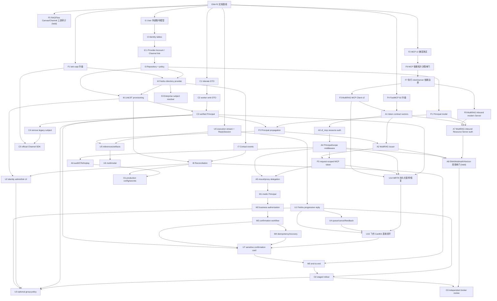

# EIM 实施路线图与进度账本

> 最后更新：2026-08-13
> 当前状态：文档基线、EIM-U0、EIM-U1、EIM-U4、EIM-U8～U13 已完成；
> CHN-U15 迁移/API 重启已完成，CHN-U16 已完成；真实 smoke 仍欠，下一项 CHN-O9，随后稳定浸泡；
> EIM-A1、EIM-A3、EIM-A4 已完成；EIM-A6 phase 1 正在收口且保持 `🔵`；MultiRAG 已完成
> EIM-I2 首期固定 Tenant ownership 与 identity schema；EIM-I2.1 已把 Provider Account 与 Channel
> 解耦为 tenant/provider-safe 显式 link；EIM-I3 repository/policy/service 与 EIM-P1 canonical
> Principal 已完成。EIM-F1 已以 `lark-oapi==1.7.2` 和 Contact V3/import contract fixture 收口；
> EIM-I4 已完成框架无关 Provider、official SDK typed async 调用链、过渡 credential adapter
> 与有界 cache/single-flight/限流；真实飞书 sandbox 因测试 credential 在 Auth V3 返回业务码
> `10003`，仍留作独立现场复验，未宣称 Contact 成功。下一条 identity 主线为 EIM-I6；
> Channel assertion 轨可独立推进；EIM-F5 /
> CHN-X14 和 EIM-O4 均保持挂起。

---

## 1. 维护协议（MANDATORY）

任何执行 `EIM-*` 的 Agent 必须：

1. **开工前重新核实**任务依赖、当前代码符号、仓库状态和 [VERSION_BASELINE](VERSION_BASELINE.md)。
   行号会漂移，以符号和实际代码为准；发现架构事实变化先更新文档。
2. 状态从 `⬜ 未开始` 改为 `🔵 进行中`，同一时间每个仓库原则上只有一个会触碰相同模块的
   任务处于进行中。
3. 一个任务一个可独立回滚的 PR/提交范围。依赖升级、schema、transport、身份、授权、UX 不混合。
4. 完成后把状态改为 `✅ 完成`，在本文“变更日志”追加日期、仓库、提交 SHA、实际修改、
   **任务特有的验证证据**。只写“verify 通过”不够。
5. 新发现不能塞进无关任务：追加新 ID。结论不成立时标 `❌ 取消` 并保留原因，不删历史。
6. 跨仓契约采用 additive-first；删除旧字段必须在所有长驻进程和调用方升级后单独执行。
7. 改 `api/channels/`、`api/channel_control/`、`api/channel_execution/`、
   `api/channel_runtime/` 的任务，提交标题同时带本表映射的 `CHN-*` ID，并更新 Channel
   `PROGRESS.md`。
8. 改 of_mcp 前完整读取其 `AGENTS.md`；契约 diff 按 breaking/behavioral/additive 处理。
9. 涉及飞书管理员审批、生产 Secret、DNS、重启、真实 Jira 工单或线上迁移的动作，必须在执行前
   获得用户明确批准；文档任务不构成这些授权。

状态取值：`⬜ 未开始` / `🔵 进行中` / `✅ 完成` / `🚫 阻塞` / `⏸ 挂起` / `❌ 取消`。

---

## 2. ID 规则

```text
EIM-Fn  Foundation / 版本与兼容
EIM-In  Identity data/service/provider
EIM-Cn  Channel identity transport
EIM-Pn  Principal propagation / MultiRAG runtime
EIM-An  MCP authentication / authorization
EIM-Mn  Medic high-risk workflow
EIM-Un  User/admin experience
EIM-On  Operations / rollout
```

`EIM-*` 负责整个跨仓项目；`CHN-*` 只负责 Channel 子系统记账。映射任务提交时两个 ID 都要出现，
例如：

```text
feat(channel): tolerate structured actor identity (EIM-C1, CHN-X5)
```

---

## 3. 依赖总图



可并行但不共文件的首批支线：`F1/F2/F4/I1/C1`；`F2` 完成后必须先做 F6，MultiRAG
的 F7/F3/F8 再按已选整根方案原子落地，F4 可在 `of_mcp` 独立推进。授权主线不可简化成
“A1 后 A2/A3 同时开工”：`P1+C3 -> P2`，`F3+F4 -> A1`，随后 `A1+F4 -> A3 -> A4`
与 `A1+P2 -> A2` 才能跨仓推进，`P2+F3+A2+A4 -> P3`。U14 必须等待 F3/P3/A4/C3，
U15 再接飞书渲染；A8/O3 是出现真实企业 IdP、多 issuer 或托管平台需求后的评审轨，
不在首期关键路径。

---

## 4. Phase F · 版本与兼容基础

| ID | 仓库 | 任务 | 状态 | 依赖 | 验收证据 |
|---|---|---|:---:|---|---|
| EIM-F0 | MR docs | 建立并维护本权威文档集、版本和上游快照 | ✅ | — | 本目录 13 份文档互链；官方/PyPI/HEAD 于 2026-08-12 复核 |
| EIM-F1 | MR | `lark-oapi` 1.7.1 -> 1.7.2；增加 Contact V3 与 import-boundary contract fixture，不改变生产身份行为 | ✅ | F0 | contract 7 passed；广义 Feishu/Channel 101 passed；lock/完整 verify 全绿、unit 2012 passed |
| EIM-F2 | 两仓 test fixture | 建并维护**双方向**兼容矩阵：MultiRAG 生产 Client、真实 inbound Server、官方 MCP 2 fixture 与隔离 FastMCP 3 legacy fixture；覆盖 modern/回退握手、SSE、401/403、tool error、取消/超时 | ✅ | F0 | PEP 723 独立锁固定 MCP 2 与 FastMCP 3 oracle；每格记录实际协商路径而非只看业务成功；迁移前 12/12，迁移后增加 inbound legacy 反向格为 13/13；无 sibling import、真实 Secret、固定端口或残留进程 |
| EIM-F3 | MR | `common/mcp_tool_call_conn.py` 迁到官方 `mcp.Client` v2；保留 legacy 自动回退 | ✅ | F2,F7 | HTTP `mode=auto`、SSE `mode=legacy`，不再手调 initialize；现代/legacy fixture 全绿；`InputRequiredResult` 只表面化给 Host；并发调用无旧串行队列/HOL；timeout 取消本地调用，远端取消明确为协作式 |
| EIM-F4 | of_mcp | FastMCP 4 b1 -> 开工时最新 beta（b2），纯版本 PR | ✅ | F0 | exact b2；mount/proxy/contract snapshots；`uv run --locked ofmcp verify` 116 passed、2 skipped，六步全绿；提交 `23dd1fd` |
| EIM-F5 | MR docs + 上游审计 | RAGFlow Canvas/Agent/Channel 逐 commit 对齐审计，定义来源基线、滚动兼容基线和单次移植 commit 三层版本语义；按“直接跟进 / 语义移植 / 适配层吸收 / 暂不采纳”分类并判断 no-store/checkpoint 执行缝 | ⏸ | F0,U13；Channel 完成 CHN-U15 rollout/真实 smoke、CHN-U16、CHN-O9 与稳定浸泡；用户明确恢复从约 2026-04-24 本地同步点逐 commit 跟进 | 固定恢复同步时的 HEAD；同步区/反腐层边界清单；移植冲突预算；契约测试建议；给出继续 candidate、采用上游缝或向上游提交可合入重构的单一结论；审计不改运行行为 |
| EIM-F6 | MR docs + resolver PoC | 冻结 MCP client/server 依赖拓扑：复现 FastMCP 3 的 `mcp<2` 与 MCP SDK 2 冲突，审计顶层 `mcp/` 同名边界，并在独立 runtime、全根协同 beta、等待 stable 三案中决策 | ✅ | F2 | 用户确认当前无生产 FastMCP 3 服务，选择单根环境原子升级；exact pin `fastmcp==4.0.0b2`、`mcp==2.0.0`；本地 `mcp/` 继续无 `__init__.py` 且入口保持文件路径；F3/F7/F8 因 import/依赖原子性同提交落地 |
| EIM-F7 | MR | 执行 F6 选定的单根 FastMCP 4 / MCP SDK 2 运行时边界 | ✅ | F6 | 根 lock 确定解析为 FastMCP/slim 4.0.0b2、MCP/mcp-types 2.0.0、sse-starlette 3.4.8；启动、SSE、HTTP、tools/list/call 和结构化结果全绿；未引入身份功能 |
| EIM-F8 | MR MCP server | 将 inbound MultiRAG RAG MCP Server 升到 `2026-07-28` modern era，同时保留受门禁控制的 legacy 兼容 | ✅ | F2,F7 | 真实跨进程 `server/discover`、`Mcp-Method/Mcp-Name`、无 session、structured result 全绿；隔离 FastMCP 3 legacy Client/Server 路径保留；未引入 Principal/scope/EMA |

F1/F3/F4/F7/F8 禁止携带身份功能。F2 只是 characterization/兼容矩阵，不得修改根 `pyproject.toml`
或 `uv.lock`；F6 只做依赖拓扑决策和可解析 PoC，F7 才实施选定边界。F5 是只读决策任务，
长期 upstream-first 原则不变，但当前不是近期任务；
只有上述稳定性闸门完成且用户恢复逐 commit 同步后才解除挂起。F5 不得顺手实现 Canvas runtime 或
启动 O4。若升级或移植审计失败，记录 `🚫` 和上游 issue，不通过放宽门禁解决。

### EIM-F1 完成边界与 I4 交接

- 根依赖下界和 lock 已对齐 `lark-oapi==1.7.2`；本任务只升级官方 SDK 并固定兼容契约，不新增
  `FeishuEnterpriseIdentityProvider`、目录 cache、身份写入、Principal 或 Channel transport 迁移。
- `tests/fixtures/eim_f1/contact_v3/get_user_success.json` 与
  `tests/unit/test_lark_oapi_contract.py` 固定 Contact V3 `GET /open-apis/contact/v3/users/:user_id` 的
  `user_id_type=open_id` request，以及 `GetUserResponse/User/UserStatus` typed response 白名单字段。
- 1.7.2 顶层 `lark_oapi` import 会安装 SDK 模块级 event loop；契约只接受“loop 存在但 idle、未运行、
  无 task、无新增 thread”。平台 control/provider/verification/identity 模块必须不加载 SDK，且在原本
  没有 loop 的进程中导入后仍没有 loop。该已知边界不能被写成“SDK 完全没有 import-time 副作用”。
- SDK `TokenManager` 有按 SDK cache key（自建应用 tenant token 当前以 `app_id` 分区）的本地 cache
  和提前过期，但 cache miss 路径没有
  single-flight。F1 不自己重写 token client；I4 必须在项目 Provider adapter 层按正确 account scope
  合并并发刷新，并用测试证明不会把 token 或刷新任务串到另一个 Provider Account。
- 完成证据：contract **7 passed**，广义 Feishu/Channel 定向 **101 passed**；`uv lock --check` 通过；
  `make verify` 的 Ruff format/check（1222 files）、7 import contracts、async DB gate、mypy 73 source
  files 全绿，unit **2012 passed in 30.95s**。F1 已解锁 I4，但没有提前实现 I4 运行时能力。

---

## 5. Phase I · MultiRAG 身份数据与服务

| ID | 仓库 | 任务 | 状态 | 依赖 | 主要锚点与完成条件 |
|---|---|---|:---:|---|---|
| EIM-I1 | MR | 让 `User` 支持 external-only：nullable email、`account_kind`、登录/找回密码兼容 | ✅ | F0 | `api/db/db_models.py::User`、auth/user APIs；存量迁移 + fresh DB；null email 不 500，不造假邮箱 |
| EIM-I2 | MR | 新增 provider tenant/account ownership、canonical identity、alias、enterprise subject、event receipt 六表与 Alembic | ✅ | I1 | [CONTRACTS §3](CONTRACTS.md#3-数据模型) 的固定单 Tenant、唯一/复合外键、RESTRICT、脱敏与安全回滚约束；并发 insert 真库测试；head `8f2c4d6e7a9b` |
| EIM-I2.1 | MR | Provider Account 去除 Channel 所有权；新增 tenant/provider-safe 一对一 `IdentityProviderChannelLink`，迁移旧关系且保留现有 ChannelSecret 归属 | ✅ | I2 | forward revision/单 head `9a3b5c7d8e0f`；account 可无 Channel，link 两端复合 FK + 双唯一 + RESTRICT；旧 account→link 无损 backfill；account/link 任一有数据则 downgrade fail closed；不宣称凭据已解耦 |
| EIM-I3 | MR | `api/identity` contracts/repository/policy/service 骨架，三种 provisioning policy | ✅ | I2.1 | `ProviderContext + AliasKey` 单 SQL 权威快照，revision + scope marker/alias proof freshness；五个窄 port；定向 57 passed，完整 verify 1969 / integration 82 |
| EIM-I4 | MR | `FeishuEnterpriseIdentityProvider`：open_id -> user_id/status/employee_no，token/cache/限流 | ✅ | F1,I3 | I4-specific unit 86 + F1 contract 7；credential 真 PostgreSQL 1；完整 verify/integration 全绿；可选真实 sandbox 保留脱敏失败分层 |
| EIM-I5 | MR | `FeishuEmployeeNumberResolver` + 可插拔 OA/HR resolver SPI | ⬜ | I4 | resolved/not-found/ambiguous/unavailable/inactive 五态；不含原力 if/else |
| EIM-I6 | MR | `preprovisioned/link_only/jit`、User/UserTenant 事务、一次性 link code、显式合并 | ⬜ | I3,I4 | JIT 只能 NORMAL；并发首次消息只建一个用户；绑定码单次/短 TTL；无邮箱匹配 |
| EIM-I7 | MR | Contact created/updated/deleted/scope 事件规范化、receipt 幂等、cache/revision 失效 | ⬜ | I4 | 重复事件无副作用；离职禁用；scope 变化触发 account revision，不全量拉取 |
| EIM-I8 | MR | 已链接活跃用户兜底 reconciliation、identity health、管理员可观测性 | ⬜ | I6,I7 | 不枚举全员；限流/游标；故障续跑；指标和脱敏错误码 |

### EIM-I1 开工简报

- 先全库搜索 `User.email` 的非空假设、密码登录、注册、找回密码、管理员和序列化路径。
- migration 先加 nullable/account_kind，再改业务代码；不要把外部用户伪装成已认证本地密码用户。
- 对现有用户的 backfill 必须确定且可回滚；PostgreSQL unique nullable 行为用真库验证。

### EIM-I2 开工简报

- 先实现模型和迁移，再 repository；不要让 ORM `create_all` 掩盖缺失 Alembic。
- 首期用 `provider tenant ownership` 机器强制 `(provider, provider_tenant_key) -> exactly one
  tenant_id`；I2 当时以 account 直接引用 Channel 逐级固定到同一 Tenant，I2.1 再把该关系迁为显式
  tenant/provider-safe link。未来集团多 Tenant 不预埋动态路由旁路，必须不同安装实例并另走
  ADR/schema 迁移。
- 用两个并发 AsyncSession 模拟相同 open_id 首次解析，证明唯一约束而非应用层先查后插承担最终保护。
- enterprise subject/API/log 默认脱敏；JSONB attributes 只能白名单写入。
- I2 是 MultiRAG 身份持久化，不 import FastMCP；后续 A7/P3 的 MCP 暴露继续优先复用 FastMCP 4
  auth、AccessToken 和 list/call middleware，不把领域 identity/Principal 改造成框架类型。

### EIM-I2.1 开工简报

- 不重写已提交的 I2 revision；用 `9a3b5c7d8e0f` 加法式迁移把旧 account `channel_id` backfill 为
  显式 link，再删除旧列。model-first 近似 schema、跨 Tenant/Provider link、缺失 backfill 或无法
  无损 downgrade 都 fail closed；当前 downgrade 仅允许 account/link 两表都为空。
- Provider Account 是可独立创建的企业连接；首期 link 同时 `UNIQUE(provider_account_id)` 和
  `UNIQUE(channel_id)`。普通路径不得 unlink/rebind；未来一对多必须先迁移 credential ownership。
- 飞书 Secret 仍位于 `ChannelSecret`。I4 在通用 Provider credential vault 前只能沿唯一 link 精确
  获取，不能按 `app_id` 猜测；无 Channel 的 account 只能 onboarding/pending，不能调用 Provider API。
- `CustomerOrganization` 仅进入目标架构，首期与 Tenant 1:1，不落表/claim/API。MCP/FastMCP 不拥有
  该领域 schema；本轮也不为假想 RAGFlow Git 冲突搬移模型，真实上游提交仍按
  `port-ragflow-commit` Skill 语义移植。

### EIM-I3 开工简报

- 当前实现的 identity core 只接受服务端构造的 `ProviderContext + AliasKey`，没有 `channel_id`、飞书
  SDK、FastMCP 或 Channel import。`IdentityService` 只依赖 `IdentityLookupRepository`；repository
  用一条 SQL 返回 account + alias/canonical identity + live `User/UserTenant` 快照。返回 `None` 只表示
  Provider Context 无效；有效 account 下 alias 缺失用 `snapshot.identity=None` 明确表达，不能混成同一
  “not found”。
- `preprovisioned/link_only/jit` 只返回 verification-gated action plan，不在 I3 创建 `User/UserTenant`、
  写 link、调用 Contact、激活 identity 或构造 Principal。真正 Provider 验证属于 I4，开户/绑定事务
  属于 I6，Principal 属于 P1/C3。
- `ProviderContext` 同时携 account revision 与 `provider_account_last_scope_change_at`；read query 精确
  匹配二者并投影 `alias_verified_at`。旧 alias proof 早于最新 scope marker 时结果要求 Provider 重验；
  conflict/revoked 终态仍优先返回各自结果且不提示可重验，不能被 freshness 掩盖。
- 写命令都携带完整 `ProviderContext`，repository 先锁 Provider Account 并复核 revision + scope marker，
  再从权威 account 派生 tenant/provider scope。ordinary mutation 只允许 pending identity insert 和
  单向收紧状态 CAS；verified identity mutation 独占 alias 新建/刷新与显式 activation；provider-account
  control 独占 health/scope/event marker CAS；ownership 仍独立且只暴露两个 verified insert。
- alias proof 早于 scope marker 时写入拒绝；比现有 proof 更旧的时间不得倒退 alias `verified_at`。
  account health CAS 中省略的时间字段保留原值，显式 scope/event 时间只能单调前进；所有 Core
  INSERT/UPDATE 显式写 BaseModel 审计时间。`conflict/revoked` 是终态。
- lookup、三种 write/control capability 与 ownership ports 相互分离，普通 service 只拿 lookup。所有
  协议都没有 generic CRUD、commit/rollback/delete、Channel unlink/rebind；事务边界由调用方拥有。
  结构/长度/attributes allowlist 在 SQL 前校验，SQLAlchemy/driver 异常统一脱敏为稳定 repository code。
- 完成证据：领域 unit **40 passed**、真 PostgreSQL repository **17 passed**，合计定向 **57 passed**；
  repository + identity schema 连续真库 **40 passed**；`make verify` 全绿（Ruff format/check、**7** 条
  import contracts、async gate、mypy **71 files**、unit **1969 passed in 28.85s**）；
  `REQUIRE_SERVICES=1 make integration` **82 passed in 12.48s**。I3/P1/F1/I4 均已完成；下一条
  identity 主线为 I6。

### EIM-I4 完成边界

- 已新增框架无关 `api.identity.providers` 边界：
  `FeishuEnterpriseIdentityProvider.resolve()/refresh()/invalidate()` 只消费服务端
  `ProviderContext`、外部 assertion 和 credential port，不依赖 Channel、FastMCP、数据库模型或
  Principal。
- 官方 `lark-oapi==1.7.2` 按需加载；调用顺序为 Auth V3
  `tenant_access_token.ainternal()` -> Tenant V2 `tenant.aquery()` 精确验证 `tenant_key` ->
  Contact V3 `user.aget()`。Tenant/Contact 显式传递 project-scoped token，不走 SDK 同步、
  `app_id` 全局 cache 的 `TokenManager` cold path；请求、解码和 domain 仍全部使用官方
  typed SDK，未重写 HTTP client/签名。
- 临时 credential composition 位于 `api.identity_adapters.channel_credentials`；它从精确
  Provider Account 出发，沿唯一 tenant/provider-safe link 读取 Channel 公开 `app_id/domain`，
  再用注入的 `SecretStore` 解密 `ChannelSecret`。缺失/多条/跨 scope/停用/污染明文/解密失败
  全部稳定映射为 `IDENTITY_PROVIDER_CREDENTIAL_UNAVAILABLE`，不按 `app_id` 猜测。
- token 和 directory result 的 cache/single-flight key 绑定 account id + revision + scope marker +
  `ChannelSecret.version` + Feishu/Lark domain。token 最多 512 项、identity 最多 2048 项、全局
  distinct in-flight 最多 512；正向/NOT_FOUND·NOT_IN_SCOPE·INACTIVE 负向 TTL 分别为
  300/30 秒，token 在 Provider expiry 前 600 秒过期。同 key cold miss 折叠，等待者取消
  不取消共享 producer，失败不缓存并释放 slot；跨 account/generation/domain 绝不共享。
- Contact 按 account 限制为 15 calls/s，最长排队 2 秒；容量或排队耗尽、timeout、transport
  失败都 fail closed 为可重试 `IDENTITY_PROVIDER_UNAVAILABLE`。scope/不可见、inactive、
  assertion/tenant/link conflict 保持独立稳定分类；五个 status primitive 全部必须是真
  `bool`，只有 activated 且未 frozen/resigned/exited/unjoin 才是 active。
- SDK response 只投影 `user_id/open_id/union_id/employee_no/display_name/status`；空的可选
  `employee_no/display_name` 归一为 `None`。完整 SDK model、raw response、token、Secret 与
  任何真实个人信息均不进入 domain repr、日志或持久化。
- Auth/Tenant/Contact 三个 endpoint 都同时保留 HTTP status 与业务 code；即使业务 code 为 0，
  非 2xx HTTP envelope 仍按失败处理。Auth/Tenant 属于控制面，任何 403/404 都不得伪装成
  identity `NOT_IN_SCOPE/NOT_FOUND` 并进入开户/JIT；业务码 `10003` 在 Contact 的 403/404
  envelope 中也优先归为 credential failure。
- 2026-08-13 真实 sandbox 只得到脱敏分层结果：凭据端点 HTTP 200，Provider
  business code `10003`，因此未签发 token，Tenant V2/Contact V3 均未调用。这不是真实
  Contact 通过证据；没有任何 credential、token、tenant/user ID 或个人字段落盘。ROADMAP
  原定验收是固定 fixture + **可选**真实 sandbox，因此该外部 credential 失败不阻塞 I4 的自动化
  `✅`；更新测试 credential 后仍须单独从 Auth V3 -> Tenant V2 -> Contact V3 脱敏复验。
- 完成证据：I4-specific unit **86 passed**，加 F1 contract 7 为组合定向 **93 passed**；
  Channel credential 真 PostgreSQL **1 passed**；`make verify` 全绿（format/Ruff **1234 files**、
  7 import contracts、async gate、mypy **78 source files**、unit **2098 passed in 33.26s**）；
  `REQUIRE_SERVICES=1 make integration` **84 passed in 11.51s**。
- I4 不新增明文配置或 token 数据库表，不持久化首次 tenant ownership，不写
  ExternalIdentity/Alias/User/UserTenant，不实现 I5/I6/I7/C3/Principal 传播。

---

## 6. Phase C · Channel 身份契约

| ID | CHN ID | 仓库 | 任务 | 状态 | 依赖 | 完成条件 |
|---|---|---|---|:---:|---|---|
| EIM-C1 | CHN-X5 | MR | private command tolerate 新 `ExternalIdentityAssertion`，仍读 legacy subject | ⬜ | F0 | extra-forbid 兼容测试；旧 worker -> 新 API 活体通过；更新 Channel CONTRACT |
| EIM-C2 | CHN-X6 | MR | Feishu worker emit tenant_key + 全部 ID；resolver 仍兼容 legacy | ⬜ | C1 | 新 worker -> 新 API；缺字段/重复 kind 拒绝；重启与部署证据 |
| EIM-C3 | CHN-X7 | MR | execution 调 IdentityService，把 verified user 提升为 `TrustedChannelContext.principal_id`/Principal | ⬜ | C2,I6,P1 | 外部 subject 永不直通；JIT/link/inactive 路由契约测试；端到端私聊 |
| EIM-C4 | CHN-X8 | MR | 所有 runner 升级后删除 legacy `ChannelActor.subject` | ⬜ | C3 + deployment soak | tolerate/emit/remove 第四步；先 API 后 supervisor；日志无 extra_forbidden |
| EIM-C5 | CHN-P14 | MR | 对官方 `lark-channel-sdk` 做 transport PoC；门禁全过才切换，失败则保留现有实现 | ⬜ | C4,F1 | 身份字段无损；公开生命周期；去重、卡片、长连接、凭据日志、回滚实测；audit 后才 strict |

### Channel 部署硬规则

`RuntimeBindingConfig`/command 都是 `extra="forbid"` 且 worker/supervisor 是长驻进程。每个半步
部署前读 Channel README 的 tolerate-then-emit 规则。C1/C2/C4 的活体验证不能只靠单测。

C3 不允许在 `binding_bridge.py` 里直接把 `message.sender_id` 填进 Principal；唯一合法路径是：

```text
server binding tenant + provider account + structured assertion
  -> EnterpriseIdentityService
  -> verified platform User/UserTenant
  -> Principal
```

---

## 7. Phase P · Principal 与 MultiRAG 执行链

| ID | 仓库 | 任务 | 状态 | 依赖 | 完成条件 |
|---|---|---|:---:|---|---|
| EIM-P1 | MR | 扩展/统一 immutable Principal 与 AuthenticationContext，不把 ORM 对象带出请求 | ✅ | I3 | [CONTRACTS §4](CONTRACTS.md#4-identity-service-接口)；web/token auth 基线不回归 |
| EIM-P2 | MR | Channel Execution -> Agent/RAG/Memory/Workflow 全链传 Principal；按 platform user 隔离 | ⬜ | P1,C3 | 不再用 `principal_id or ""` 静默匿名；跨用户会话/Memory 隔离测试 |
| EIM-P3 | MR | MCP request-scoped credential provider；按 Principal/resource/scope 获取 token | ⬜ | P2,F3,A2,A4 | Agent 初始化不缓存用户 token；cache key 绑定 principal/tenant/agent/resource/scope/policy revision/credential generation；并发用户不串 token；每 HTTP request 携带 bearer |

P1 已完成现有消费方审计：唯一 owner 是 `api.identity.principal.Principal`，
`api.utils.api_utils.Principal` 只是同一 class object 的兼容 re-export，存量 route import 迁完即删。
legacy Web/API 只活查 personal OWNER context，不代表一般多 Tenant 选择；C3/P2、A2/P3/A7
继续按独立任务验收。

---

## 8. Phase A · MCP 认证与授权

| ID | 仓库 | 任务 | 状态 | 依赖 | 完成条件 |
|---|---|---|:---:|---|---|
| EIM-A1 | 两仓测试/文档 | 固定 `mcp_access`/`mcp_internal_actor` claims、ES256 test JWKS、语言中立 corpus 和正反 vectors | ✅ | F3,F4 | PyJWT/joserfc 独立解析同一固定 token 并得到相同 normalized claims/稳定错误类；cross-profile、aud/kid/JOSE/time/scope/privacy 全覆盖；两仓 corpus 摘要一致；无真实 Secret |
| EIM-A2 | MR | issuer 模块、KMS/file key provider、JWKS、短 token 签发和轮换 | ⬜ | A1,P2 | scopes 取交集；audience 固定；5 分钟；private key 不入 DB/log；轮换测试 |
| EIM-A3 | of_mcp | gateway protected-resource metadata、WWW-Authenticate、JWT/JWKS + strict profile verifier | ✅ | A1,F4 | `RemoteAuthProvider`/自定义 verifier 组合；认证层 401 与 verifier 故障 503 分层；保留可测 403 seam、真实工具级 403 交给 A4；issuer/resource/JOSE/claims/clock/profile 全验；A3 handoff 保持 local/secure loopback；无 auth 绕过路由 |
| EIM-A4 | of_mcp | immutable Principal dependency、service scope enforcement、tool visibility/step-up | ✅ | A3 | A1 verified claims 独立投影为 immutable Principal；post-assembly canonical tool registry 完整覆盖并生成带 `policy_revision` 的确定性快照；outer HTTP 403 preflight + inner `tools/list` filter/`tools/call` 执行前重验；scope/tenant/assurance 分层且 domain/core 不 import FastMCP；external business resolver 与 `auth_time` freshness 明确保留为 future seam；local/secure 继续 loopback |
| EIM-A5 | of_mcp | proxy `mcp_internal_actor` 换发，mount/proxy Principal 与授权等价 | ⬜ | A4,P3 | 独立 issuer/keyset/service audience；scope/TTL attenuation；外部 token 不透传；两形态成功/拒绝/audit 等价 |
| EIM-A6 | of_mcp | auth audit、OTel、jti 高风险重放防护、指标和脱敏 | 🔵 | A4 | **phase 1 已落**：显式 effect/replay policy、canonical runtime revision、冻结 audit schema、原子 replay coordinator、OTel API 和 A4 最终 allow 后执行边界；**尚欠完成门禁**：多实例 durable replay/audit、HMAC/KMS 轮换、SDK/exporter 与跨仓 trace、A5 `parent_jti_hash`、生产集成/演练；审计无 token/PII，高风险重复/冲突 fail closed |
| EIM-A7 | MR MCP server | 把 inbound MultiRAG MCP 变成独立 OAuth Resource Server：protected-resource metadata、audience、scope、Principal 和工具可见性 | ⬜ | F8,A1,P1 | inbound/outbound resource 与 bearer 不复用；401/403/WWW-Authenticate 标准化；`tools/list` 与 direct call 均授权；dataset/tenant 隔离；legacy API-key 仅按明确迁移门禁保留 |
| EIM-A8 | 两仓架构/PoC | 企业托管与多 issuer 采用闸门：有真实企业 IdP/外部 MCP client 需求时评估 EMA + ID-JAG；FastMCP MultiAuth 只作为组合实现候选；Horizon 只作托管平台 build-vs-buy | ⏸ | A2,A4,A7 + 真实需求 | ADR/威胁模型区分标准、扩展、框架实现和托管产品；EMA fixture 使用真实形状的 IdP assertion，不伪造飞书事件；首期短时 issuer/resource-token 路径不回归；无需求不引入依赖或平台锁定 |

### EIM-A1 test vectors

使用明确的 test-only P-256 key/JWKS 生成并提交**固定 token bytes**；测试只读 corpus，不在断言时
重新签发。`manifest.json` 固定 validation time、30 秒 clock skew、4096 bytes 上限、两个 profile、
resources、scope registry，以及分层的 `cases`、`issuance_policy_cases`、
`delegation_cases`。Resource Server token 校验、MultiRAG signer policy 与 gateway delegation policy
分别断言，不能把“拒绝签发/拒绝换发”伪装成伪造 token 后的 401。

正向至少包括：

- 合法 `mcp_access`，以及带多个合法已登记 scope 的 token；
- 普通低风险 token 不带 `enterprise_subject`；需要业务主体的 token 使用
  `{type, issuer, subject, tenant}` 最小结构；同一无主体 token 调要求 assurance 的工具时在授权层
  返回 403 `enterprise_subject_required` 且不发 scope challenge，不能在认证层误报 401；
- old/new `kid` 在轮换重叠期都能验证；
- `mcp_internal_actor` 顶层 `sub` 保持用户，`act.sub` 为 gateway workload，并带
  `parent_jti_hash`、service audience、trace 和 scope attenuation。

JOSE/JWKS 负向至少包括：

- 缺失/错误 `typ`，缺失/未知 `kid`，`alg=none`、算法混淆、错误 `kty/crv/use/alg`；
- 重复 `kid`、JWKS 私钥参数、`jku/x5u/jwk`、未知 critical header；
- header/payload/signature 篡改，malformed compact JWT/Base64/JSON，超长 token。

时间/claims/scope 至少包括：

- expired、not-yet-valid、未来 `iat`、`exp<=iat`、超过 profile TTL；
- wrong issuer、wrong audience、尾斜杠 audience、必需 claim 缺失/空值/
  类型错误、多 audience；
- malformed、重复、未知 scope；合法额外 scope 必须仍通过认证，缺工具所需 scope 必须进入
  403 `insufficient_scope` 而不是 401；
- 有效 token 的 wrong tenant 在授权层返回 403；缺失/畸形 tenant claim 才是 401。

`issuance_policy_cases` 必须证明 `open_id`/Provider 原始 ID 不能被请求为 `sub`，role/department/
Channel 内容不能被加入 claims，调用方声明的 tenant/scope 不能扩大服务端交集；这些情况由 signer
拒绝签发，不能伪装成 Resource Server 收到危险 token 后再返回 401。

cross-profile/resource 至少证明 Channel workload/assertion、MultiRAG inbound token、gateway
`mcp_access`、proxy `mcp_internal_actor` 和不同 proxy service audience 不能互换。gateway 必须拒绝
internal token，proxy service 必须拒绝 external gateway token，即使签名、用户和 scope 合法。
corpus 必须让同一份合法 `mcp_internal_actor` compact bytes 在目标 proxy 的 internal profile 下通过、
在 Gateway 的 access profile 下拒绝，不能用 malformed 或 hybrid token 代替这条 confused-deputy 边界。

fixture 中企业主体使用低熵重复占位值，避免 gitleaks；private key 若为生成器所需，只能作为明确的
test-only 资料保留，运行时 JWKS 只含 public parameters。corpus 不能包含姓名、邮箱、电话、员工号、
飞书/OA token、聊天/表单正文或真实 Secret。

### EIM-A1 corpus 与跨仓交付

- 两仓各自保存字节一致的 `manifest.json`/schema、`jwks/access.json`、
  `jwks/internal_actor.json`、`jwks/invalid/*.json`、`tokens/*.jwt` 和 `SHA256SUMS`；
  CI 不做 sibling import、网络下载或共享 verifier。
- canonical `scripts/generate_eim_a1_vectors.py` 使用 PEP 723 锁定依赖和 deterministic RFC 6979
  ES256，输出 token、manifest/schema、JWKS 与摘要；生成器只处理 test-only key，验证读取固定输出。
- MultiRAG 用显式 direct dev dependency `PyJWT[crypto]==2.13.0`；of_mcp 用显式 direct test
  dependency `joserfc==1.7.4`。两端都要叠加项目 profile oracle，不能把依赖库默认校验当完整契约。
- `validation_time` 是唯一测试时钟；底层库的 wall-clock `exp/nbf/iat` 校验须关闭，再由项目 oracle
  确定性执行。测试比较稳定错误码，不锁第三方异常文案。
- 初次交付按 of_mcp corpus/tests、MultiRAG 同一 corpus/tests/docs 的顺序完成。门禁未满足阶段
  ROADMAP 保持 `🔵`；清单中的跨仓 commit 可以写 `pending`，但 corpus 摘要必须从实际文件计算，
  禁止填写占位 hash 或猜测 SHA。本轮两仓门禁与字节一致性现已全部通过。
- 只有两仓各自完整 verify 全绿、corpus 文件集合与 SHA-256 一致，并在本页变更日志登记两个 commit
  和 corpus aggregate digest（`sha256(SHA256SUMS raw bytes)`）后，A1 才能改为 `✅`。A1 不添加
  生产 issuer/verifier、DB/JWKS route、Channel Principal、动态 Authorization 或 KMS。

最终冻结 corpus 为 **91 个文件：79 个 `cases` + 7 个
`issuance_policy_cases` + 5 个 `delegation_cases`**；`sha256(SHA256SUMS raw bytes)` 为
`59f82684aa06365f45623ce9bfad336d487f2c9351879266a6b2ab21bf8fe208`。两仓目录字节一致；
MultiRAG EIM-A1 定向测试 **96 passed**，完整 `make verify` 的 Ruff format/check、6 条 import
contracts、async DB gate、mypy 65 files 全绿，unit **1904 passed in 25.76s**；of_mcp 已 amend 为
`3e1d5ac`，定向 **100 passed**，完整 `uv run --locked ofmcp verify` **216 passed、2 existing
skipped**。A1 状态为 `✅`。

### EIM-A3/A4 装配边界

auth 属于 of_mcp root composition，不能加到 service `build_server(auth=...)`。公共 metadata、
受保护的 MCP endpoint、最小健康端点和只由 verifier 访问的 issuer JWKS trust source 必须逐条列出，
不得用“一律放行 health”掩盖 service 缺失。

A3 已由 of_mcp `e4ab560` 完成：

- 新增独立 `ofmcp-auth` 平台包；production verifier 以 joserfc 做真实 ES256 验签，再执行 A1 冻结的
  `typ/kid/issuer/audience/time/max_ttl/token_use/claim/scope-registry/cross-profile` 严格规则，最后才
  投影为 FastMCP `AccessToken`；运行时代码不 import A1 测试 oracle。
- Gateway 用 FastMCP 4 `RemoteAuthProvider` 发布 RFC 9728 metadata 和 challenge，但用项目自定义
  bearer middleware 消除两个框架默认缺口：只在精确 `/mcp` 校验 Authorization，以及把 typed
  verifier outage 映射为 `503 verifier_unavailable` 而不是 500/401。
- JWKS trust source 是启动时冻结的固定 HTTPS URI；无重定向/环境代理、响应与 key 数有界。cache
  使用 last-known-good 的**新鲜**快照、原子全量替换、single-flight、每 `kid` 负缓存、跨未知 `kid`
  的全局 refresh cooldown 和负缓存条目硬上限；慢失败按请求完成时钟开始 backoff。没有新鲜可信
  snapshot 时 fail closed 为 503，不把过期 key 无限延寿；NaN/Infinity cache/timeout 配置在启动时拒绝。
- `local` profile 仍匿名；`secure` profile 缺 issuer/JWKS/resource 配置即
  fail-fast，只允许 mount，并显式关闭 scope registry 外的 hello。A5 完成 actor token 前，任何
  proxy 在 secure profile 下都拒绝装配。
- production profile/scope constants 与 A1 manifest 逐字段锁定，防止测试 corpus 与运行时信任词表
  单边漂移。
- A3 handoff 时 `local` 和 `secure` 都由 CLI 机器拒绝绑定非 loopback；`fastmcp.json` 固定 loopback，
  CLI 与 JSON 启动面同时启用 `host_origin_protection=auto`，覆盖 Host/Origin/DNS rebinding 防线。
  这条部署门禁在 A4 完成后仍保留，不能随工具授权落地而自动开放远程入口。
- Protected Resource Metadata 与 `/health/live`、`/health/ready` 是公开 route；health 只返回最小
  状态，公开/未知 route 上的 bearer 不触发 JWKS。除这些显式公开面外，业务入口固定为受保护的
  `/mcp`。
- A3 的 production `required_scopes=[]` 是安全边界，不是“无需 scope”：endpoint verifier 只判断
  token 是否属于当前 resource 和登记词表；若此处要求所有 enabled service scopes，会把合法的
  最小权限 token 错误拒绝。FastMCP global scope denial 的 403 seam 单独以 HTTP 测试钉住；真实
  tool registry 授权由 A4 接续。
- production verifier 已逐条消费 A1 的 **68** 个 Gateway 认证 case；定向 **126 passed**；
  `uv run --locked ofmcp verify` 六步全绿、**342 passed、2 existing skipped**，contract 无漂移。

A3 是安全的“先部署验证能力”半步：它不构造领域 Principal，不消费 role/group/department，也不
实现 internal actor token、audit/PDP、确认或幂等。

A4 已由 of_mcp `74117a0` 完成：

- A3 strict verifier 的 allowlisted claims 经独立 bridge 投影为框架无关、不可变的领域 Principal；所有
  A1 Gateway authentication-accepted vectors 都经过该投影回归。Principal 不包含 role/group/
  department、Provider 原始标识或上游 token，core/domain 不 import FastMCP auth 类型。
- `service.toml.scopes` 保持服务词表，逐工具 policy 才决定授权。registry 在 mount/namespace assembly
  完成后的 canonical tool catalog 上构造，缺失/孤儿 policy、重复 canonical name、namespace collision
  和未在当前 service scope 词表登记的 scope 在启动或 contract check 时 fail closed。
- `ofmcp contract` 生成排序稳定的 `apps/gateway/contract/tool-policies.json`；其
  `policy_revision=6f79e7ddf8f630993a054f284ebd5213424ffe39b252c661d16a2967ed6fdd67`，由不含
  revision 自身的 canonical policy document 计算 SHA-256。策略变更从此是显式 contract drift。
- 外层 ASGI authorization preflight 对真实 MCP request 返回标准 HTTP 403；内层 FastMCP middleware
  用同一 policy registry 过滤 `tools/list`，并在 `tools/call` 实际执行前再次授权。缺 scope 返回完整
  required scopes；tenant/assurance/business denial 不伪装 scope challenge。默认 SSE 响应在内层检查
  完成前不会提前发出 200，TOCTOU 二次拒绝/基础设施故障仍分别保持真实 403/500。
- tenant、ACR/AMR 与可选 `enterprise_subject` 的配置化判断已落地；`auth_time` 只携带并满足
  `auth_time<=iat`，未实现 freshness/max-age。external membership/role/business resolver 只是
  fail-closed future seam，当前 service policy 未启用；业务对象输入也未形成统一 schema-normalized
  production authorization contract。
- A4 完成后 `local` 与 `secure` 仍 machine-enforced loopback，并继续启用 Host/Origin protection。独立
  remote-release gate 至少仍等待 A2/P3 动态委托、企业主体、A6 审计/重放与上线证据。

A4 定向 **201 passed**；`uv run --locked ofmcp verify` 六步全绿、**417 passed、2 existing skipped**，
contract snapshot 无漂移。这是 A4 完成当时的快照；当前 MultiRAG P1 已完成，但 P2、A2/P3 与飞书
`ExternalIdentityAssertion -> binding/directory -> Principal` 链仍未实现，通用 MCP Client OAuth
取 token 也未闭环；当前文档仓 `make verify` 全绿、**1915 passed**。

### EIM-A6 phase 1 安全中间态（仍为 `🔵`）

当前代码已经建立可测试、可替换但尚非生产完整态的执行安全边界：

1. 每个 `service.toml [tool_policies.*]` 必填 `effect=read|prepare|side_effect` 与
   `replay_mode=reusable|single_use`；模型、registry 和 auth projection 都强制
   `side_effect => single_use`。leave create/submit 与四个 medic submit 为
   `side_effect/single_use`，其余当前工具为 `read/reusable`；完整真实工具覆盖仍由 A4 registry 门禁。
2. `ofmcp.core.policy_snapshot` 是 devkit 与 Gateway 唯一 canonical snapshot/revision 算法。format 2
   把 effect/replay mode 纳入 hash；local revision 为
   `7bf9e09082ca4f1d529e51bf3fe8e6dd5c4334c62deaf9a5b6be204af9fca446`。runtime 发布 registry 与
   revision 的同一不可变快照，A6 不读硬编码值或文件 mtime。
3. framework-independent coordinator 在 A4 inner middleware 最终 allow 后、业务 `call_next` 前，使用
   同一个 evaluation policy、runtime revision、Principal 和 canonical arguments。单次工具以
   `(token_use, issuer, audience, jti)` 的 domain-separated digest claim；这个 key 表示整枚 token/JTI 的
   **单一 capability**，不按 tool 再切一份。HMAC request fingerprint 才绑定完整 Principal/tenant/
   Agent/client、tool、policy revision 与 canonical arguments；因此同一 JTI 只能对应一个高风险逻辑
   操作，未来 P3 必须按执行换发短期 token/JTI。
4. same-fingerprint duplicate 返回 HTTP 409 `duplicate_operation`；同一 replay key 搬到不同参数或
   主体返回 HTTP 403 `replay_detected`；replay/audit 前置依赖不可用返回 HTTP 503。三者均
   `Cache-Control: no-store`、无 OAuth challenge，且业务函数零调用。成功记 `SUCCEEDED`；tool error、
   异常和取消保守记 `OUTCOME_UNKNOWN`。post-dispatch outcome 持久化失败保留 `DISPATCHED`，只写安全
   日志，不篡改已经形成的业务响应，也不自动重放。
5. audit 是无扩展 bag 的冻结 schema；主体/tenant/agent/client 用 keyed HMAC，JTI 只存 SHA-256，记录
   resource、tool、effect、replay mode、policy revision、request fingerprint、trace/call correlation、
   decision/reason/state，不记录 token、参数、结果、Provider PII、企业 subject 或医疗正文。OTel adapter
   只依赖 API，给 current span 增加受控属性并发出低基数 counters；不配置 SDK/exporter 时 no-op，
   telemetry 故障不改变认证、授权或 replay 决策。
6. secure Gateway 必须显式注入 coordinator；`production_ready` 只能由 multi-instance-safe replay store
   与 durable audit sink 共同成立，不能靠配置布尔值伪造。内存实现仅供测试/显式 test-only 启动；
   当前真实 secure CLI 因没有生产后端 fail-fast，loopback/remote-release gate 继续关闭。

A6 仍不得改为 `✅`，直至至少完成并验证：共享持久 replay store 与 append-only audit sink、容量/
故障/过期/重启/多副本语义、fingerprint HMAC key 的 KMS 托管和轮换、OTel SDK/provider/exporter 与
W3C 跨仓 trace propagation、A5 internal actor 的 `parent_jti_hash`、P3 动态 bearer 后的真实主体链、
业务级 idempotency/result lookup（M3/M4）以及 remote-release 演练。replay claim 只阻止同一 capability
重复进入代码，不能证明外部系统未执行，也不能替代业务幂等或结果缓存；duplicate 只拒绝，不回放
先前结果。当前 P3 尚未实现，secure 又因没有生产 coordinator 后端 fail-fast，所以这条 token/JTI
消费纪律还没有进入真实 MultiRAG 委托流。

### EIM-A5 两种 token

外部 token audience 是 gateway。proxy 路径由 gateway 在已验证 Principal 基础上签发/交换 60 秒
internal actor token，scope 只减不增；service composition root 验证。严禁把外部 bearer 原样
forward。

### EIM-A7 inbound Resource Server 边界

MultiRAG inbound MCP 与 of_mcp 是两个不同的 OAuth resource。它必须拥有自己的 canonical resource
URI、audience、scope namespace、protected-resource metadata、审计和回滚面；任何 bearer 都不得在
两个方向间透传。A7 只做入站认证授权，不引入 EMA、MultiAuth 或托管平台。

### EIM-A8 官方边界

- EMA 是 MCP 官方 auth extension，适用于真实企业 IdP 参与的托管授权；它不把飞书机器人事件升级为
  ID Token/SAML，也不取代 MultiRAG 的 Principal 解析。
- ID-JAG 是 EMA 所依赖的 IETF 工作项；在其规范/库状态变化时必须重新核验，不能把 draft 当成本项目
  已实现的稳定登录协议。
- MultiAuth 是 FastMCP 的多认证提供方组合实现，不是 MCP 协议；是否采用必须由实际多 issuer 路由、
  冲突和 fail-closed 测试证明。
- Horizon 是 Prefect/FastMCP 的托管平台产品，不是标准组件，也不是搭建企业 MCP 服务中心的前置条件。

---

## 9. Phase M · medic 真实副作用收口

| ID | 仓库 | 任务 | 状态 | 依赖 | 完成条件 |
|---|---|---|:---:|---|---|
| EIM-M1 | of_mcp | medic 工具注入 Principal；`workcode` 改 optional+ignored | ⬜ | A5,I5 | 所有 medic tools 使用同一 dependency；伪造 workcode 无效；contract diff 正确申报 |
| EIM-M2 | of_mcp | `medic:submit` scope + 企业主体类型 + 业务授权 adapter/preflight | ⬜ | M1 | allow/deny/unavailable；业务拒绝不泄露规则；真实执行前检查 |
| EIM-M3 | 两仓 + of_mcp | prepare/confirm/execute 两阶段、Confirmation Store、过期/取消/操作者绑定 | ⬜ | M2,U14 | action digest 固定；他人点击无效；参数变化需重确认；持久化状态机 |
| EIM-M4 | of_mcp | 端到端幂等、Jira request key/查询恢复、unknown outcome 队列 | ⬜ | M3 | 双击、网络超时、模型重试不重复建单；未知结果不自动重放 |
| EIM-M5 | 两仓 integration | 从飞书消息到测试 Jira 的完整成功/拒绝/离职/重放测试 | ⬜ | M4,U7,I8 | sandbox/test project；零真实生产工单；跨仓 trace/audit 对账 |

M1 需要修改 medic 每个工具文件，但先在共享 submission/application service 收口企业主体，不复制
四份授权逻辑。domain 仍不 import FastMCP；dependency 只存在 tools/adapters 边界。

---

## 10. Phase U · 用户与管理员体验

实现契约、交互状态和测试矩阵以 [FEISHU_BOT_UX](FEISHU_BOT_UX.md) 为准。SDK transport PoC
EIM-C5 与 U0/U1 并行，不是前置依赖。

| ID | CHN ID | 仓库 | 任务 | 状态 | 依赖 | 完成条件 |
|---|---|---|---|:---:|---|---|
| EIM-U0 | CHN-X9 | MR | `runtime_client` 以加法暴露 async execution event stream；新增 transport-neutral ReplySession，保留 `ask()` 兼容聚合 | ✅ | F0 | `stream()` 是唯一 HTTP/SSE 核心路径；BindingBridge 直接消费 stream；默认 buffered session 完成时单次发送；wire、旧 `AgentReply`、reasoning 过滤、截断、session、幂等/顺序/安全状态语义均由测试锁定 |
| EIM-U1 | CHN-U8 | MR + 飞书 | Typing reaction、CardKit 2.0 流式卡片、Markdown/post/text renderer、delivery uuid 和 fallback | ✅ | U0 | 首 ack/首卡 SLO；<=4 QPS 节流；strict sequence；最终 flush/finish；卡片失败不重跑 Agent且仍交付文本 |
| EIM-U2 | — | MR + web | tenant identity policy、link code、自身身份、冲突/revalidate 管理 UI/API | ⬜ | I6,I8 | Secret/subject 脱敏；管理员权限；link-only 完整流程；additive-first |
| EIM-U3 | CHN-U10 | MR + web/飞书 | 可选群聊：@ only、群 allowlist、thread session、reply hydration、高风险工具默认关闭 | ⏸ | U1,U2,C3,O2 | 单独风险评审；群内身份隔离；机器人 loop guard；未批准前不启用 |
| EIM-U4 | CHN-U9 | MR + 飞书 | follow-up 有界队列、queued/running/final 状态、纯生成取消、重新生成和低风险反馈 | ✅ | U1 | 队列满不静默；每来源消息独立状态；副作用已开始不伪装回滚；回调幂等 |
| EIM-U5 | CHN-X10 | MR + 飞书 | `references_ready/artifact_ready` 安全事件、来源和产物渲染 | ⬜ | U0,P2 | 不解析内部 tool/A2UI payload；资源可见性；无本地路径/临时 token URL；降级可用 |
| EIM-U6 | CHN-X11 | MR + 飞书 | 图片、文件、输出 artifact、语音转写的结构化附件链 | ⬜ | U0,U5,C3 | message_id+resource key 下载；大小/MIME/扫描/TTL；tenant/user/session 隔离；不支持类型明确提示 |
| EIM-U7 | CHN-X12 | MR + 飞书 + of_mcp | 敏感确认卡、`card.action.trigger`、取消/完成/失败与持久化恢复 | ⬜ | U15,M3,M4 | 操作者/tenant/digest/expiry/nonce 绑定；重复点击一次执行；重启恢复；执行前重授权 |
| EIM-U8 | CHN-U11 | MR | 飞书渐进式回复 transport Protocol 运行时可检查，恢复 beartype 对 reply session 构造入口的参数校验 | ✅ | U1 | supervisor 启动不再产生对应 `BeartypeClawDecorWarning`；结构化 transport 可通过运行时实例检查；不合规实现被拒绝 |
| EIM-U9 | CHN-U12 | MR + 飞书 | CardKit 自适应增量合并，减少模型四字 delta 与同步 patch RTT 叠加造成的碎片化慢更新 | ✅ | U1 | 首个正文快速显示；持续输出时后续 patch 默认至少合并 16 字或等待 1s；patch RTT 不计入下一批等待；final flush 不丢 |
| EIM-U10 | CHN-U13 | MR + 飞书 | CardKit 后台单写者刷新与客户端流式打印参数，彻底解除模型 delta 消费对飞书 patch RTT 的背压 | ✅ | U9 | `append()` 不等待 CardKit 网络；最多 1 个 patch 在途且只保留最新待发快照；定时刷新不依赖后续 delta；终态 drain + final flush；显式 `fast` 打印策略 |
| EIM-U11 | CHN-X13 | MR | Provider/Target capabilities、启动预取与目标私有 driver；Dialog 为主目标、Canvas 为扩展目标，拆除具体目标方法组成的通用 session manager | ✅ | U4 | Provider × Target 无组合分支；现有行为逐事件等价；新增目标不修改既有 Provider；见 [执行架构](../channel-program/EXECUTION_ARCHITECTURE.md) |
| EIM-U12 | CHN-U14 | MR | Dialog detached working copy + 终态单次 CAS，移除 Dialog 候选会话写放大；私有 SSE 按 consumer/tolerate → worker 部署 → producer/emit 执行 | ✅ | U11 | generation 8 worker 先部署 consumer；terminal commit barrier 前失败/取消/仅推理零公开历史写；并发头冲突不覆盖；新会话终态才发布；普通/重新生成均无候选 insert/delete |
| EIM-U13 | CHN-U15 | MR | Canvas candidate strategy 独立化、候选元数据显式化、TTL GC 移出请求热路径 | ✅ | U11、U12 | 保持 MultiRAG Canvas 同步区零 Channel 私参；周期批量回收 Canvas 与 U14 前遗留 Dialog 候选；公开历史 CAS；完整 `make integration` |
| EIM-U14 | — | 两仓 runtime/contract | 建 transport-neutral 的持久化 `InteractionRequest`/`InteractionResponse` 暂停恢复状态机，承接 MCP 2026 MRTR `input_required`，也允许 legacy server 适配到同一内部契约 | ⬜ | F3,P3,A4,C3 | 缺参时不阻塞连接；状态绑定 principal/tenant/tool/参数 digest/expiry/idempotency；重启可恢复；恢复前重授权；超时/取消/重复响应 fail closed；renderer fallback 绝不重跑工具 |
| EIM-U15 | CHN-X15 | MR + 飞书 | 在 U14 上实现 CardKit“点击 -> 表单 -> 提交 -> 后端处理 -> 原卡结果页”闭环；卡片只负责渲染与收集，不承担授权 | ⬜ | U14,U1,U4 | `card.action.trigger` 3 秒内验签、去重、持久化并应答；后台恢复同一 interaction；成功/字段错误/授权拒绝/过期/取消/未知结果均更新原卡；本任务不启用敏感写，后续 U7 仅在 M3/M4 完成后开放 |

所有工具过程卡片只显示服务端白名单安全摘要；不能显示完整 MCP 参数、模型推理、企业工号、token、
文件内容或底层错误。纯输出 U1 不订阅 `card.action.trigger`，只有 U4/U7 需要交互回调。

U14/U15 首期不依赖 MCP Tasks 或 MCP Apps：MRTR 只定义跨请求补充输入，持久化状态、授权、幂等和
结果恢复仍由两仓负责；Tasks 当前实现成熟度不足以替代本项目 run/interaction ledger。MCP Apps 要求
host 支持受控 web UI，飞书 CardKit 不是 Apps host；未来另有 Web host 需求时再单独立项。

---

## 11. Phase O · 运维、上线和长期演进

| ID | 仓库/环境 | 任务 | 状态 | 依赖 | 完成条件 |
|---|---|---|:---:|---|---|
| EIM-O1 | 两仓 + infra | production config、issuer/resource DNS+TLS、KMS/JWKS、Secret rotation、网络策略 | ⬜ | I8,A6 | runbook 演练；proxy 不可公网直达；密钥轮换无中断；配置无明文 |
| EIM-O2 | 两仓 + 飞书 | 分阶段 rollout：shadow identity -> RAG Principal -> read-only MCP -> medic canary | ⬜ | O1,M5,U1 | 每阶段 rollback/指标/审计；离职演练；管理员签字；无 big-bang |
| EIM-O3 | 架构评审 | 判断是否抽独立 identity-broker，以及是否把 A8 已验证的企业 IdP/多 issuer 能力平台化 | ⏸ | O2,A8 + 实际需求 | 满足 README 抽取条件；独立 ADR/威胁模型；不提前实现 |
| EIM-O4 | MR + 架构评审 | Channel API 侧 durable run ledger、单会话单活和 cancel/final CAS；Provider worker 继续只走内部 API/SSE，不替代或复制 Canvas 目标 checkpoint runtime | ⏸ | U11～U13 + 明确的 `kill -9`/主机故障、跨实例取消或终态结果未知恢复需求 | 不按 token 写库；DB 约束兜底单活；已接受取消不被迟到成功覆盖；未满足需求前不实现完整 workflow runtime。正常可控重启的卡片终态化由 CHN-U16 解决，不构成启动本项的理由 |

推荐 rollout：

1. **shadow**：解析身份但不影响执行，对比 open_id/user_id/员工状态，不签 token。
2. **platform principal**：只用于会话/Memory 隔离，MCP 仍关闭。
3. **read-only MCP**：小范围用户、只读工具、短 token 和完整审计。
4. **medic test tenant**：测试 Jira + 确认 + 幂等。
5. **medic canary**：指定部门/用户 allowlist，观察后扩展。

---

## 12. 当前任务推荐顺序

Channel 近期只走下面这条稳定性收口路径：

```text
CHN-U15 迁移/API 重启已完成，补 Dialog/Canvas 真实飞书 smoke   <- 仍然欠着
CHN-U16 优雅停机终态化 + 跨层测试                          <- ✅ 2026-08-11 完成
  -> CHN-O9 最小可观测                                     <- 当前下一项
  -> 稳定浸泡
  -> 用户恢复从约 2026-04-24 本地同步点逐 commit 跟进时，再启动 EIM-F5 / CHN-X14
```

U16 先于现场 smoke 落地并不注销那条：跨层测试证明的是进程行为（卡片终态、零执行调用、流被
关闭），真实飞书会话行为仍要现场跑。

CHN-U16 只保证正常、可控的 supervisor/worker 停机不会留下 queued/running 卡片；不恢复进程内
队列或旧 action，不涵盖 `kill -9`、主机掉电、跨实例恢复和数据库终态不确定性，在 Windows 上也
不涵盖 supervisor 触发的停止（`TerminateProcess` 不给合作窗口）。后者继续由挂起的
EIM-O4 / CHN-O14 守门。CHN-U16、CHN-O9 均沿用 Channel 账本自己的 ID，不新造 EIM 映射。

EIM-F5 / CHN-X14 仍是长期 upstream-first 的上游审计入口，但当前状态为挂起，不得因为文档已经
登记就提前刷新滚动兼容基线、批量拉取上游或实现 Canvas execution port。

当前 of_mcp 与 MultiRAG 身份候选：

```text
EIM-A6  🔵 phase 1 已落；下一半完成生产 durable backend、key rotation 与跨仓 trace
EIM-F1  ✅ lark-oapi 1.7.2 + Contact/import contracts
EIM-I1  ✅ User 外部账号模型
EIM-I2  ✅ provider ownership + external identity schema
EIM-I2.1 ✅ Provider Account / Channel explicit link
EIM-I3  ✅ repository + policy/service
EIM-P1  ✅ canonical immutable Principal
EIM-I4  ✅ Feishu directory provider；自动化门禁已收口，真实 Contact sandbox 单独待复验
EIM-C1  Channel tolerate structured assertion
```

MCP Foundation 的实际串并行轨道：

```text
                 +-> F4 of_mcp FastMCP 4 b2 beta（✅ `23dd1fd`）
F0 -> F2 (✅) ---+
                 +-> F6 单根环境决策 -> F7 原子依赖升级 -> F3 outbound Client v2（✅）
                                                          -> F8 inbound modern Server（✅）

协议基础轨、A1 契约轨与 of_mcp A3/A4 Resource Server 认证授权轨已完成。后续不得把它们或
P1 误写成 MultiRAG 身份/动态委托已经打通；P2、A2/P3、A7 和 U14/U15 仍按各自依赖推进。
```

体验快速通道（不等待身份/MCP/SDK 迁移）：

```text
U0 -> U1 -> U4 -> U11 -> U12/U13
```

身份、MCP 与敏感操作主通道（`+` 表示全部前置均需完成）：

```text
I1 -> I2 -> I2.1 -> I3 -> P1
F1 + I3 -> I4 -> I6
C1 -> C2 -> C3                         (C3 另需 I6 + P1)
P1 + C3 -> P2

F2 -> F6 -> F7/F3/F8                   (已按整根方案原子完成)
F3 + F4 -> A1 (✅)
A1 + F4 -> A3 -> A4                   (✅)
A1 + P2 -> A2
P2 + F3 + A2 + A4 -> P3
F8 + A1 + P1 -> A7
F3 + P3 + A4 + C3 -> U14 -> U15
A4 + P3 -> A5
A4 -> A6

I5 -> I7 -> I8 -> M1 -> M2 -> M3 -> M4 -> U7 -> M5 -> U2 -> O1/O2 -> U3

A8 -> O3  仅在真实企业 IdP、多 issuer 或托管平台需求成立后解除挂起。
```

A3/A4 已完成，of_mcp 的 A6 phase 1 已落但保持进行中；下一步不是把内存 store 当生产后端，而是完成
durable multi-instance replay/audit、HMAC key rotation 和跨仓 OTel。MultiRAG 已完成 F1/I2/I2.1/I3/I4/P1，
当前 identity 主线为 `I6`，`C1 -> C2` 可并行，只有
`C2 + I6 + P1 -> C3 -> P2` 后才能做 A2。
随后必须等 `P2 + F3 + A2 + A4 -> P3`，再启动 A5/U14 等真实委托消费者。A7 保持独立入站
resource；A8 仍无真实需求不启动。这个顺序既保留 of_mcp 的 fail-closed verifier/authorizer 先行，
又不把未验证的 Channel subject 塞进 token；A4 的 Resource Server Principal 不能替代
MultiRAG P2 的执行链传播。

C5/CHN-P14 在 C4、F1 后单独做 transport PoC，可与 U1 之后的体验任务并行；不得为了迁移 SDK
把 UX 任务重新绑回 C5。

实际开工仍以依赖图和当时仓库状态为准。

---

## 13. 变更日志

| 日期 | ID | 变更 | 仓库/提交 | 验证证据 | 记录人 |
|---|---|---|---|---|---|
| 2026-08-07 | EIM-F0 | 建立企业身份与 MCP 授权权威文档集；核验飞书/MCP 最新官方文档、PyPI 版本和参考仓 HEAD | MultiRAG docs / 本次提交 | 文档互链与本地路径检查；版本来源见 VERSION_BASELINE | Codex |
| 2026-08-09 | EIM-F0 | 按当前 Channel 代码和官方/主流飞书项目重构体验路线：新增 ReplySession/渐进式回复基线，拆开 SDK、普通 UX 与敏感确认依赖，登记 U0/U4-U7 和 CHN 映射 | MultiRAG docs / 本次提交 | PyPI/官方仓 HEAD 复核；任务 ID 双向检查；相对链接和 `git diff --check` | Codex |
| 2026-08-09 | EIM-U0 / CHN-X9 | 完成 worker 侧类型化 `message_delta/message_completed/execution_failed` 流；`stream()` 统一 command/header/HTTP/SSE/超时/完整性/session/安全错误与跨 delta reasoning 过滤，`ask()` 仅聚合同一流；BindingBridge 改为 `stream() -> ReplySession`，普通 Channel 默认 buffer，成功只发送一次，部分结果失败时丢弃并发送安全提示。未改服务端 SSE wire，未实现 CardKit/U1；`ask()` 只为迁移/回滚保留，新代码禁用，待生产调用归零且 U1 稳定后单独删除 | MultiRAG / `feat(channel): stream execution replies (EIM-U0, CHN-X9)` | 定向 `test_channel_runtime_client.py test_reply_session.py test_binding_bridge.py`: **50 passed in 0.26s**，覆盖有序 delta、DONE/非法/中断/超时/未知事件、安全码、跨片 reasoning、跨片截断、ask 单路径、ReplySession 全状态机/发送失败、Bridge 去重/reset/顺序/异常与 tombstone；`make fix`: Ruff 全绿、1175 files unchanged；`make verify`: format/Ruff、6 import contracts、async DB gate、mypy 62 files 全绿，unit **1641 passed, 1 warning in 25.60s**；`git diff --check` 通过 | Codex |
| 2026-08-09 | EIM-U1 / CHN-U8 | 飞书 `begin_reply()` 落地 Typing、CardKit JSON 2.0 单卡流式更新、250ms/4 QPS 节流、严格 sequence、确定性 stage UUID、final flush/finish；独立 Markdown/post/text renderer 拒绝非 HTTPS 链接、外部图片、原始 mention 与 `@all`，表格/未闭合代码块安全降级。Typing 与首卡并发启动，慢 reaction 不阻塞卡片且终态迟到会自动清理；create/reply/patch 失败继续消费同一次 execution stream，最终 post→text fallback，不重跑 Agent；finish 单独失败不重复交付。已读回执注册安全空处理器，`lark-oapi` 下界提升到仓库验证过的 1.7.1，manifest 声明 streaming cards | MultiRAG / `feat(channel): stream Feishu CardKit replies (EIM-U1, CHN-U8)` | 定向四文件 **66 passed in 2.48s**，覆盖 SDK request builder、Typing/慢 reaction 首卡不阻塞、节流/sequence/final、renderer、terminal state、reaction/card/post/text 全降级、同 UUID fallback、CardKit 故障 execution 只调用一次与 `message_read_v1` processor；`make fix` Ruff 全绿；`make verify` format/Ruff、6 import contracts、async DB gate、mypy 62 files全绿，unit **1658 passed, 1 warning in 26.53s**；`uv lock --check` 与 `git diff --check` 通过 | Codex |
| 2026-08-09 | EIM-U8 / CHN-U11 | `FeishuReplyTransport` 声明为运行时可检查 Protocol，恢复 beartype 对渐进式 reply session 构造入口的 transport 参数校验；同步订正 UX 基线中的 U1 实现状态 | MultiRAG / `fix(channel): restore Feishu reply runtime checks (EIM-U8, CHN-U11)` | `test_feishu_reply.py` **15 passed in 0.22s**，覆盖运行时结构检查、无关实现拒绝和告警升级为 error 的全新进程 import；现场复现命令修复前 exit 1、修复后零输出 exit 0；`make verify` format/Ruff、6 import contracts、async DB gate、mypy 62 files 全绿，unit **1661 passed, 1 unrelated warning in 25.46s**；`git diff --check` 通过 | Codex |
| 2026-08-09 | EIM-U9 / CHN-U12 | 飞书流式卡片改为自适应增量合并：首个正文快速显示，后续默认合并 16 个新字符或在持续输出 1s 后更新；下一轮窗口从 CardKit patch 返回后计时，避免同步 RTT 造成背靠背四字刷新；final flush 语义不变 | MultiRAG / `fix(channel): coalesce short Feishu card deltas (EIM-U9, CHN-U12)` | 定向两文件 **34 passed in 0.33s**，覆盖四字中文 delta 合并、1s 上限、2s 模拟 RTT 与既有 final flush/sequence/fallback；`make verify` format/Ruff、6 import contracts、async DB gate、mypy 62 files 全绿，unit **1664 passed, 1 unrelated warning in 25.23s**；`git diff --check` 通过 | Codex |
| 2026-08-09 | EIM-U10 / CHN-U13 | `append()` 改为非阻塞后台刷新：250ms 定时器、单 patch 在途、latest-value 待发合并，终态 drain 后强制 final patch/finish；保留 strict sequence、delivery UUID 与 card→post→text 降级。CardKit 显式配置 70ms/1 字/`fast` 客户端打印节奏；设计对照官方流式卡片文档、Channel SDK、OpenClaw、LangBot 和 shareAI-lab 快照源码 | MultiRAG / `perf(channel): decouple Feishu card flushing (EIM-U10, CHN-U13)` | 六个飞书/Bridge 定向文件 **95 passed in 2.84s**；覆盖 append 不等待慢 patch、1 running + latest pending、独立定时 flush、terminal drain/final、客户端配置与后台失败 fallback；`make fix` 1177 files unchanged；`make verify` format/Ruff、6 import contracts、async DB gate、mypy 62 files全绿，unit **1665 passed, 1 unrelated warning in 23.41s** | Codex |
| 2026-08-10 | EIM-U11～U13 / CHN-X13、U14、U15 | 定案 MultiRAG Channel 执行架构：Provider 与目标正交，Dialog 是主目标并迁移到 detached CAS，Canvas 是扩展目标并保留独立 candidate CAS；能力取 Provider/Target/RunPolicy 交集，worker 继续无数据库；候选 GC 移出请求热路径。EIM-O4/CHN-O14 durable run ledger 挂起到真实恢复需求成立 | MultiRAG docs / 本次变更 | 核对当前 `TargetExecutorRegistry`、`runtime_client`、`ChannelSessionManager`、Dialog/Canvas completion；刷新 RAGFlow、DeerFlow、Open WebUI、LangBot HEAD 与官方执行/持久化资料；相对链接、ID 双向 grep、`make verify` | Codex |
| 2026-08-10 | EIM-U11 / CHN-X13 | 删除目标命名的通用 session manager，落地 Dialog/Canvas 私有 driver/history transaction；新增 Provider × Target × RunPolicy 纯能力交集、每次 worker 启动一次的脱敏 preflight、Bridge 最小 action 注册和服务端 regenerate/retry 二次授权。Canvas replay 对未知、已淘汰或副作用图 fail closed，纯文本 Message 保持可用；不修改 `RuntimeBindingConfig`、execution SSE 或 MultiRAG completion 同步区 | MultiRAG / `refactor(channel): add target drivers and capability negotiation (EIM-U11, CHN-X13)` | 定向 **160 passed**；真实历史事务 **4 passed**；worker 导入图无 SQLAlchemy/`api.db`；`make verify` 6 import contracts、mypy 63 files、unit **1744 passed** 全绿；完整 `make integration` **20 passed**；`git diff --check` 通过 | Codex |
| 2026-08-10 | EIM-U11 / CHN-X13 | 将失败/取消卡的用户操作完整收口为 retry：卡片文案改为“重试”，保留独立 `reply_retry`/opaque action/Bridge kind，toast 和后台 task 名同步区分；retry 仍映射普通 `operation=message`，FINAL 的 regenerate 语义不变 | MultiRAG / `fix(channel): distinguish retry interaction copy (EIM-U11, CHN-X13)` | Feishu Reply + Bridge **49 passed**；覆盖 ERROR/CANCELLED、scheduler unavailable、旧失败卡和任务名；`make verify` unit **1748 passed** 且全部静态门禁绿；`git diff --check` 通过 | Codex |
| 2026-08-10 | EIM-U11 / CHN-X13 | 订正 retry 的 execution 映射：普通失败继承 `message`，失败/取消的 regenerate 继承 `regenerate`，FINAL 卡仍强制 regenerate；不新增 `retry` wire operation | MultiRAG / `fix(channel): preserve operation when retrying (EIM-U11, CHN-X13)` | 三条映射钉板 **3 passed**；相关四文件 **97 passed**；`make verify` unit **1758 passed** 且静态门禁全绿；`git diff --check` 通过 | Codex |
| 2026-08-10 | EIM-U12 / CHN-U14 | 完成权威终态快照 consumer/tolerate：typed completed 可选正文，runtime 严格校验/reasoning 过滤，`ask()` 权威替换；ReplySession 新增纯内存 `replace()`，Bridge 在取消屏障后 replace→complete，Buffered/Feishu 保持 Provider-neutral。producer 与 wire 本提交不变，等待 worker 部署后才 emit | MultiRAG / `feat(channel): tolerate authoritative reply snapshots (EIM-U12, CHN-U14)` | 四个 consumer/Bridge 文件 **97 passed**；覆盖新旧 wire、非法/空/推理快照、聚合替换、失败终态和 CardKit 高 sequence 覆盖；`make verify` unit **1758 passed** 且静态门禁全绿；producer/route 零 diff、`git diff --check` 通过 | Codex |
| 2026-08-10 | EIM-U12 / CHN-U14 | generation 8 worker 先完成 consumer 部署后启用 producer：Dialog 以 transient 配置 + detached transcript 直接调用既有 `async_chat()`，终态 existing CAS UPDATE / new INSERT，提交成功后在 `message_completed.content` emit 权威正文；公开 executor 关闭会立即传递到 driver/模型流。Canvas candidate CAS 不变；terminal commit barrier 后的跨存储不确定性留 EIM-O4 | MultiRAG / `feat(channel): emit detached Dialog snapshots (EIM-U12, CHN-U14)` | producer/consumer 与真库定向 **144 passed**；`make verify` unit **1764 passed**、全部静态门禁绿；完整 `make integration` **26 passed**；MultiRAG `conversation_service.py` / `dialog_service.py` 零 diff；`git diff --check` 通过 | Codex |
| 2026-08-10 | EIM-U13 / CHN-U15 | Canvas 使用 MultiRAG 自有 sidecar 显式管理候选 owner/target/public session/expiry；新会话与元数据同事务创建，候选在发布前移出普通目标会话命名空间，终态按固定锁序恢复公开身份或清理。API 侧启动及周期运行有界 `SKIP LOCKED` GC，兼容回收遗留 Canvas/Dialog marker；请求热路径不再 prune，worker 继续无数据库。迁移兼容 model-first 启动并严格拒绝不兼容既有表，MultiRAG Canvas/Dialog 同步区零 diff | MultiRAG / `refactor(channel): isolate Canvas candidate lifecycle (EIM-U13, CHN-U15)` | 定向单元 **97 passed**、真 PostgreSQL **23 passed**；`make verify` unit **1781 passed** 且全部静态门禁绿；完整 `make integration` **35 passed**；单 Alembic head `e4f6a8b0c2d4`；`git diff --check` 通过 | Codex |
| 2026-08-10 | EIM-F5 / CHN-X14 | 定案 RAGFlow upstream-first 的 Canvas/Channel 长期收敛策略：现代项目提供 terminal publish、CAS、run/history 分离、幂等和副作用门禁等不变量，不替换上游 Canvas 内核。登记逐 commit 只读审计入口并明确保持挂起：CHN-U15 迁移/API 重启已确认，先补真实 smoke，再完成 CHN-U16、CHN-O9 和稳定浸泡；待用户恢复从约 2026-04-24 本地同步点逐 commit 跟进后再启动。历史来源、滚动兼容与单次移植三层版本语义不变，EIM-O4 继续挂起 | MultiRAG docs / 本次变更 | CHN-ADR-08、执行架构与两份账本双向 ID/链接检查；`make verify` | Codex |
| 2026-08-12 | EIM-F0/F2/F6～F8/A7/A8/U14/U15 | 按 MCP 2026 与两仓实锁重排 MCP Foundation：F2 扩为双方向、双解释器矩阵；依赖边界、outbound Client、inbound modern Server 与 inbound Resource Server auth 分任务；另登记 EMA/MultiAuth/Horizon 可选闸门及 MRTR 到飞书表单闭环，明确 Tasks/Apps 不作为首期依赖 | MultiRAG docs / 本次变更 | 文档 ID/版本/相对链接检查；`git diff --check` | Codex |
| 2026-08-12 | EIM-F2 | 首次完成升级前双方向、双解释器 MCP 兼容实验室与 12 格基线；该行记录的是**迁移前 characterization**，后续 F3/F8 已将生产协商结果升级为 modern，legacy fixture 继续作为回退 oracle | MultiRAG `956bff4e`；of_mcp `9fa3a33` | 当时 `make mcp-compat` 12/12、MultiRAG `make verify` 1796 passed；of_mcp verify 116 passed、2 skipped；两份隔离锁与无残留进程检查通过 | Codex |
| 2026-08-12 | EIM-F4 | of_mcp 从 FastMCP 4.0.0b1 精确升级到 b2；只刷新 b2 自动派生的 tool title 契约，名称、schema、annotations、授权面和业务语义不变 | of_mcp `23dd1fd` | `uv lock --check`；定向 24 passed；`uv run --locked ofmcp verify` 六步全绿，116 passed、2 skipped；`git diff --check` | Codex |
| 2026-08-12 | EIM-F3/F6/F7/F8 | 用户确认无生产 FastMCP 3 运行负担后选择单根环境原子升级：exact FastMCP 4.0.0b2/MCP SDK 2.0.0；outbound 改为官方 Client auto/legacy、HTTP response-hook 保留 401/403、MRTR 表面化、并发无旧队列；inbound 真实进入 2026-07-28 modern era，同时以隔离 FastMCP 3 保留 legacy 回退门禁。身份、scope、EMA、持久 InteractionSession 均未实现 | MultiRAG / 本次提交 | SDK2 client + inbound 定向 **33 passed**（其中 lifecycle 在 asyncio debug + ResourceWarning-as-error 下 19 passed）；升级后 `make mcp-compat` **13/13 PASS**；`uv lock --check`、独立 FastMCP3/MCP2 script locks、无残留进程；`make verify` 全部门禁绿、unit **1808 passed** | Codex |
| 2026-08-12 | EIM-A1 | 完成 91-file、RFC 9068-shaped `mcp_access`/`mcp_internal_actor` 契约；PyJWT/joserfc 独立 oracle 共同覆盖 79 token、7 issuance policy、5 delegation cases；增加同一合法 internal actor 在 proxy 通过、Gateway cross-profile 拒绝的向量，固定 401/403/issuance/delegation 分层与跨 resource 安全边界 | of_mcp `3e1d5ac`；MultiRAG 本次变更；corpus `59f82684aa06365f45623ce9bfad336d487f2c9351879266a6b2ab21bf8fe208` | MultiRAG 定向 **96 passed**；`make verify` Ruff format/check、6 条 import contracts、async DB gate、mypy 65 files 全绿，unit **1904 passed in 25.76s**；of_mcp 定向 **100 passed**、`uv run --locked ofmcp verify` **216 passed、2 existing skipped**；两仓 91-file corpus 字节一致、摘要一致，A1 cases 无 skip/xfail | Codex |
| 2026-08-12 | EIM-A3 | of_mcp 新增独立 strict `mcp_access` verifier、固定 HTTPS JWKS/LKG/轮换/single-flight/cache 防放大、RFC 9728 PRM 与稳定 401/503；secure profile 缺配置 fail-fast、mount-only/hello disabled，production endpoint scopes 保持空并把真实工具 403 留给 A4；A3 交接时 local/secure 均机器限制 loopback，Host/Origin protection 开启 | of_mcp `e4ab560`；MultiRAG docs / 本次变更 | production verifier 全跑 68 个 A1 Gateway cases；定向 **126 passed**；`uv run --locked ofmcp verify` 六步全绿、**342 passed、2 existing skipped**；contract no drift；MultiRAG `make verify` 全绿、**1904 passed**；scope/profile constants 与 A1 manifest 锁定，NaN/Infinity、随机 unknown kid、慢失败 backoff 和非 loopback 负向均覆盖 | Codex |
| 2026-08-12 | EIM-A4 | of_mcp 将 A3 verified claims 投影为 framework-independent immutable Principal；在 post-assembly canonical tool catalog 上建立完整逐工具 policy registry，生成确定性 snapshot/revision；outer ASGI 返回真实 HTTP 403，inner FastMCP 对 `tools/list` 过滤并在 `tools/call` 执行前重验；default SSE response guard 保持二次拒绝的 403/500；scope/tenant/assurance 分层，external business resolver 与 `auth_time` freshness 明确保留为 future seam；local/secure 继续 loopback | of_mcp `74117a0`；policy revision `6f79e7ddf8f630993a054f284ebd5213424ffe39b252c661d16a2967ed6fdd67`；MultiRAG docs / 本次变更 | of_mcp 定向 **201 passed**；`uv run --locked ofmcp verify` 六步全绿、**417 passed、2 existing skipped**；contract snapshot no drift；MultiRAG `make verify` 全绿、**1904 passed**；本行不宣称 A2/P3、飞书 Principal、M1/M2、A5/A6 已完成 | Codex |
| 2026-08-12 | EIM-I1 | `User` 支持 nullable email 与 `local/external/hybrid` 账户类型；数据库与 service 双层禁止 external-only 本地密码，登录/找回密码只接受 password-capable 账户；公共 user projection、Admin 创建用户响应与注册失败响应不暴露密码哈希、存量 access token 或 SQL 参数；邀请人姓名在 nickname/email 都缺失时使用稳定非 PII fallback。迁移按存量 `login_channel/password` 可逆分类 local/external/hybrid，fresh DB、upgrade → downgrade → upgrade 与不可重建状态均有真 PostgreSQL 守门；Web OAuth 强制一次性 state 且在 I6 建立 provider-subject binding 前不执行 email 登录、注册或合并 | MultiRAG `7041f92a` | `make verify`：format/Ruff、6 import contracts、async DB gate、mypy 65 files 全绿，unit **1915 passed in 24.79s**；`REQUIRE_SERVICES=1 make integration`：**41 passed in 6.50s**；Alembic 单 head `7c8d9e0f1a2b`；安全复核无剩余 blocker | Codex |
| 2026-08-12 | EIM-I2 | 新增 provider tenant/account ownership、canonical identity、tenant-scoped alias、enterprise subject 与 body-free event receipt 六表；首期由数据库 ownership/复合外键强制一个飞书企业、安装实例和 Channel 固定单 Tenant，所有身份历史外键 RESTRICT；attributes 关闭白名单，默认 projection 脱敏；model-first 逐项核对 CHECK SQL/server default，错误 default 与六表部分存在的半迁移 schema 均 fail closed；downgrade 先锁六表并在有数据或并发写竞争时 fail closed。该任务未引入 repository、Channel Principal、动态 MCP token 或 FastMCP domain 依赖；下一项 EIM-I3 | MultiRAG / 本次提交 | Alembic 单 head `8f2c4d6e7a9b`；I2 unit **10 passed**；identity integration **11 passed**，含错误 default/partial schema 负向、并发 alias 单 winner、空表 down/up、有历史拒绝与 `ACCESS EXCLUSIVE` 锁竞争 SQLSTATE `55P03`；`make verify` 静态门禁全绿、unit **1925 passed**；`REQUIRE_SERVICES=1 make integration` **52 passed**；`git diff --check` 通过 | Codex |
| 2026-08-12 | EIM-I2.1 | Provider Account 去除 Channel 所有权并可独立存在；新增 tenant/provider-safe 首期一对一 `IdentityProviderChannelLink`，旧 `account.channel_id` 无损 backfill 后删除；link 双唯一、两端复合 FK 与 RESTRICT 机器拒绝跨 Tenant/Provider、一端多绑和级联删除；Channel 控制面保护改为沿 link 查询。飞书凭据仍归 `ChannelSecret`，Customer Organization 仅进入首期 1:1 Tenant 的目标术语；未引入通用 Provider credential vault、Principal、动态 MCP token 或 FastMCP domain 依赖；下一项 EIM-I3 | MultiRAG / 本次提交 | Alembic 单 head `9a3b5c7d8e0f`；I2.1 identity integration **23 passed**；相关 I2.1 unit **14 passed**；identity schema + Channel control persistence **25 passed**；相关 identity + Channel control unit **67 passed**；`make verify` 全绿、unit **1929 passed**；`REQUIRE_SERVICES=1 make integration` **65 passed**；`git diff --check` 通过 | Codex |
| 2026-08-12 | EIM-I3 | 新增框架无关 `ProviderContext`/identity contracts、三态 provisioning plan、只读 `IdentityService`、共享输入 validation 与纯异步 SQLAlchemy repository；单 SQL 区分无效 account context 与有效 alias miss，重查 live User/UserTenant，并用 account revision + scope marker/alias proof 判 freshness。ordinary mutation 仅 pending insert/单向收紧 CAS；verified identity mutation 独占 alias refresh/activation；provider control 独占 health CAS；ownership 独立。旧 proof 拒绝/不降级，health 时间 preserve/monotonic，Core 写显式审计时间，输入和 SQLAlchemy 异常稳定脱敏；conflict/revoked 终态均先于 freshness 分类且不可复活。本任务不交付飞书 Provider、开户、Principal、Channel 接线、动态 MCP token 或 FastMCP 运行时变更 | MultiRAG / 本次提交 | I3 定向 **57 passed**（unit 40 + 真 PG 17）；repository + identity schema 连续真库 **40 passed**；`make verify` 全绿：Ruff format/check、7 import contracts、async gate、mypy 71 files、unit **1969 passed in 28.85s**；`REQUIRE_SERVICES=1 make integration` **82 passed in 12.48s**；`git diff --check` 通过 | Codex |
| 2026-08-12 | EIM-P1 | 建立 `api.identity.principal` 唯一 canonical Principal/AuthenticationContext，封闭 direct constructor，用 legacy actor 与 I3 RESOLVED 两个进程内 evidence builder 绑定 user/tenant/provider/proof；Principal 不携 email/role/groups/scopes/token，兼容 `.id/.nickname` 与 `api_utils` re-export 只保留到存量 route import 迁完。新增独立 legacy owner adapter，每请求活查 active User + 唯一 personal OWNER Tenant，valid JWT 身份失效不降级为 API token，意外 verifier 错误不吞。本轮不交付 C3/P2、A2/P3、A7，不宣称 sync ORM auth 入口已迁移 | MultiRAG / 本次提交 | P1 定向 unit **49 passed**；真 PostgreSQL P1 **1 passed**；`make verify` 全绿：7 import contracts、async gate、mypy 73 files、unit **2005 passed**；`REQUIRE_SERVICES=1 make integration` **83 passed**；安全复核无 blocker；`git diff --check` 通过 | Codex |
| 2026-08-12 | EIM-F1 | 将官方 `lark-oapi` 从 1.7.1 升到 1.7.2；新增固定 Contact V3 success fixture，钉住 `user_id_type=open_id` request 与 `GetUserResponse/User/UserStatus` typed response；隔离证明平台 control/provider/verification/identity import 不加载 SDK/不安装 loop，并把 SDK 顶层 import 的模块级 idle loop 明确固定为无 task/无新增 thread 的已知边界。源码审计确认 `TokenManager` 有 cache 但 cache miss 无 single-flight，项目级并发刷新留给 I4。本任务不实现 Provider、身份写入、Principal 或 Channel transport 迁移 | MultiRAG / 本次提交 | 新 contract **7 passed**；广义 Feishu/Channel 定向 **101 passed**；`uv lock --check` 通过；`make verify` 全绿：Ruff 1222 files、7 import contracts、async DB gate、mypy 73 source files、unit **2012 passed in 30.95s**；`git diff --check` 通过 | Codex |
| 2026-08-13 | EIM-I4 | 新增框架无关飞书 Provider SPI/DTO 与 `resolve/refresh/invalidate`；以官方 `lark-oapi==1.7.2` typed async Auth V3 -> Tenant V2 -> Contact V3 完成 token、企业归属和单人目录验证；用 account/revision/scope/credential generation/domain 分区的有界 cache、single-flight 与每 account 限流防止跨企业复用和冷启动放大；沿唯一 Provider Account link 精确读取仍归 `ChannelSecret` 的过渡 credential。三 endpoint 保留 HTTP/business envelope，Auth/Tenant 控制面不产生 identity miss，business `10003` 优先归 credential failure。本任务不写 identity/User/UserTenant，不实现 I5/I6/I7/C3/Principal/MCP token；下一项 I6 | MultiRAG / 本次提交 | I4-specific unit **86 passed**，加 F1 contract 7 为组合定向 **93 passed**；credential 真 PostgreSQL **1 passed**；`make verify` 全绿：format/Ruff 1234 files、7 import contracts、async gate、mypy 78 source files、unit **2098 passed in 33.26s**；`REQUIRE_SERVICES=1 make integration` **84 passed in 11.51s**。真实 sandbox 仅为 Auth V3 HTTP 200/business `10003`、无 token、Tenant/Contact 未调用，不宣称真实 Contact 成功；更新测试 credential 后单独复验 | Codex |
| 2026-08-12 | EIM-A6 phase 1 | of_mcp 为所有实际工具增加 effect/replay policy 并把它纳入 canonical snapshot/revision；新增冻结脱敏 audit schema、单 capability JTI replay claim/state machine、HMAC request fingerprint、框架无关 security coordinator 与 OTel API adapter；Gateway 在 A4 最终 allow 后、业务执行前 prepare，重复/冲突/依赖故障分别稳定映射 409/403/503，业务结果未知不释放 claim。仅完成安全中间态：生产 durable backend、HMAC/KMS 轮换、OTel SDK/exporter/跨仓 trace、A5 parent JTI、P3 动态 token、业务幂等和远程发布仍未完成，A6 保持 `🔵` | of_mcp `0d1224d`；MultiRAG docs / 本次提交；policy revision `7bf9e09082ca4f1d529e51bf3fe8e6dd5c4334c62deaf9a5b6be204af9fca446` | A6/Gateway 定向 **65 passed**；`uv run --locked ofmcp verify` 六步全绿、**453 passed、2 existing skipped**；MultiRAG `make verify` 静态门禁全绿、**1915 passed**；当前 secure 无生产 coordinator 后端时 fail-fast，remote gate 未开放 | Codex |
