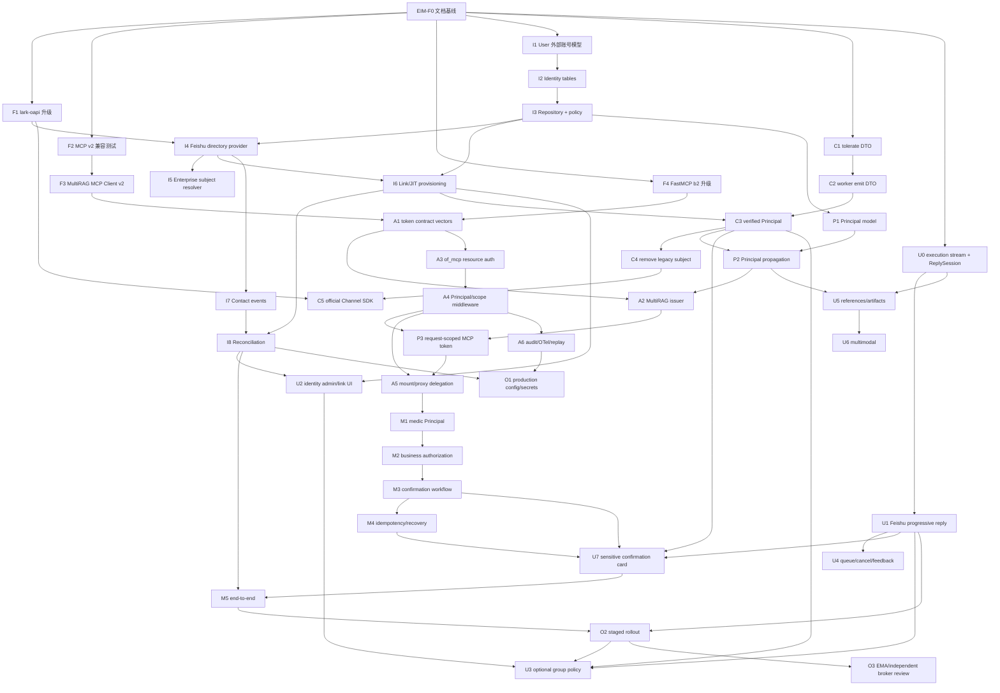

# EIM 实施路线图与进度账本

> 最后更新：2026-08-09
> 当前状态：文档基线、EIM-U0、EIM-U1 与 EIM-U8 已完成；下一项体验依赖为 EIM-U4。

---

## 1. 维护协议（MANDATORY）

任何执行 `EIM-*` 的 Agent 必须：

1. **开工前重新核实**任务依赖、当前代码符号、仓库状态和 [VERSION_BASELINE](VERSION_BASELINE.md)。
   行号会漂移，以符号和实际代码为准；发现架构事实变化先更新文档。
2. 状态从 `⬜ 未开始` 改为 `🔵 进行中`，同一时间每个仓库原则上只有一个会触碰相同模块的
   任务处于进行中。
3. 一个任务一个可独立回滚的 PR/提交范围。依赖升级、schema、transport、身份、授权、UX 不混合。
4. 完成后把状态改为 `✅ 完成`，在本文“变更日志”追加日期、仓库、提交 SHA、实际修改、
   **任务特有的验证证据**。只写“verify 通过”不够。
5. 新发现不能塞进无关任务：追加新 ID。结论不成立时标 `❌ 取消` 并保留原因，不删历史。
6. 跨仓契约采用 additive-first；删除旧字段必须在所有长驻进程和调用方升级后单独执行。
7. 改 `api/channels/`、`api/channel_control/`、`api/channel_execution/`、
   `api/channel_runtime/` 的任务，提交标题同时带本表映射的 `CHN-*` ID，并更新 Channel
   `PROGRESS.md`。
8. 改 of_mcp 前完整读取其 `AGENTS.md`；契约 diff 按 breaking/behavioral/additive 处理。
9. 涉及飞书管理员审批、生产 Secret、DNS、重启、真实 Jira 工单或线上迁移的动作，必须在执行前
   获得用户明确批准；文档任务不构成这些授权。

状态取值：`⬜ 未开始` / `🔵 进行中` / `✅ 完成` / `🚫 阻塞` / `⏸ 挂起` / `❌ 取消`。

---

## 2. ID 规则

```text
EIM-Fn  Foundation / 版本与兼容
EIM-In  Identity data/service/provider
EIM-Cn  Channel identity transport
EIM-Pn  Principal propagation / MultiRAG runtime
EIM-An  MCP authentication / authorization
EIM-Mn  Medic high-risk workflow
EIM-Un  User/admin experience
EIM-On  Operations / rollout
```

`EIM-*` 负责整个跨仓项目；`CHN-*` 只负责 Channel 子系统记账。映射任务提交时两个 ID 都要出现，
例如：

```text
feat(channel): tolerate structured actor identity (EIM-C1, CHN-X5)
```

---

## 3. 依赖总图



可并行但不共文件的支线：`F1/F2/F4/I1/C1`；`A2` 与 `A3` 在 A1 契约固定后可跨仓并行。

---

## 4. Phase F · 版本与兼容基础

| ID | 仓库 | 任务 | 状态 | 依赖 | 验收证据 |
|---|---|---|:---:|---|---|
| EIM-F0 | MR docs | 建立并维护本权威文档集、版本和上游快照 | ✅ | — | 本目录 11 份文档互链；官方/PyPI/HEAD 于 2026-08-09 复核 |
| EIM-F1 | MR | `lark-oapi` 1.7.1 -> 当时最新 1.x；增加 Contact V3 contract fixture，不改变生产身份行为 | ⬜ | F0 | 现有 Channel 测试；token/client import 无事件循环副作用；Contact typed response 测试 |
| EIM-F2 | MR + of_mcp test fixture | 建 MCP SDK 2 兼容矩阵：现代 2026 server、legacy server、401/403、tool error、取消/超时 | ⬜ | F0 | 测试先在旧生产 client 上暴露差异；结果和迁移清单入账 |
| EIM-F3 | MR | `common/mcp_tool_call_conn.py` 迁到官方 `mcp.Client` v2；保留 legacy 自动回退 | ⬜ | F2 | 不再手调 initialize；现代/legacy fixture 全绿；无身份静态 header |
| EIM-F4 | of_mcp | FastMCP 4 b1 -> 开工时最新 beta（当前 b2），纯版本 PR | ⬜ | F0 | of_mcp AGENTS 的 b1 实测行为逐项复测；mount/proxy snapshots；`ofmcp verify` |

F1/F3/F4 禁止携带身份功能。若升级失败，记录 `🚫` 和上游 issue，不通过放宽门禁解决。

---

## 5. Phase I · MultiRAG 身份数据与服务

| ID | 仓库 | 任务 | 状态 | 依赖 | 主要锚点与完成条件 |
|---|---|---|:---:|---|---|
| EIM-I1 | MR | 让 `User` 支持 external-only：nullable email、`account_kind`、登录/找回密码兼容 | ⬜ | F0 | `api/db/db_models.py::User`、auth/user APIs；存量迁移 + fresh DB；null email 不 500，不造假邮箱 |
| EIM-I2 | MR | 新增 canonical identity、alias、enterprise subject、event receipt 表与 Alembic | ⬜ | I1 | [CONTRACTS §3](CONTRACTS.md#3-数据模型) 的唯一约束；并发 upsert 真库测试 |
| EIM-I3 | MR | `api/identity` contracts/repository/policy/service 骨架，三种 provisioning policy | ⬜ | I2 | async-first；封闭单测；无 api route import；冲突 fail closed |
| EIM-I4 | MR | `FeishuEnterpriseIdentityProvider`：open_id -> user_id/status/employee_no，token/cache/限流 | ⬜ | F1,I3 | Contact V3 fixture + 可选真实 sandbox；scope/status/error 分类；single-flight |
| EIM-I5 | MR | `FeishuEmployeeNumberResolver` + 可插拔 OA/HR resolver SPI | ⬜ | I4 | resolved/not-found/ambiguous/unavailable/inactive 五态；不含原力 if/else |
| EIM-I6 | MR | `preprovisioned/link_only/jit`、User/UserTenant 事务、一次性 link code、显式合并 | ⬜ | I3,I4 | JIT 只能 NORMAL；并发首次消息只建一个用户；绑定码单次/短 TTL；无邮箱匹配 |
| EIM-I7 | MR | Contact created/updated/deleted/scope 事件规范化、receipt 幂等、cache/revision 失效 | ⬜ | I4 | 重复事件无副作用；离职禁用；scope 变化触发 account revision，不全量拉取 |
| EIM-I8 | MR | 已链接活跃用户兜底 reconciliation、identity health、管理员可观测性 | ⬜ | I6,I7 | 不枚举全员；限流/游标；故障续跑；指标和脱敏错误码 |

### EIM-I1 开工简报

- 先全库搜索 `User.email` 的非空假设、密码登录、注册、找回密码、管理员和序列化路径。
- migration 先加 nullable/account_kind，再改业务代码；不要把外部用户伪装成已认证本地密码用户。
- 对现有用户的 backfill 必须确定且可回滚；PostgreSQL unique nullable 行为用真库验证。

### EIM-I2 开工简报

- 先实现模型和迁移，再 repository；不要让 ORM `create_all` 掩盖缺失 Alembic。
- 用两个并发 AsyncSession 模拟相同 open_id 首次解析，证明唯一约束而非应用层先查后插承担最终保护。
- enterprise subject/API/log 默认脱敏；JSONB attributes 只能白名单写入。

### EIM-I4 开工简报

- App Secret 从现有 Channel Secret dependency 获取，不新增配置明文入口。
- provider account 的 tenant_key 首次绑定必须验证并持久化；后续不一致是安全事件。
- SDK response 只提取白名单字段；不要把完整 User model/原始响应持久化或记录日志。
- `tenant_access_token` 交给官方 SDK 生命周期，不自建数据库 token 表。

---

## 6. Phase C · Channel 身份契约

| ID | CHN ID | 仓库 | 任务 | 状态 | 依赖 | 完成条件 |
|---|---|---|---|:---:|---|---|
| EIM-C1 | CHN-X5 | MR | private command tolerate 新 `ExternalIdentityAssertion`，仍读 legacy subject | ⬜ | F0 | extra-forbid 兼容测试；旧 worker -> 新 API 活体通过；更新 Channel CONTRACT |
| EIM-C2 | CHN-X6 | MR | Feishu worker emit tenant_key + 全部 ID；resolver 仍兼容 legacy | ⬜ | C1 | 新 worker -> 新 API；缺字段/重复 kind 拒绝；重启与部署证据 |
| EIM-C3 | CHN-X7 | MR | execution 调 IdentityService，把 verified user 提升为 `TrustedChannelContext.principal_id`/Principal | ⬜ | C2,I6,P1 | 外部 subject 永不直通；JIT/link/inactive 路由契约测试；端到端私聊 |
| EIM-C4 | CHN-X8 | MR | 所有 runner 升级后删除 legacy `ChannelActor.subject` | ⬜ | C3 + deployment soak | tolerate/emit/remove 第四步；先 API 后 supervisor；日志无 extra_forbidden |
| EIM-C5 | CHN-P14 | MR | 对官方 `lark-channel-sdk` 做 transport PoC；门禁全过才切换，失败则保留现有实现 | ⬜ | C4,F1 | 身份字段无损；公开生命周期；去重、卡片、长连接、凭据日志、回滚实测；audit 后才 strict |

### Channel 部署硬规则

`RuntimeBindingConfig`/command 都是 `extra="forbid"` 且 worker/supervisor 是长驻进程。每个半步
部署前读 Channel README 的 tolerate-then-emit 规则。C1/C2/C4 的活体验证不能只靠单测。

C3 不允许在 `binding_bridge.py` 里直接把 `message.sender_id` 填进 Principal；唯一合法路径是：

```text
server binding tenant + provider account + structured assertion
  -> EnterpriseIdentityService
  -> verified platform User/UserTenant
  -> Principal
```

---

## 7. Phase P · Principal 与 MultiRAG 执行链

| ID | 仓库 | 任务 | 状态 | 依赖 | 完成条件 |
|---|---|---|:---:|---|---|
| EIM-P1 | MR | 扩展/统一 immutable Principal 与 AuthenticationContext，不把 ORM 对象带出请求 | ⬜ | I3 | [CONTRACTS §4](CONTRACTS.md#4-identity-service-接口)；web/token auth 基线不回归 |
| EIM-P2 | MR | Channel Execution -> Agent/RAG/Memory/Workflow 全链传 Principal；按 platform user 隔离 | ⬜ | P1,C3 | 不再用 `principal_id or ""` 静默匿名；跨用户会话/Memory 隔离测试 |
| EIM-P3 | MR | MCP request-scoped credential provider；按 Principal/resource/scope 获取 token | ⬜ | P2,F3,A2,A4 | Agent 初始化不缓存用户 token；并发用户不串 token；每 HTTP request 携带 bearer |

P1 必须评估现有 `api.utils.api_utils.Principal` 的所有消费方。不要同时存在两个同名但语义不同的
Principal；如需迁移 facade，明确 owner 模块和删除计划。

---

## 8. Phase A · MCP 认证与授权

| ID | 仓库 | 任务 | 状态 | 依赖 | 完成条件 |
|---|---|---|:---:|---|---|
| EIM-A1 | 两仓测试/文档 | 固定 access/internal actor token claims、ES256 test key/JWKS、正反 test vectors | ⬜ | F3,F4 | 同一 token 两仓解析一致；wrong aud/kid/scope/expiry/tamper 全拒绝；无真实 Secret |
| EIM-A2 | MR | issuer 模块、KMS/file key provider、JWKS、短 token 签发和轮换 | ⬜ | A1,P2 | scopes 取交集；audience 固定；5 分钟；private key 不入 DB/log；轮换测试 |
| EIM-A3 | of_mcp | gateway protected-resource metadata、WWW-Authenticate、JWT/JWKS verifier | ⬜ | A1,F4 | `oauth_enabled=true`；401/403 标准化；issuer/aud/alg/kid/clock 验证；无 auth 绕过路由 |
| EIM-A4 | of_mcp | immutable Principal dependency、service scope enforcement、tool visibility/step-up | ⬜ | A3 | `service.toml.scopes` 真正生效；缺 scope 工具不可调用；domain 不 import FastMCP |
| EIM-A5 | of_mcp | proxy internal actor token，mount/proxy Principal 与授权等价 | ⬜ | A4,P3 | 外部 token 不透传；两形态成功/拒绝/audit 逐字节等价 |
| EIM-A6 | of_mcp | auth audit、OTel、jti 高风险重放防护、指标和脱敏 | ⬜ | A4 | trace 跨两仓；审计无 token/PII；高风险 jti/confirmation 重放被拒 |

### EIM-A1 test vectors

使用测试私钥生成固定 token fixture，至少包括：

- valid gateway token；
- expired、not-yet-valid；
- wrong issuer、wrong audience、wrong tenant；
- missing/extra scope；
- unknown kid、wrong algorithm、tampered signature；
- missing enterprise subject；
- internal actor token with parent jti；
- external gateway token 被 proxy service 直接拒绝。

fixture 中企业主体使用低熵重复占位值，避免 gitleaks；私钥必须明确是 test-only。

### EIM-A3/A4 装配边界

auth 属于 of_mcp root composition，不能加到 service `build_server(auth=...)`。公共 metadata/JWKS
路由、MCP endpoint 和健康端点的认证策略逐条列出，不得用“一律放行 health”掩盖 service 缺失。

### EIM-A5 两种 token

外部 token audience 是 gateway。proxy 路径由 gateway 在已验证 Principal 基础上签发/交换 60 秒
internal actor token，scope 只减不增；service composition root 验证。严禁把外部 bearer 原样
forward。

---

## 9. Phase M · medic 真实副作用收口

| ID | 仓库 | 任务 | 状态 | 依赖 | 完成条件 |
|---|---|---|:---:|---|---|
| EIM-M1 | of_mcp | medic 工具注入 Principal；`workcode` 改 optional+ignored | ⬜ | A5,I5 | 所有 medic tools 使用同一 dependency；伪造 workcode 无效；contract diff 正确申报 |
| EIM-M2 | of_mcp | `medic:submit` scope + 企业主体类型 + 业务授权 adapter/preflight | ⬜ | M1 | allow/deny/unavailable；业务拒绝不泄露规则；真实执行前检查 |
| EIM-M3 | 两仓 + of_mcp | prepare/confirm/execute 两阶段、Confirmation Store、过期/取消/操作者绑定 | ⬜ | M2 | action digest 固定；他人点击无效；参数变化需重确认；持久化状态机 |
| EIM-M4 | of_mcp | 端到端幂等、Jira request key/查询恢复、unknown outcome 队列 | ⬜ | M3 | 双击、网络超时、模型重试不重复建单；未知结果不自动重放 |
| EIM-M5 | 两仓 integration | 从飞书消息到测试 Jira 的完整成功/拒绝/离职/重放测试 | ⬜ | M4,U7,I8 | sandbox/test project；零真实生产工单；跨仓 trace/audit 对账 |

M1 需要修改 medic 每个工具文件，但先在共享 submission/application service 收口企业主体，不复制
四份授权逻辑。domain 仍不 import FastMCP；dependency 只存在 tools/adapters 边界。

---

## 10. Phase U · 用户与管理员体验

实现契约、交互状态和测试矩阵以 [FEISHU_BOT_UX](FEISHU_BOT_UX.md) 为准。SDK transport PoC
EIM-C5 与 U0/U1 并行，不是前置依赖。

| ID | CHN ID | 仓库 | 任务 | 状态 | 依赖 | 完成条件 |
|---|---|---|---|:---:|---|---|
| EIM-U0 | CHN-X9 | MR | `runtime_client` 以加法暴露 async execution event stream；新增 transport-neutral ReplySession，保留 `ask()` 兼容聚合 | ✅ | F0 | `stream()` 是唯一 HTTP/SSE 核心路径；BindingBridge 直接消费 stream；默认 buffered session 完成时单次发送；wire、旧 `AgentReply`、reasoning 过滤、截断、session、幂等/顺序/安全状态语义均由测试锁定 |
| EIM-U1 | CHN-U8 | MR + 飞书 | Typing reaction、CardKit 2.0 流式卡片、Markdown/post/text renderer、delivery uuid 和 fallback | ✅ | U0 | 首 ack/首卡 SLO；<=4 QPS 节流；strict sequence；最终 flush/finish；卡片失败不重跑 Agent且仍交付文本 |
| EIM-U2 | — | MR + web | tenant identity policy、link code、自身身份、冲突/revalidate 管理 UI/API | ⬜ | I6,I8 | Secret/subject 脱敏；管理员权限；link-only 完整流程；additive-first |
| EIM-U3 | CHN-U10 | MR + web/飞书 | 可选群聊：@ only、群 allowlist、thread session、reply hydration、高风险工具默认关闭 | ⏸ | U1,U2,C3,O2 | 单独风险评审；群内身份隔离；机器人 loop guard；未批准前不启用 |
| EIM-U4 | CHN-U9 | MR + 飞书 | follow-up 有界队列、queued/running/final 状态、纯生成取消、重新生成和低风险反馈 | ⬜ | U1 | 队列满不静默；每来源消息独立状态；副作用已开始不伪装回滚；回调幂等 |
| EIM-U5 | CHN-X10 | MR + 飞书 | `references_ready/artifact_ready` 安全事件、来源和产物渲染 | ⬜ | U0,P2 | 不解析内部 tool/A2UI payload；资源可见性；无本地路径/临时 token URL；降级可用 |
| EIM-U6 | CHN-X11 | MR + 飞书 | 图片、文件、输出 artifact、语音转写的结构化附件链 | ⬜ | U0,U5,C3 | message_id+resource key 下载；大小/MIME/扫描/TTL；tenant/user/session 隔离；不支持类型明确提示 |
| EIM-U7 | CHN-X12 | MR + 飞书 + of_mcp | 敏感确认卡、`card.action.trigger`、取消/完成/失败与持久化恢复 | ⬜ | U1,C3,M3,M4 | 操作者/tenant/digest/expiry/nonce 绑定；重复点击一次执行；重启恢复；执行前重授权 |
| EIM-U8 | CHN-U11 | MR | 飞书渐进式回复 transport Protocol 运行时可检查，恢复 beartype 对 reply session 构造入口的参数校验 | ✅ | U1 | supervisor 启动不再产生对应 `BeartypeClawDecorWarning`；结构化 transport 可通过运行时实例检查；不合规实现被拒绝 |

所有工具过程卡片只显示服务端白名单安全摘要；不能显示完整 MCP 参数、模型推理、企业工号、token、
文件内容或底层错误。纯输出 U1 不订阅 `card.action.trigger`，只有 U4/U7 需要交互回调。

---

## 11. Phase O · 运维、上线和长期演进

| ID | 仓库/环境 | 任务 | 状态 | 依赖 | 完成条件 |
|---|---|---|:---:|---|---|
| EIM-O1 | 两仓 + infra | production config、issuer/resource DNS+TLS、KMS/JWKS、Secret rotation、网络策略 | ⬜ | I8,A6 | runbook 演练；proxy 不可公网直达；密钥轮换无中断；配置无明文 |
| EIM-O2 | 两仓 + 飞书 | 分阶段 rollout：shadow identity -> RAG Principal -> read-only MCP -> medic canary | ⬜ | O1,M5,U1 | 每阶段 rollback/指标/审计；离职演练；管理员签字；无 big-bang |
| EIM-O3 | 架构评审 | 判断是否抽 identity-broker、接企业 IdP EMA/ID-JAG、开放外部 MCP client | ⏸ | O2 + 实际需求 | 满足 README 抽取条件；独立 ADR/威胁模型；不提前实现 |

推荐 rollout：

1. **shadow**：解析身份但不影响执行，对比 open_id/user_id/员工状态，不签 token。
2. **platform principal**：只用于会话/Memory 隔离，MCP 仍关闭。
3. **read-only MCP**：小范围用户、只读工具、短 token 和完整审计。
4. **medic test tenant**：测试 Jira + 确认 + 幂等。
5. **medic canary**：指定部门/用户 allowlist，观察后扩展。

---

## 12. 当前任务推荐顺序

第一批可启动候选（其中 C1 与 U0 会改同一执行契约，必须串行）：

```text
EIM-F1  lark-oapi patch 升级
EIM-F2  MCP v2 兼容测试
EIM-F4  of_mcp FastMCP beta 升级
EIM-I1  User 外部账号模型
EIM-C1  Channel tolerate structured assertion
EIM-U0  execution stream + ReplySession（与 C1 都会触碰 execution contract，不同 Agent 不并行）
```

体验快速通道（不等待身份/MCP/SDK 迁移）：

```text
U0 -> U1 -> U4
```

身份、MCP 与敏感操作主通道：

```text
F1 -> I1 -> I2 -> I3 -> I4 -> I6 -> P1 -> C1 -> C2 -> C3
   -> F2 -> F3 -> F4 -> A1 -> A2/A3 -> A4 -> P2/P3 -> A5
   -> I5 -> I7 -> I8 -> M1 -> M2 -> M3 -> M4 -> U7 -> M5 -> U2 -> O1/O2 -> U3
```

C5/CHN-P14 在 C4、F1 后单独做 transport PoC，可与 U1 之后的体验任务并行；不得为了迁移 SDK
把 UX 任务重新绑回 C5。

实际开工仍以依赖图和当时仓库状态为准。

---

## 13. 变更日志

| 日期 | ID | 变更 | 仓库/提交 | 验证证据 | 记录人 |
|---|---|---|---|---|---|
| 2026-08-07 | EIM-F0 | 建立企业身份与 MCP 授权权威文档集；核验飞书/MCP 最新官方文档、PyPI 版本和参考仓 HEAD | MultiRAG docs / 本次提交 | 文档互链与本地路径检查；版本来源见 VERSION_BASELINE | Codex |
| 2026-08-09 | EIM-F0 | 按当前 Channel 代码和官方/主流飞书项目重构体验路线：新增 ReplySession/渐进式回复基线，拆开 SDK、普通 UX 与敏感确认依赖，登记 U0/U4-U7 和 CHN 映射 | MultiRAG docs / 本次提交 | PyPI/官方仓 HEAD 复核；任务 ID 双向检查；相对链接和 `git diff --check` | Codex |
| 2026-08-09 | EIM-U0 / CHN-X9 | 完成 worker 侧类型化 `message_delta/message_completed/execution_failed` 流；`stream()` 统一 command/header/HTTP/SSE/超时/完整性/session/安全错误与跨 delta reasoning 过滤，`ask()` 仅聚合同一流；BindingBridge 改为 `stream() -> ReplySession`，普通 Channel 默认 buffer，成功只发送一次，部分结果失败时丢弃并发送安全提示。未改服务端 SSE wire，未实现 CardKit/U1；`ask()` 只为迁移/回滚保留，新代码禁用，待生产调用归零且 U1 稳定后单独删除 | MultiRAG / `feat(channel): stream execution replies (EIM-U0, CHN-X9)` | 定向 `test_channel_runtime_client.py test_reply_session.py test_binding_bridge.py`: **50 passed in 0.26s**，覆盖有序 delta、DONE/非法/中断/超时/未知事件、安全码、跨片 reasoning、跨片截断、ask 单路径、ReplySession 全状态机/发送失败、Bridge 去重/reset/顺序/异常与 tombstone；`make fix`: Ruff 全绿、1175 files unchanged；`make verify`: format/Ruff、6 import contracts、async DB gate、mypy 62 files 全绿，unit **1641 passed, 1 warning in 25.60s**；`git diff --check` 通过 | Codex |
| 2026-08-09 | EIM-U1 / CHN-U8 | 飞书 `begin_reply()` 落地 Typing、CardKit JSON 2.0 单卡流式更新、250ms/4 QPS 节流、严格 sequence、确定性 stage UUID、final flush/finish；独立 Markdown/post/text renderer 拒绝非 HTTPS 链接、外部图片、原始 mention 与 `@all`，表格/未闭合代码块安全降级。Typing 与首卡并发启动，慢 reaction 不阻塞卡片且终态迟到会自动清理；create/reply/patch 失败继续消费同一次 execution stream，最终 post→text fallback，不重跑 Agent；finish 单独失败不重复交付。已读回执注册安全空处理器，`lark-oapi` 下界提升到仓库验证过的 1.7.1，manifest 声明 streaming cards | MultiRAG / `feat(channel): stream Feishu CardKit replies (EIM-U1, CHN-U8)` | 定向四文件 **66 passed in 2.48s**，覆盖 SDK request builder、Typing/慢 reaction 首卡不阻塞、节流/sequence/final、renderer、terminal state、reaction/card/post/text 全降级、同 UUID fallback、CardKit 故障 execution 只调用一次与 `message_read_v1` processor；`make fix` Ruff 全绿；`make verify` format/Ruff、6 import contracts、async DB gate、mypy 62 files全绿，unit **1658 passed, 1 warning in 26.53s**；`uv lock --check` 与 `git diff --check` 通过 | Codex |
| 2026-08-09 | EIM-U8 / CHN-U11 | `FeishuReplyTransport` 声明为运行时可检查 Protocol，恢复 beartype 对渐进式 reply session 构造入口的 transport 参数校验；同步订正 UX 基线中的 U1 实现状态 | MultiRAG / `fix(channel): restore Feishu reply runtime checks (EIM-U8, CHN-U11)` | `test_feishu_reply.py` **15 passed in 0.22s**，覆盖运行时结构检查、无关实现拒绝和告警升级为 error 的全新进程 import；现场复现命令修复前 exit 1、修复后零输出 exit 0；`make verify` format/Ruff、6 import contracts、async DB gate、mypy 62 files 全绿，unit **1661 passed, 1 unrelated warning in 25.46s**；`git diff --check` 通过 | Codex |
