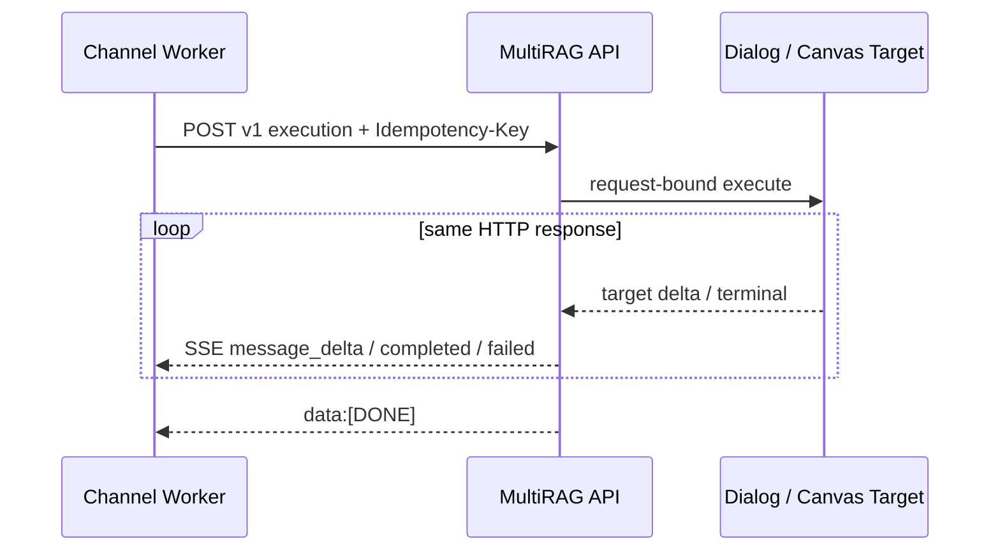
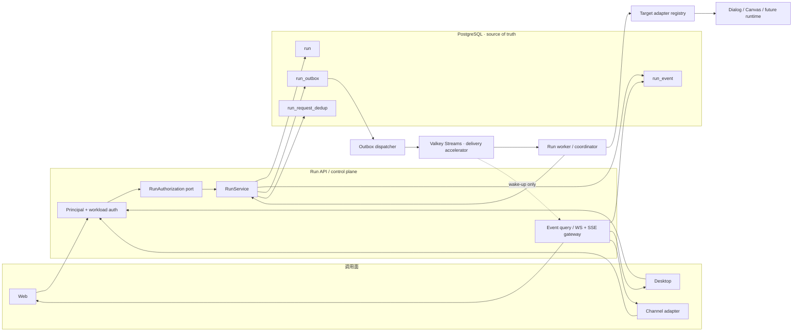
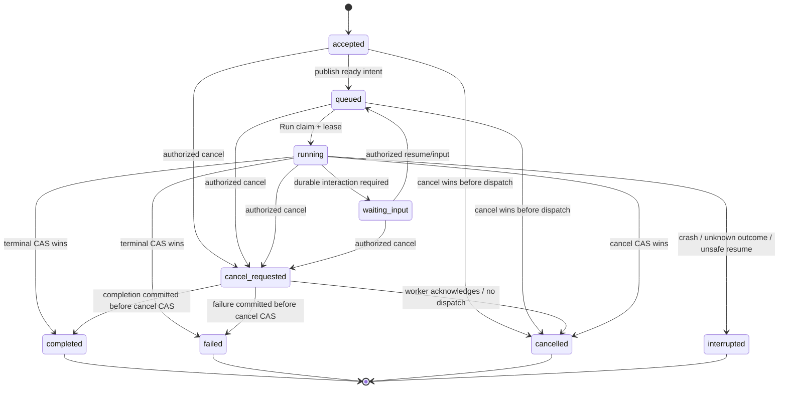

# Run Platform 架构

> 状态：F0 目标架构；除“当前 v1”小节外均未实现
> 权威入口：[README](README.md)
> API/事件细节：[CONTRACT](CONTRACT.md)

## 1. 目标与约束

Run Platform 为 Web、未来桌面客户端、Channel 和其他受信入口提供一套远程、可恢复的运行控制面。
它解决的是 **Run 的接受、排队、执行所有权、事件、取消、恢复与终态**，不是重写 Dialog/Canvas
业务 runtime。

目标：

- 创建请求在执行前获得稳定 `run_id`；
- API/客户端断线不终止 Run，客户端可以重新查询和续传事件；
- Run 状态、事件和取消意图可跨 API/worker 重启恢复；
- Web、Desktop、Channel 使用同一套 Run 语义，不复制状态机；
- 低延迟流式体验与强一致终态同时成立；
- 每个租户、主体、目标和工具副作用都经过服务端授权边界。

非目标：

- F0 不改变任何运行代码；
- 首期不做通用 DAG/workflow 编排器；
- 不把 Canvas checkpoint、Channel reply 状态或 MCP replay store 合并成 Run 表；
- 不承诺任意模型 token 永久保存，也不把 Valkey 当持久化数据库；
- 不在 API 进程中长期执行模型/tool workload。

## 2. 当前 v1：request-bound SSE 事实基线

当前 Channel 私有执行路径由以下代码组成：

- `api/apps/restful_apis/channel_execution_api.py`：`POST .../executions`，请求内调用
  `ChannelExecutionService.execute()` 并直接返回 `StreamingResponse`；
- `api/channel_execution/models.py`：请求只允许 `event_id`、`conversation_key`、operation、message、
  actor，服务端另行解析 tenant/target/revision/session；
- `api/channels/runtime_client.py`：同一个 HTTP 连接读取 `message_delta`、`message_completed`、
  `execution_failed`，最后要求 `[DONE]`；
- `api/channels/binding_bridge.py`：Channel worker 进程内管理 queued/running/reply 生命周期和协作取消。



当前 v1 已具备 binding workload authentication、服务端 target 解析、event claim、目标私有历史事务、
Channel 进程内有界队列和合作式取消；但它不是 durable Run Platform：

| 能力 | 当前 v1 | 目标 v2 |
|---|---|---|
| Run 资源 | 没有通用持久化 Run | PostgreSQL `Run` |
| 执行所有权 | 当前请求/API task | 独立 worker 的 lease + fence |
| 事件 | 当前响应内 SSE | PostgreSQL event log + 可续传 SSE |
| 低延迟通知 | 直接响应 yield | outbox → Valkey Streams |
| 断线 | consumer 失去后续事件；可能触发 task cancellation | Run 继续；按 `seq` 重连 |
| 重启恢复 | 仅已有的合作停机收口；无 kill/crash 接管 | lease 到期后重新 claim/对账 |
| 取消 | worker 内 task cancel；作用域为当前进程 | 鉴权后的持久 cancel intent + CAS |
| 查询 | 无通用 `GET run` | 按租户/主体查询状态和事件 |

因此，v2 上线前不能对外宣称“断点续跑”“跨实例取消”或“客户端重启后恢复”。

## 3. 目标 v2 组件



### 3.1 Run API

Run API 是唯一公开 control-plane composition root：认证、授权、幂等、状态迁移与首事件在这里收口。
它只做短事务，不同步等待模型运行。成功创建返回 `202`；此时 Run 已经可查询，之后是否有 worker
立即消费不影响接受事实。

### 3.2 Outbox dispatcher

Dispatcher 从 PostgreSQL 用 `FOR UPDATE SKIP LOCKED` 有界领取未发布 outbox，向 Valkey Stream
`XADD`，成功后写回发布状态。它允许 at-least-once，因此重复投递是正常情况；消息携带稳定
`event_id`，下游按 `event_id`/`run_id + seq` 幂等。

### 3.3 Run worker / coordinator

Worker 从 ready stream 获得唤醒信号，再到 PostgreSQL claim Run。数据库 lease、fencing token
和状态 CAS 决定执行所有权，Valkey consumer ownership 不能替代数据库所有权。Worker：

1. claim 当前可运行 Run；
2. 通过 Target Adapter Registry 解析目标；
3. 将 target 输出转换为统一事件；
4. 有界合并增量，批量写 event/outbox；
5. 在一个事务内竞争 terminal state、权威 snapshot 和 terminal event；
6. 对副作用结果未知的 Run 停止自动重放，终态化为 `interrupted` 并转人工/对账。

### 3.4 Event gateway

Event gateway 以 PostgreSQL 为回放源，以 Valkey 为低延迟 wake-up：

1. 按客户端 `after` cursor 从 PostgreSQL 补齐历史；
2. 记录已发送 watermark；
3. 订阅 Valkey 通知；
4. 每次被唤醒后仍按 PostgreSQL 查询 `seq > watermark`；
5. 连接建立窗口再做一次 gap check；
6. 收到唯一 terminal event 后正常结束该 Run 的订阅。

实时首选 `WS /api/v2/runs/stream`，在一条连接上为多个 Run 各自维护 cursor；企业代理阻断 WebSocket
upgrade 时，客户端按相同 cursor 降级到单 Run SSE。这样即使 transport 切换，或 Valkey 消息丢失、
重复、乱序、被 trim，也不会造成协议级丢事件。

连接发送缓冲必须有界。慢消费者先收到 `slow_consumer + cursor` control，再由服务端结束连接；客户端
释放旧连接并用该 cursor 主动重连 WS，代理仍阻断时改用 SSE 回放。control frame 不进入 Run event log。

### 3.5 Target adapter

Target adapter 只负责将 Run 输入/取消意图映射到 Dialog、Canvas 或后续 runtime，并把输出规范化。
它不拥有 Run API、认证、SSE 或 Valkey。现有 `api/channel_execution` 的 target-neutral registry、
历史 transaction 和 terminal commit barrier 可作为迁移输入，但不能直接声称已经实现 durable Run。

## 4. 目标实体

以下是 F0 逻辑实体；表名、字段类型和索引在 F1 migration 评审时冻结。

### 4.1 `Run`

| 字段组 | 目标内容 |
|---|---|
| identity | `run_id`、`tenant_id`、创建主体的 immutable principal reference |
| target | `target_type`、`target_id`、`target_revision`，均由授权后的服务端快照固定 |
| input | canonical request digest；大附件只保存受控 artifact reference |
| relationship | 权威 `thread_id`、`turn_id`，以及可选 `retry_of_run_id`、`supersedes_run_id` |
| lifecycle | `status`、`desired_state`、`version`、内部 lease/fence、时间戳、terminal reason/code |
| observability | `trace_id`、创建入口类型；不保存 prompt/answer 到普通日志 |

`Run` 不保存不断增长的事件 JSON 数组，不保存 Channel card state，也不把公开 Dialog/Canvas message
当作 run 状态列。

每次用户可见执行尝试本身就是唯一 `run_id`。retry/regenerate 创建新 Run，并通过
`retry_of_run_id` / `supersedes_run_id` 关联；不再引入第二层公共执行尝试资源。
lease/fence 只是服务端内部执行所有权。进程崩溃后，只有 target 有同一 Run 的安全 checkpoint/resume
证明时才可继续；否则该 Run 终态化为 `interrupted`，不得在原 `run_id` 下从头重演副作用。

### 4.2 `RunEvent`

不可变公共事件固定为 `v: 2` 与 `event_id`、`run_id`、`thread_id`、`turn_id`、严格递增 `seq`、
`type`、`created_at`、安全 `data`。事件不原地更新；更正通过新事件或权威 terminal snapshot 表达。
内部数据库可另存 commit metadata、lease/fence 和 trace context，但不能用这些字段替换公共 envelope。

### 4.3 `RunOutbox`

每个需要投递的已提交事件有 outbox 记录：稳定 `outbox_id/event_id`、topic、partition key、payload
reference、publish state、attempt count、next retry、published_at。事件和 outbox 在同一事务写入；
不能先 `XADD` 再补写 PostgreSQL。

### 4.4 `RunRequestDedup`

幂等记录以 server-resolved tenant、authenticated subject、operation 和 `Idempotency-Key` 定位，保存
canonical request digest 与 `run_id`。相同 key + 相同 digest 返回原 Run；相同 key + 不同 digest
返回冲突。其保留期不能短于客户端安全重试窗口。

## 5. PostgreSQL 状态机



`accepted`、`queued` 是否在首期合并为一个物理状态由 F1 决定，但对外事件语义保持清晰。核心规则：

- 每次迁移使用 `WHERE run_id=? AND version=? AND status IN (...)` 的 CAS；
- 状态、`version`、对应 `RunEvent` 和 `RunOutbox` 同事务提交；
- terminal 集合精确为 `completed|failed|cancelled|interrupted`，提交后不可退回 running；
- `cancel_requested` 是持久意图，不保证回滚已经发生的副作用；
- `waiting_input` 只有持久 interaction/confirmation 契约就绪后才能启用，首期可以不开放；
- 用户点击“重试”或重新生成必须创建新 Run 并用关系字段关联，不把旧 terminal Run 改回 running，
  也不在公共协议中创建第二层 attempt。

## 6. 写入与投递事务

### 6.1 创建 Run

同一 PostgreSQL 事务：

1. 校验/写入 dedup；
2. 插入 Run；
3. 插入 `run.accepted`（必要时同事务再插入 `run.queued`）；
4. 为 ready event 插入 outbox；
5. commit；
6. API 返回 `202`。

commit 失败时没有 Run；commit 成功而 HTTP 响应丢失时，客户端用同一 Idempotency-Key 重试并得到
相同 `run_id`。

### 6.2 增量事件

模型/token 回调先在 worker 内做有界时间/大小合并，再写 `message.delta`。具体窗口是性能配置，不进入
wire contract；但必须限制最大延迟、payload 大小和内存。每批事件/outbox 同事务提交，不能按原始
token 写库。

### 6.3 成功终态

同一事务竞争：

- Run `running|cancel_requested -> completed`；
- target 的 terminal commit barrier 或其不可分割引用；
- `message.snapshot`（权威可见结果）；
- `run.completed`；
- 对应 outbox。

如果 target 历史与 Run 数据暂时不能共享数据库事务，必须记录明确的跨存储 commit order、幂等键和
`interrupted` 对账策略，不能用补偿删除假装原子回滚。

## 7. 取消与授权架构

取消路径严格分四步：

1. **authenticate**：解析 canonical Principal 或受信 workload identity；
2. **authorize**：服务端加载 Run 的 tenant/owner/target，检查当前 membership、ownership、管理策略、
   assurance 和 target cancellation capability；
3. **persist**：CAS 写 `desired_state=cancelled` / `cancel_requested` 事件/outbox；
4. **cooperate**：worker 收到后停止尚未 dispatch 的工作，或向 target 发协作取消，再竞争 terminal。

安全边界：

- 请求体不能携带可信 `tenant_id`、`principal_id` 或“管理员”标记；
- 跨租户/无权读取的 Run 对普通调用方返回不可枚举结果；
- workload 只能操作其绑定且 policy 允许的 Run，不能把外部 `actor.subject` 当 Principal；
- 当前 Channel `TrustedChannelContext.principal_id` 未形成所有调用面的完整用户授权闭环时，不得让
  Channel 以用户身份取消/恢复高风险工具 Run；
- SSE 断开、浏览器关闭和客户端超时只关闭订阅，不自动写 cancel；
- terminal 已提交后，cancel 返回当前 terminal snapshot，不伪装“已取消”。

Principal、AuthenticationContext、delegated token、PDP 和 MCP resource authorization 的构造与
策略由 [企业身份与 MCP](../enterprise-identity-mcp/README.md) 独占；Run Platform 只消费其稳定 port。

## 8. 恢复、重放与故障语义

| 故障 | 正确行为 |
|---|---|
| API 在 create commit 前崩溃 | 无 Run；同 key 重试重新创建 |
| API 在 commit 后、响应前崩溃 | dedup 返回同一 `run_id` |
| Dispatcher 崩溃 | outbox 保留；重启后继续，可能重复投递 |
| Valkey 不可用 | PostgreSQL 继续是真相源；创建可按容量策略接受或 fail-fast，不能伪装已投递 |
| Valkey 丢/trim 消息 | gateway/worker 从 PostgreSQL watermark 对账 |
| Worker 在 dispatch 前崩溃 | lease 过期后安全重新 claim |
| Worker 在外部副作用后崩溃 | 只有同一 Run 的安全 checkpoint/resume 证明成立才继续，否则 `interrupted`；用户重试创建新 Run |
| WS/SSE 断线 | Run 继续；客户端用 `after` cursor 重连，WS 被企业代理阻断时降级 SSE 回放 |
| cancel 与 completion 并发 | PostgreSQL CAS 只允许一个终态；返回实际胜者 |
| target 历史提交成功、事件提交不明 | 进入对账路径；禁止自动重复执行 |

## 9. 性能与容量边界

- API 创建/取消只做小事务，不持有模型连接；
- Run 表只写状态迁移，不按 delta 更新同一行；
- `RunEvent` 按 `run_id, seq` 查询，按租户/时间做保留与归档；
- outbox 批量 claim/publish，有限 batch、有限 retry/backoff，不做无界扫描；
- Valkey stream 按稳定 partition key 分片，单 Run 保序；
- WS/SSE gateway 不为每条连接轮询全表，只按 watermark 查询目标 Run，并由通知唤醒；
- 大 tool result/artifact 存对象存储，事件只携带授权后的引用与摘要；
- 慢客户端有有界发送缓冲；落后时发送 `slow_consumer + cursor` 并结束 transport，要求客户端主动
  从 PostgreSQL cursor 重连，不让内存无限增长。

具体延迟、吞吐、保留期和分区数必须在 F1/F2 用容量模型和压测冻结，不在 F0 猜常量。

## 10. 部署拓扑与依赖方向

```text
multirag/
├── api/run_platform/
│   ├── domain.py              # 纯状态、实体与 transition
│   ├── schemas.py             # OpenAPI/event schema 真源
│   ├── service.py             # 用例编排
│   ├── repository.py          # PostgreSQL port/adapter
│   ├── events.py              # seq/envelope/event factory
│   ├── outbox.py              # transactional outbox + publisher
│   ├── stream.py              # WS/SSE gateway、replay、slow consumer
│   ├── authorization.py       # Principal/ownership/policy port
│   └── runners/
│       ├── dialog.py
│       └── canvas.py
├── api/apps/restful_apis/run_api.py
├── configs/alembic/versions/
├── docs/run-platform/
├── tests/unit/
└── tests/integration/
```

依赖方向为 route → service → domain ports；repository/outbox/stream/authorization/runners 向内实现 ports。`schemas.py` 不依赖 Channel Provider 或 Web/Desktop 源码，生成客户端只能单向消费它。

禁止：

- protocol/schema 依赖 FastAPI route、SQLAlchemy model 或 Channel Provider；
- worker 直接信任客户端 tenant/Principal 字段；
- Channel worker 直连 Run 数据库；
- API renderer/HTTP 连接承载长期 Agent runtime；
- MultiRAG 后端导入 Web/Desktop 源码；
- Valkey consumer group 状态替代 PostgreSQL Run lease/fence。

具体 additive-first 部署顺序和 v1/v2 灰度见 [ROADMAP §6](ROADMAP.md#6-部署顺序与-v1v2-灰度)。
